# pubm Architecture Documentation

> **pubm**: A CLI tool for publishing packages to multiple registries simultaneously, with automatic rollback on failure.

This document covers pubm's architecture, including the monorepo, package dependencies, module layout, design patterns, and data flow.

---

## Table of Contents

1. [System Overview](#system-overview)
2. [Monorepo Structure](#monorepo-structure)
3. [Package Dependency Graph](#package-dependency-graph)
4. [Core Package Architecture](#core-package-architecture)
5. [Release Pipeline](#release-pipeline)
6. [Ecosystem Abstraction](#ecosystem-abstraction)
7. [Registry Abstraction](#registry-abstraction)
8. [Plugin System](#plugin-system)
9. [Context & State Management](#context--state-management)
10. [Changeset System](#changeset-system)
11. [Monorepo Support](#monorepo-support)
12. [Rollback System](#rollback-system)
13. [CLI Package Architecture](#cli-package-architecture)
14. [Asset Pipeline](#asset-pipeline)
15. [Build System](#build-system)

---

## System Overview

### Architecture Overview

```
┌────────────────────────────────────────────────────────────────────────┐
│                      pubm — Multi-Registry Publisher                    │
└────────────────────────────────────────────────────────────────────────┘

User Input          CLI Layer           Core SDK            External
──────────          ─────────           ────────            ────────

$ pubm           ─→  Commander      ─→  Task Runner    ─→  npm registry
                     (cli.ts)           (runner.ts)        jsr.dev
                     • Parse args       • Prerequisites    crates.io
                     • Resolve opts     • Conditions       GitHub API
                     • Load config      • Prompts          Git
                            ↓           • Test & Build
                     @pubm/core         • Version bump
                     (programmatic)     • Publish
                                        • Post-publish
                                               ↓
                                        On failure:
                                        RollbackTracker
                                        reverses git ops
```

### Key Components

| Component | Package | Responsibility |
|-----------|---------|----------------|
| **CLI** | `packages/pubm` | Commander-based CLI, 14 subcommands |
| **Core SDK** | `packages/core` | Release pipeline, registries, ecosystems, changesets |
| **Plugin: Brew** | `packages/plugins/plugin-brew` | Homebrew formula publishing |
| **Plugin: Version Sync** | `packages/plugins/plugin-external-version-sync` | Sync version to external files |
| **Platform Binaries** | `packages/pubm/platforms/*` | 12 cross-compiled Bun binaries |

### Design Principles

1. **Multi-Registry First**: Publish to npm, jsr, crates.io, and custom registries in one command.
2. **Automatic Rollback**: Track git operations and reverse them on publish failure.
3. **TTY/CI Duality**: Use interactive prompts in TTY mode and automation in CI.
4. **Ecosystem Extensibility**: Add new languages and registries through abstract base classes.
5. **Plugin Hooks**: Let plugins extend each phase of the pipeline.

---

## Monorepo Structure

```
pubm/
├── packages/
│   ├── core/                              @pubm/core (Core SDK)
│   │   ├── src/
│   │   │   ├── assets/                    Release asset pipeline
│   │   │   ├── changeset/                 Changeset management
│   │   │   ├── config/                    Config loading & validation
│   │   │   ├── ecosystem/                 Language-specific implementations
│   │   │   ├── manifest/                  Package manifest readers
│   │   │   ├── monorepo/                  Workspace & dependency graph
│   │   │   ├── plugin/                    Plugin system
│   │   │   ├── registry/                  Registry implementations
│   │   │   ├── tasks/                     Release pipeline tasks
│   │   │   ├── types/                     Type definitions
│   │   │   ├── utils/                     27+ utility modules
│   │   │   └── validate/                  Pre-publish validation
│   │   └── tests/
│   │       ├── unit/                      Unit tests (mirrors src/)
│   │       └── e2e/                       End-to-end tests
│   │
│   ├── pubm/                              pubm (CLI)
│   │   ├── src/
│   │   │   ├── cli.ts                     Entry point (Commander)
│   │   │   └── commands/                  14 subcommands
│   │   ├── bin/cli.cjs                    Platform binary delegator
│   │   └── platforms/                     12 cross-compiled targets
│   │       ├── darwin-arm64/
│   │       ├── darwin-x64/
│   │       ├── linux-x64/
│   │       ├── windows-x64/
│   │       └── ... (12 total)
│   │
│   └── plugins/
│       ├── plugin-brew/                   @pubm/plugin-brew
│       │   └── src/
│       │       ├── index.ts               Plugin entry (brewCore, brewTap)
│       │       ├── brew-core.ts           homebrew-core PR logic
│       │       ├── brew-tap.ts            Custom tap logic
│       │       ├── formula.ts             Formula generation
│       │       └── git-identity.ts        Git identity for PRs
│       │
│       └── plugin-external-version-sync/  @pubm/plugin-external-version-sync
│           └── src/
│               ├── index.ts               Plugin entry
│               ├── sync.ts                Sync logic (JSON path, regex)
│               └── types.ts               Type definitions
│
├── plugins/
│   └── pubm-plugin/                       Claude Code plugin (skills)
│
├── website/                               Astro documentation site
├── Formula/                               Homebrew formula
└── patches/                               Dependency patches (listr2)
```

### Workspace Configuration

- **Manager**: Bun workspaces (root `package.json`)
- **Orchestrator**: Turborepo (`turbo.json`)
- **Workspaces**: `packages/*`, `packages/plugins/*`, `packages/pubm/platforms/*`

---

## Package Dependency Graph

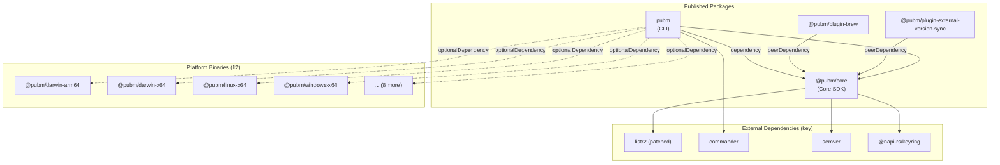

### Dependency Direction

| From | To | Type | Reason |
|------|-----|------|--------|
| `pubm` → `@pubm/core` | dependency | CLI wraps Core SDK |
| `pubm` → `@pubm/<platform>` | optionalDependency | Platform-specific binary resolution |
| `plugin-brew` → `@pubm/core` | peerDependency | Plugins use Core types and hooks |
| `plugin-external-version-sync` → `@pubm/core` | peerDependency | Plugins use Core types and hooks |

---

## Core Package Architecture

### Module Organization

```
packages/core/src/
│
├── index.ts                 Public API (~177 exports)
├── context.ts               PubmContext: config + options + runtime
├── options.ts               CLI flags → normalized options
├── git.ts                   Git operations wrapper
├── error.ts                 Error types and handling
│
├── tasks/                   Release Pipeline
│   ├── runner.ts            Main task orchestrator (listr2)
│   ├── prerequisites.ts     Branch, remote, working tree checks
│   ├── conditions.ts        Registry connectivity, permissions
│   ├── prompts.ts           Version/tag interactive prompts
│   ├── test-build.ts        Run test & build scripts
│   ├── version.ts           Version bump + git commit/tag
│   ├── publish.ts           Concurrent multi-registry publish
│   └── post-publish.ts      Push tags, GitHub release draft
│
├── ecosystem/               Language Abstraction
│   ├── ecosystem.ts         Abstract base class
│   ├── js.ts                JsEcosystem (npm, jsr)
│   └── rust.ts              RustEcosystem (crates.io)
│
├── registry/                Registry Abstraction
│   ├── registry.ts          Abstract base class (PackageRegistry)
│   ├── npm.ts               NpmPackageRegistry
│   ├── jsr.ts               JsrPackageRegistry
│   ├── crates.ts            CratesPackageRegistry
│   └── custom.ts            CustomRegistry
│
├── manifest/                Manifest Readers
│   ├── reader.ts            ManifestReader (pluggable schema, cached)
│   └── schemas/             JSON/TOML schema definitions
│
├── plugin/                  Plugin System
│   ├── types.ts             PubmPlugin interface
│   └── runner.ts            Plugin hook executor
│
├── changeset/               Changeset Management
│   ├── parse.ts             Frontmatter YAML + markdown parser
│   ├── read.ts              Find .changeset/*.md files
│   ├── write.ts             Create changesets with auto-ID
│   ├── version.ts           Calculate version bumps
│   ├── changelog.ts         Generate CHANGELOG.md entries
│   └── status.ts            Pending changes report
│
├── monorepo/                Workspace Support
│   ├── detect.ts            Workspace type detection
│   ├── discover.ts          Package discovery (glob)
│   ├── graph.ts             Dependency graph + topological sort
│   └── groups.ts            Fixed/linked version groups
│
├── config/                  Configuration
│   ├── load.ts              Load pubm.config.{ts,js,json}
│   └── validate.ts          Schema validation
│
├── assets/                  Release Assets
│   ├── resolve.ts           Filter assets by platform/name
│   ├── transform.ts         Plugin transformations
│   ├── compress.ts          zip/tar compression
│   ├── name.ts              Template naming
│   ├── hash.ts              SHA256 computation
│   ├── checksums.ts         Manifest generation
│   └── upload.ts            GitHub release upload
│
├── validate/                Pre-publish Validation
│   ├── entry-points.ts      Package entry point checks
│   └── extraneous.ts        Extraneous file detection
│
├── prerelease/              Pre-release Handling
│   ├── prerelease.ts        Pre-release version logic
│   └── snapshot.ts          Snapshot version generation
│
└── utils/                   Utilities (27+ modules)
    ├── exec.ts              Bun.spawn wrapper
    ├── rollback.ts          RollbackTracker
    ├── db.ts                AES-256-CBC encrypted token storage
    ├── secure-store.ts      @napi-rs/keyring integration
    ├── github-token.ts      Token resolution (env→keyring→prompt)
    ├── package.ts           package.json/jsr.json/deno.json/deno.jsonc read/cache
    ├── package-manager.ts   Detect npm/yarn/pnpm/bun/deno
    ├── resolve-phases.ts    Release phase validation
    ├── filter-config.ts     Filter config packages
    ├── spawn-interactive.ts TTY passthrough
    ├── open-url.ts          Cross-platform URL opener
    ├── listr.ts             Listr2 renderer config
    ├── ui.ts                Chalk color/formatting
    └── ...
```

### Module Dependency Flow

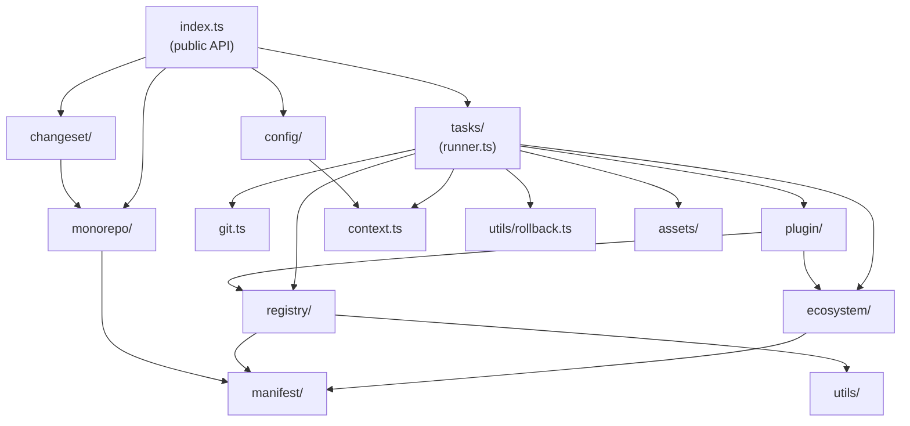

---

## Release Pipeline

### Pipeline Entry Point

`run(ctx: PubmContext)` in `tasks/runner.ts` is the main orchestrator. It initializes the pipeline based on context:

```
run(ctx)
  1. Set ctx.runtime.promptEnabled = !isCI && process.stdin.isTTY
  2. Resolve phases from --phase option (prepare / publish / both)
  3. Register SIGINT handler for graceful rollback
  4. Branch: snapshot mode OR normal release
```

### Pipeline Modes

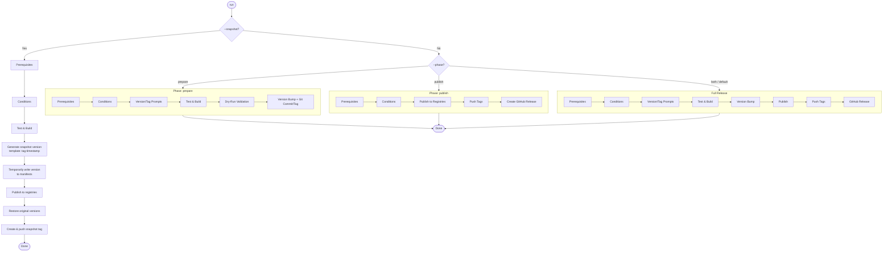

### Complete Task Tree

```
Pipeline
├─ Prerequisites Check (prerequisites.ts)
│  ├─ Branch check (skip if --any-branch)
│  │  ├─ Verify current branch matches config.branch
│  │  ├─ TTY: prompt to switch if different
│  │  └─ CI: fail if different
│  ├─ Remote history check
│  │  ├─ git fetch --dry-run → detect available updates
│  │  ├─ git rev-list (count) → detect if behind remote
│  │  └─ TTY: prompt to pull / CI: fail
│  ├─ Working tree check
│  │  ├─ git status → detect dirty files
│  │  └─ Set ctx.runtime.cleanWorkingTree
│  ├─ Commits since last release
│  │  ├─ git rev-list {lastTag}..HEAD → count new commits
│  │  └─ TTY: prompt to continue / CI: fail if none
│  └─ Plugin prerequisite checks
│     └─ plugin.checks(ctx) where phase = "prerequisites"
│
├─ Required Conditions (conditions.ts, concurrent)
│  ├─ Ping registries (concurrent per ecosystem)
│  │  └─ npm ping / JSR API ping / crates.io API ping
│  ├─ Test/build script validation
│  │  └─ Verify scripts exist in package.json
│  ├─ Git version check
│  │  └─ Validate git meets minimum version
│  ├─ Registry availability (concurrent per ecosystem)
│  │  ├─ npm: login check → published check → permission → 2FA mode
│  │  ├─ jsr: CLI install → scope/package creation → permission
│  │  └─ crates: CARGO_REGISTRY_TOKEN check
│  └─ Plugin condition checks
│     └─ plugin.checks(ctx) where phase = "conditions"
│
├─ Version/Tag Prompts (prompts.ts, TTY only)
│  ├─ Version selection (bump type or explicit version)
│  └─ Tag input (dist-tag for npm)
│
├─ Test (test-build.ts, if !skipTests)
│  └─ Run configured testScript (default: {pm} run test)
│
├─ Build (test-build.ts, if !skipBuild)
│  └─ Run configured buildScript (default: {pm} run build)
│
├─ Dry-Run Validation (if dryRun OR CI prepare phase)
│  ├─ Backup original versions from config
│  ├─ Temporarily write target versions to manifests
│  ├─ Resolve workspace:* protocols
│  ├─ Run per-registry dry-run:
│  │  ├─ npm publish --dry-run
│  │  ├─ jsr publish --dry-run --token ...
│  │  └─ cargo publish --dry-run
│  ├─ Restore workspace:* protocols
│  ├─ Re-sync lockfiles (critical: lockfile may be stale)
│  └─ Restore original versions
│
├─ Version Bump (version.ts, rollback: YES)
│  ├─ git reset (refresh index)
│  ├─ Backup manifest files → register rollback
│  ├─ Write versions to manifests:
│  │  ├─ single: all packages → plan.version
│  │  ├─ fixed: all packages → plan.version
│  │  └─ independent: each package → own version
│  ├─ Changeset handling (if changesetConsumed):
│  │  ├─ Read .pubm/changesets/*.md
│  │  ├─ Build changelog entries
│  │  ├─ Write CHANGELOG.md
│  │  └─ Delete consumed changeset files
│  ├─ Run afterVersion plugin hooks
│  ├─ git stage(".")
│  ├─ Tag existence check:
│  │  ├─ single/fixed: tag = "v{version}"
│  │  └─ independent: tag = "{packageName}@{version}" per package
│  │  └─ TTY: prompt to delete if exists / CI: fail
│  ├─ git commit → register rollback (git reset HEAD~1)
│  └─ git tag → register rollback (git tag -d)
│
├─ Publishing (publish.ts, rollback: YES)
│  ├─ Run beforePublish plugin hooks
│  ├─ Resolve workspace:* → concrete versions (if needed)
│  │  └─ Register rollback to restore originals
│  ├─ Collect publish tasks (grouped by ecosystem → registry):
│  │  ├─ Ecosystems: concurrent
│  │  ├─ Registries within ecosystem: concurrent
│  │  └─ Packages within registry:
│  │     ├─ npm/jsr: concurrent (descriptor.concurrentPublish = true)
│  │     └─ crates: sequential (topological order for path deps)
│  ├─ Per-package publish:
│  │  ├─ Check if version already published → skip
│  │  ├─ npm:
│  │  │  ├─ npm publish [--otp]
│  │  │  ├─ On EOTP: shared OTP prompt (cached across concurrent tasks)
│  │  │  ├─ CI: npm publish --provenance --access public
│  │  │  └─ Register rollback: npm unpublish {name}@{version}
│  │  ├─ jsr:
│  │  │  ├─ jsr publish --allow-dirty --allow-slow-types --token {token}
│  │  │  ├─ On "package creation needed": extract URLs, return false
│  │  │  └─ No unpublish rollback (JSR doesn't support it)
│  │  └─ crates:
│  │     ├─ cargo publish [--manifest-path ...]
│  │     └─ Register rollback: cargo yank --vers {version}
│  ├─ Run afterPublish plugin hooks
│  └─ Restore workspace:* protocols
│
├─ Push Tags (post-publish.ts, rollback: YES)
│  ├─ Run beforePush plugin hooks
│  ├─ Store pre-push HEAD SHA (for force-push rollback)
│  ├─ git push --follow-tags
│  │  └─ Protected branch fallback: git push --tags (tags only)
│  ├─ Register rollback:
│  │  ├─ Per tag: git push origin :{tag}
│  │  └─ Commits: git push --force origin {prePushSha}:{branch}
│  └─ Run afterPush plugin hooks
│
├─ Create GitHub Release (post-publish.ts, rollback: YES)
│  ├─ Resolve GitHub token (env → keyring → prompt)
│  ├─ Per-package (independent) or single (fixed/single):
│  │  ├─ Read CHANGELOG.md for release notes
│  │  ├─ Prepare release assets (if configured)
│  │  ├─ Create GitHub release (draft if configured)
│  │  ├─ Register rollback: delete release
│  │  ├─ Run afterRelease plugin hooks
│  │  └─ Upload additional assets via plugin hooks
│  └─ Fixed mode: concatenates all package changelogs
│
└─ Error Handler
   ├─ Run onError plugin hooks
   ├─ Execute RollbackTracker in reverse:
   │  ├─ TTY: prompt for confirm-flagged actions
   │  ├─ CI: auto-execute (skip confirm-flagged)
   │  └─ SIGINT: skip confirm-flagged actions
   └─ Exit 1
```

### TTY vs CI Behavior

```
┌──────────────────────┬────────────────────────────┬────────────────────────────┐
│ Behavior             │ TTY (Local)                │ CI (Non-Interactive)       │
├──────────────────────┼────────────────────────────┼────────────────────────────┤
│ promptEnabled        │ true                       │ false                      │
│ Preflight failures   │ Interactive prompts        │ Throws error immediately   │
│ Version selection    │ Prompt with bump choices   │ Must be pre-set            │
│ OTP (npm 2FA)        │ Prompt user for code       │ Must pass --otp or fail    │
│ Token resolution     │ env → keyring → prompt     │ env → keyring → fail       │
│ Rollback             │ Prompt "Rollback? (Y/n)"   │ Auto-rollback              │
│ npm publish          │ npm publish                │ npm publish --provenance   │
│ SIGINT handling      │ Graceful rollback + prompt │ Rollback (skip confirms)   │
└──────────────────────┴────────────────────────────┴────────────────────────────┘
```

### Monorepo Publishing Order

```
┌────────────────────────────────────────────────────────────────────────┐
│                 Monorepo Concurrent Publishing Model                    │
└────────────────────────────────────────────────────────────────────────┘

Packages grouped by ecosystem → registry:

  JsEcosystem                          RustEcosystem
  ├─ npm (concurrent)                  └─ crates (sequential)
  │  ├─ pkg-a ──┐                        ├─ crate-a (no deps)
  │  ├─ pkg-b ──┼── publish in parallel  │     ↓ (wait)
  │  └─ pkg-c ──┘                        └─ crate-b (depends on crate-a)
  └─ jsr (concurrent)
     └─ pkg-a ── publish

Ordering rules:
  ├─ Ecosystems: concurrent
  ├─ Registries within ecosystem: concurrent
  └─ Packages within registry:
     ├─ npm/jsr: concurrentPublish = true (all packages at once)
     └─ crates: concurrentPublish = false (topological sort via orderPackages())
```

### OTP Sharing (npm 2FA)

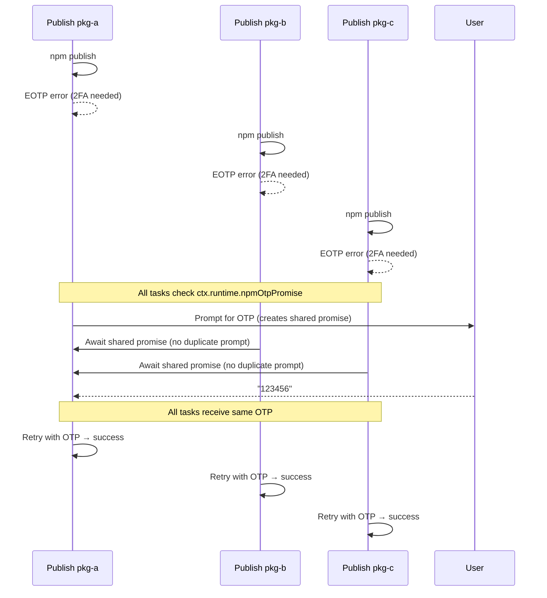

---

## Ecosystem Abstraction

The Ecosystem layer abstracts language-specific package management. Each ecosystem knows how to read/write manifests, resolve dependencies, and sync lockfiles for its language.

### Class Hierarchy

```mermaid
classDiagram
    class Ecosystem {
        <<abstract>>
        #packagePath: string
        +registryClasses()* typeof PackageRegistry[]
        +writeVersion(newVersion: string)* Promise~void~
        +manifestFiles()* string[]
        +defaultTestCommand()* string | Promise~string~
        +defaultBuildCommand()* string | Promise~string~
        +supportedRegistries()* RegistryType[]
        +createDescriptor()* Promise~EcosystemDescriptor~
        +readManifest() Promise~PackageManifest~
        +readRegistryVersions() Promise~Map~
        +isPrivate() Promise~boolean~
        +packageName() Promise~string~
        +readVersion() Promise~string~
        +dependencies() Promise~string[]~
        +updateSiblingDependencyVersions(siblingVersions) Promise~boolean~
        +syncLockfile(mode) Promise~string | undefined~
        +resolvePublishDependencies(workspaceVersions) Promise~Map~
        +restorePublishDependencies(backups: Map)
    }

    class JsEcosystem {
        +registryClasses() [NpmPackageRegistry, JsrPackageRegistry]
        +writeVersion() regex replace in package.json, jsr.json, deno.json, deno.jsonc
        +manifestFiles() ["package.json"]
        +defaultTestCommand() "{pm} run test"
        +defaultBuildCommand() "{pm} run build"
        +supportedRegistries() ["npm", "jsr"]
        +createDescriptor() JsEcosystemDescriptor
        +resolvePublishDependencies() workspace:* → concrete versions
        +restorePublishDependencies() restore from backup map
        +syncLockfile() detect lockfile, run install
    }

    class RustEcosystem {
        +registryClasses() [CratesPackageRegistry]
        +writeVersion() TOML parse + update package.version
        +manifestFiles() ["Cargo.toml"]
        +defaultTestCommand() "cargo test"
        +defaultBuildCommand() "cargo build --release"
        +supportedRegistries() ["crates"]
        +createDescriptor() RustEcosystemDescriptor
        +updateSiblingDependencyVersions() update path dep versions
        +syncLockfile() cargo update --package {name}
    }

    Ecosystem <|-- JsEcosystem
    Ecosystem <|-- RustEcosystem
```

### Abstract vs Concrete Methods

```
┌─────────────────────────────────────┬──────────────┬───────────────────────────────────────────┐
│ Method                              │ Type         │ Purpose                                   │
├─────────────────────────────────────┼──────────────┼───────────────────────────────────────────┤
│ registryClasses()                   │ abstract     │ Returns supported registry class refs      │
│ writeVersion(newVersion)            │ abstract     │ Write version to manifest files            │
│ manifestFiles()                     │ abstract     │ List of manifest filenames                 │
│ defaultTestCommand()                │ abstract     │ Fallback test script command               │
│ defaultBuildCommand()               │ abstract     │ Fallback build script command              │
│ supportedRegistries()               │ abstract     │ Supported registry type strings            │
│ createDescriptor()                  │ abstract     │ Create ecosystem descriptor for publish    │
├─────────────────────────────────────┼──────────────┼───────────────────────────────────────────┤
│ readManifest()                      │ concrete     │ Iterates registryClasses().reader.read()   │
│ readRegistryVersions()              │ concrete     │ Version from each available manifest       │
│ isPrivate()                         │ concrete     │ Returns manifest.private                   │
│ packageName()                       │ concrete     │ Returns manifest.name                      │
│ readVersion()                       │ concrete     │ Returns manifest.version                   │
│ dependencies()                      │ concrete     │ Returns manifest.dependencies              │
│ updateSiblingDependencyVersions()   │ overridable  │ Default: returns false (no-op)             │
│ syncLockfile()                      │ overridable  │ Default: returns undefined (no-op)         │
│ resolvePublishDependencies()        │ overridable  │ Default: returns empty Map (no-op)         │
│ restorePublishDependencies()        │ overridable  │ Default: no-op                             │
└─────────────────────────────────────┴──────────────┴───────────────────────────────────────────┘
```

### JsEcosystem: Workspace Protocol Resolution

The most complex ecosystem-specific logic handles `workspace:*` protocol during publish:

```
resolvePublishDependencies(workspaceVersions: Map<string, string>)

  For each dependency field (dependencies, devDependencies, optionalDependencies, peerDependencies):
    For each dependency with workspace: prefix:
      ├─ workspace:*  → replace with exact version (e.g., "1.2.0")
      ├─ workspace:^  → replace with caret range  (e.g., "^1.2.0")
      └─ workspace:~  → replace with tilde range  (e.g., "~1.2.0")

  Returns: Map<filePath, originalContent> (backup for rollback)

restorePublishDependencies(backups: Map<string, string>)
  └─ For each entry: writeFileSync(path, originalContent)
```

### JsEcosystem: Lockfile Sync

```
syncLockfile(mode: "required" | "optional" | "skip")

  1. Walk up from packagePath to find lockfile:
     ├─ yarn.lock       → check .yarnrc.yml for Yarn Berry
     ├─ package-lock.json → npm
     ├─ pnpm-lock.yaml  → pnpm
     └─ bun.lockb        → bun

  2. Run appropriate install command:
     ├─ yarn (classic): yarn install --non-interactive
     ├─ yarn (berry):   yarn install --no-immutable
     ├─ npm:            npm install --package-lock-only
     ├─ pnpm:           pnpm install --lockfile-only
     └─ bun:            bun install --frozen-lockfile=false

  3. Error handling by mode:
     ├─ "required": throw on failure
     ├─ "optional": warn on failure, continue
     └─ "skip":     return undefined immediately
```

### RustEcosystem: Sibling Dependency Updates

```
updateSiblingDependencyVersions(siblingVersions: Map<string, string>)

  Parse Cargo.toml with smol-toml
  For each section [dependencies] and [build-dependencies]:
    For entries with `path` field matching a sibling name:
      └─ Update `version` field to sibling's new version

  Returns: boolean (true if file was modified)

  Purpose: cargo publish requires exact versions for path dependencies.
  Without this, `cargo publish` would fail for interdependent crates.
```

### Auto-Detection

```
Config has registries?
├── Yes → Infer ecosystem from registry types
│         npm/jsr → JsEcosystem
│         crates  → RustEcosystem
│
└── No  → Detect from manifest files
          NpmPackageRegistry.reader.exists(path)? → JsEcosystem
          JsrPackageRegistry.reader.exists(path)? → JsEcosystem (Deno-only projects with deno.json/deno.jsonc)
          CratesPackageRegistry.reader.exists(path)? → RustEcosystem
```

---

## Registry Abstraction

The Registry layer abstracts publishing to different package registries. Each registry knows how to publish, check availability, verify permissions, and manage authentication.

### Class Hierarchy

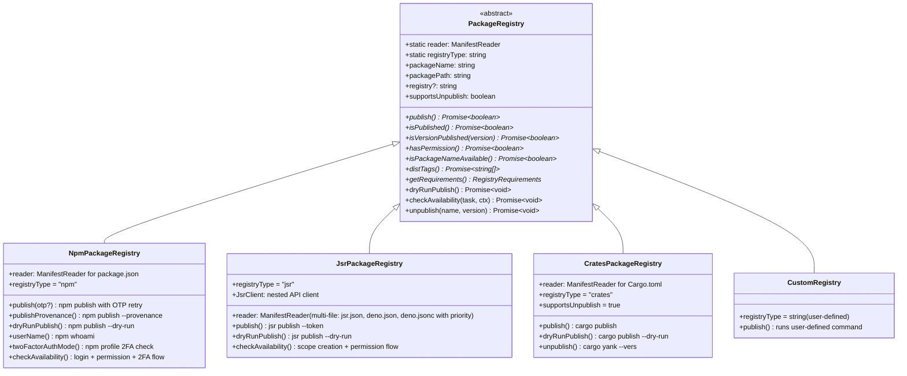

### Abstract vs Concrete Methods

```
┌──────────────────────────────┬──────────────┬──────────────────────────────────────────┐
│ Method                       │ Type         │ Purpose                                  │
├──────────────────────────────┼──────────────┼──────────────────────────────────────────┤
│ publish()                    │ abstract     │ Publish package, return false if OTP needed│
│ isPublished()                │ abstract     │ Check if package name exists on registry  │
│ isVersionPublished(version)  │ abstract     │ Check if specific version exists          │
│ hasPermission()              │ abstract     │ Check if user has publish access           │
│ isPackageNameAvailable()     │ abstract     │ Check name availability for first publish │
│ distTags()                   │ abstract     │ Fetch available dist-tags                 │
│ getRequirements()            │ abstract     │ Return {needsPackageScripts, manifest}   │
├──────────────────────────────┼──────────────┼──────────────────────────────────────────┤
│ dryRunPublish()              │ overridable  │ Default: no-op. Validate without publish  │
│ checkAvailability(task, ctx) │ overridable  │ Default: basic availability + permission  │
│ supportsUnpublish            │ overridable  │ Default: false                            │
│ unpublish(name, version)     │ overridable  │ Default: no-op                            │
└──────────────────────────────┴──────────────┴──────────────────────────────────────────┘
```

### Registry-Specific Availability Flows

Each registry has a complex `checkAvailability()` flow that handles authentication, scope creation, and permission checking:

```
┌────────────────────────────────────────────────────────────────────────┐
│                  NpmPackageRegistry.checkAvailability()                 │
└────────────────────────────────────────────────────────────────────────┘

  N1: Login Check
  ├─ npm whoami → success? → continue
  └─ Failed?
     ├─ TTY: prompt "npm login" → spawn interactive login
     │       Auto-opens browser if npm returns URL
     │       Register rollback for successful login
     └─ CI: throw "Not logged in to npm"

  N2: Already Published?
  ├─ Yes → Check hasPermission()
  │        ├─ Has write access → return (ready to publish new version)
  │        └─ No permission → throw
  └─ No → continue to N3

  N3: Package Name Available?
  ├─ Available → continue
  └─ Taken → throw "Package name already taken"

  N4: CI 2FA Warning
  ├─ twoFactorAuthMode() === "auth-and-writes"?
  │  └─ CI mode? → throw "2FA auth-and-writes not supported in CI"
  └─ Other mode → continue

┌────────────────────────────────────────────────────────────────────────┐
│                  JsrPackageRegistry.checkAvailability()                 │
└────────────────────────────────────────────────────────────────────────┘

  J0: JSR CLI Check
  ├─ jsr installed? → continue
  └─ Not installed?
     ├─ TTY: prompt "Install jsr globally?"
     │       → npm install -g jsr
     └─ CI: throw "jsr CLI not found"

  J1: Scope Selection (TTY only, non-scoped packages)
  ├─ Package already scoped (@scope/name)? → skip to J4
  └─ Not scoped → prompt scope selection:
     ├─ Option A: Derive from package name
     ├─ Option B: Derive from git remote name
     └─ Option C: Choose from existing scopes (JsrClient.scopes())

  J2: Auto-Create Scope & Package
  ├─ Scope exists? → skip creation
  └─ Scope doesn't exist → JsrClient.createScope(scope)
  ├─ Package exists? → skip creation
  └─ Package doesn't exist → JsrClient.createPackage(name)

  J3: Register Rollback
  └─ If created: register rollback to JsrClient.deletePackage() / deleteScope()

  J4: Scope Permission Check
  ├─ JsrClient.scopePermission(scope) → has permission? → continue
  └─ No permission → throw

  J5-J6: Published + Name availability (same as npm flow)

┌────────────────────────────────────────────────────────────────────────┐
│                CratesPackageRegistry.checkAvailability()                │
└────────────────────────────────────────────────────────────────────────┘

  C1: Token Check
  ├─ CARGO_REGISTRY_TOKEN env var exists? → continue
  ├─ cargo installed? → continue (uses ~/.cargo/credentials.toml)
  └─ Neither → throw "No crates.io credentials found"
```

### ManifestReader Pattern

Each registry has a static `reader: ManifestReader` with a pluggable schema for reading package metadata:

```
ManifestReader
├── schema: ManifestSchema
│   ├── file: string                     — manifest filename
│   ├── parser: (raw) → object           — JSON.parse / smol-toml.parse
│   └── fields:
│       ├── name: (parsed) → string      — extract package name
│       ├── version: (parsed) → string   — extract version
│       ├── private: (parsed) → boolean  — extract private flag
│       └── dependencies: (parsed) → string[]  — extract dep names
├── read(packagePath) → PackageManifest  — read, parse, cache
├── exists(packagePath) → boolean        — check if manifest file exists
├── invalidate(packagePath)              — clear single cache entry
└── clearCache()                         — clear all caches

Per-Registry Schema:
┌─────────────┬────────────────┬──────────────┬─────────────────────────┐
│ Registry    │ File           │ Parser       │ Field Extraction        │
├─────────────┼────────────────┼──────────────┼─────────────────────────┤
│ npm         │ package.json   │ JSON.parse   │ .name, .version,        │
│             │                │              │ .private, .dependencies │
│ jsr         │ jsr.json       │ JSON.parse   │ .name, .version,        │
│             │                │              │ private=false, deps=[]  │
│ crates      │ Cargo.toml     │ smol-toml    │ .package.name,          │
│             │                │              │ .package.version, ...   │
└─────────────┴────────────────┴──────────────┴─────────────────────────┘
```

### Token Storage

```
┌────────────────────────────────────────────────────────────────────────┐
│                       Token Resolution Chain                           │
└────────────────────────────────────────────────────────────────────────┘

Attempt Order:
1. Environment variable (NPM_TOKEN, JSR_TOKEN, CARGO_REGISTRY_TOKEN)
2. Secure keyring (@napi-rs/keyring — OS-level credential store)
3. Encrypted file store (AES-256-CBC in ~/.pubm/)
4. Interactive prompt (TTY only)

Storage Layers:
┌──────────────────┬────────────────────────────────────────────────────┐
│ secure-store.ts  │ @napi-rs/keyring integration                      │
│                  │ macOS: Keychain, Linux: libsecret, Win: Credential│
│                  │ Service: "pubm", Account: "{registry}:{scope}"    │
├──────────────────┼────────────────────────────────────────────────────┤
│ db.ts            │ AES-256-CBC encrypted JSON file                   │
│                  │ Location: ~/.pubm/tokens.enc                      │
│                  │ Key derivation: machine-specific seed             │
│                  │ Fallback when keyring unavailable                 │
├──────────────────┼────────────────────────────────────────────────────┤
│ github-token.ts  │ GitHub token specifically                         │
│                  │ env GITHUB_TOKEN → keyring → interactive prompt   │
│                  │ TTY: opens browser for token creation             │
└──────────────────┴────────────────────────────────────────────────────┘
```

---

## Plugin System

The plugin system provides extensibility at every stage of the release pipeline. Plugins can add registries, ecosystems, lifecycle hooks, CLI commands, credential requirements, and preflight checks.

### Plugin Interface

```typescript
interface PubmPlugin {
  name: string

  // Extensions — add custom registries and ecosystems
  registries?: PackageRegistry[]
  ecosystems?: Ecosystem[]

  // Lifecycle hooks — intercept pipeline phases
  hooks?: {
    // Test & Build
    beforeTest?: (ctx: PubmContext) => Promise<void> | void
    afterTest?: (ctx: PubmContext) => Promise<void> | void
    beforeBuild?: (ctx: PubmContext) => Promise<void> | void
    afterBuild?: (ctx: PubmContext) => Promise<void> | void

    // Version
    beforeVersion?: (ctx: PubmContext) => Promise<void> | void
    afterVersion?: (ctx: PubmContext) => Promise<void> | void

    // Publish
    beforePublish?: (ctx: PubmContext) => Promise<void> | void
    afterPublish?: (ctx: PubmContext) => Promise<void> | void

    // Push
    beforePush?: (ctx: PubmContext) => Promise<void> | void
    afterPush?: (ctx: PubmContext) => Promise<void> | void

    // Release
    afterRelease?: (ctx: PubmContext, releaseCtx: ReleaseContext) => Promise<void> | void

    // Error & Success
    onError?: (ctx: PubmContext, error: Error) => Promise<void> | void
    onSuccess?: (ctx: PubmContext) => Promise<void> | void

    // Asset pipeline hooks
    resolveAssets?: (assets: Asset[]) => Promise<Asset[]>
    transformAsset?: (asset: Asset) => Promise<Asset | Asset[]>
    compressAsset?: (asset: Asset) => Promise<Asset>
    nameAsset?: (asset: Asset) => Promise<Asset>
    generateChecksums?: (assets: Asset[]) => Promise<ChecksumManifest>
    uploadAssets?: (assets: Asset[], releaseCtx: ReleaseContext) => Promise<UploadResult[]>
  }

  // Credential requirements — tokens the plugin needs
  credentials?: (ctx: PubmContext) => PluginCredential[]
  // PluginCredential: { key: string, env?: string, label: string }

  // Preflight checks — run during prerequisites or conditions
  checks?: (ctx: PubmContext) => PluginCheck[]
  // PluginCheck: { phase: "prerequisites" | "conditions", fn: () => Promise<void> }

  // CLI commands — add subcommands to the CLI
  commands?: PluginCommand[]
}
```

### PluginRunner Orchestration

`PluginRunner` (`plugin/runner.ts`) manages hook execution across all registered plugins:

```
PluginRunner
├── runHook(hookName, ctx)           — Sequential execution across all plugins
├── runErrorHook(ctx, error)         — Run onError hooks (catch errors to prevent cascade)
├── runAfterReleaseHook(ctx, relCtx) — Run afterRelease hooks
├── collectRegistries()              — Flatten all plugin registries
├── collectEcosystems()              — Flatten all plugin ecosystems
├── collectCredentials(ctx)          — Deduplicate credentials by key
├── collectChecks(ctx, phase)        — Filter checks by phase
└── collectAssetHooks()              — Chain asset hooks:
    ├── resolveAssets: sequential chain
    ├── transformAsset: per-asset, supports fan-out (1 asset → N assets)
    ├── compressAsset, nameAsset: sequential chain
    ├── generateChecksums: sequential chain
    └── uploadAssets: concatenate results from all plugins
```

### Hook Execution in Pipeline

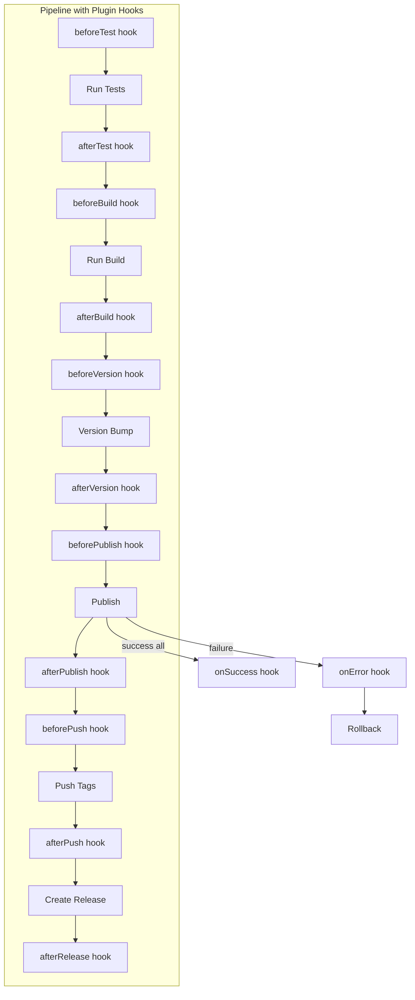

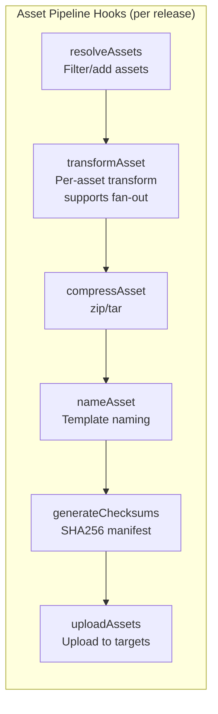

### Official Plugin Implementations

```
┌──────────────────────────────────────────────────────────────────────────┐
│ plugin-external-version-sync                                             │
├──────────────────────────────────────────────────────────────────────────┤
│ Hook:     afterVersion                                                   │
│ Purpose:  Sync version string to external files outside package manifest │
│ Targets:  JSON path (e.g., $.version in config.json)                     │
│           Regex replacement (e.g., VERSION = "x.y.z" in .env)            │
│ Rollback: Registers file content backup with RollbackTracker             │
│ Config:   files: [{path, jsonPath?, pattern?, replacement?}]             │
└──────────────────────────────────────────────────────────────────────────┘

┌──────────────────────────────────────────────────────────────────────────┐
│ plugin-brew                                                              │
├──────────────────────────────────────────────────────────────────────────┤
│ Exports:  brewCore() — PR to homebrew/homebrew-core                      │
│           brewTap()  — Update custom tap repository                      │
│ Hook:     afterPublish                                                   │
│ Purpose:  Update Homebrew formula with new version + SHA256              │
│ Features:                                                                │
│   ├─ formula.ts      — Generate Ruby formula from template               │
│   ├─ brew-core.ts    — Fork homebrew-core, create PR with formula update │
│   ├─ brew-tap.ts     — Push formula update to user's tap repo            │
│   └─ git-identity.ts — Manage Git user.name/email for formula commits    │
└──────────────────────────────────────────────────────────────────────────┘
```

---

## Context & State Management

### PubmContext Structure

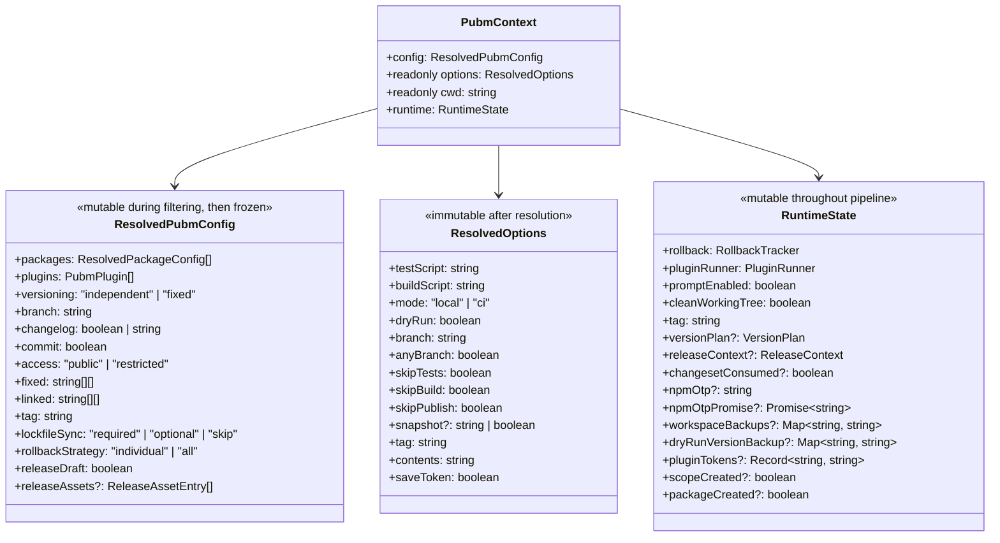

### Context Lifecycle

```
┌────────────────────────────────────────────────────────────────────────┐
│                      Context Lifecycle                                  │
└────────────────────────────────────────────────────────────────────────┘

Phase 1: Construction
  CLI args ─→ resolveOptions() ─→ ResolvedOptions (frozen)
  Config file ─→ loadConfig() ─→ resolveConfig() ─→ ResolvedPubmConfig
  PubmContext created with { config, options, cwd, runtime: {} }

Phase 2: Config Filtering (before pipeline starts)
  config.packages filtered by:
  ├─ --filter glob patterns
  ├─ --packages explicit names
  ├─ --ignore patterns
  └─ config.ignore list
  After filtering: config is effectively frozen

Phase 3: Runtime Mutation (during pipeline)
  ├─ prerequisites.ts  → sets runtime.cleanWorkingTree
  ├─ conditions.ts     → sets runtime.scopeCreated, packageCreated
  ├─ prompts.ts        → sets runtime.versionPlan, runtime.tag
  ├─ version.ts        → sets runtime.changesetConsumed
  ├─ publish.ts        → sets runtime.npmOtp, npmOtpPromise,
  │                       workspaceBackups, pluginTokens
  └─ post-publish.ts   → sets runtime.releaseContext
```

### Config Loading Strategy

```
loadConfig(cwd?, configPath?)

  File resolution order:
  1. pubm.config.ts
  2. pubm.config.js
  3. pubm.config.json
  4. pubm.config.mts
  5. pubm.config.mjs

  Loading strategy (with fallbacks):
  ┌──────────────────────────────────────────────────────────┐
  │ 1. Native import — direct ES/CJS import                 │
  │    └─ Failed? ↓                                          │
  │ 2. Bundled build — Bun.build with bundling               │
  │    └─ Failed? ↓                                          │
  │ 3. Bundled import — run bundled code with dep stubs      │
  │    └─ Failed? ↓                                          │
  │ 4. VM execution — isolated VM context (last resort)      │
  └──────────────────────────────────────────────────────────┘

  Handles optional dependencies and shims (e.g., vitest/config stubs).
```

### Version Plan Types

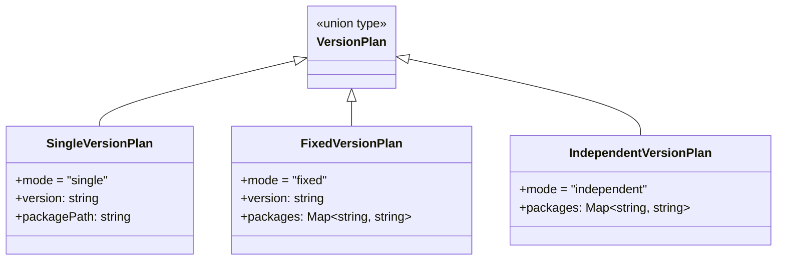

```
SingleVersionPlan:      One package, one version
  tag: "v1.2.0"

FixedVersionPlan:       All packages share the same version
  tag: "v1.2.0"
  packages: { "pkg-a" → "1.2.0", "pkg-b" → "1.2.0" }

IndependentVersionPlan: Each package has its own version
  tags: "pkg-a@1.2.0", "pkg-b@2.3.0"
  packages: { "pkg-a" → "1.2.0", "pkg-b" → "2.3.0" }
```

---

## Changeset System

### Changeset Format

```markdown
---
"packages/core": minor
"packages/pubm": patch
---

Add support for custom registries
```

### Changeset Workflow

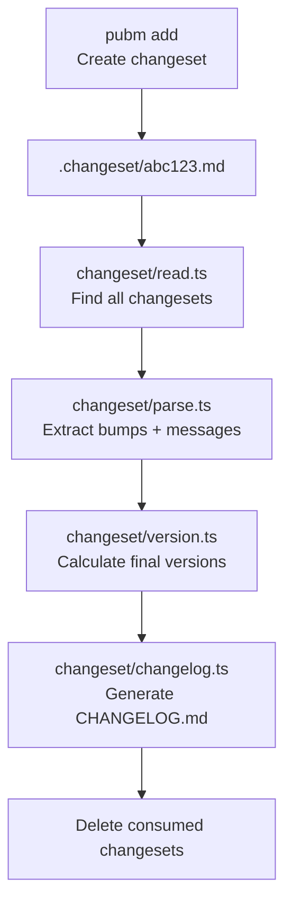

### Version Plan Types

```
SingleVersionPlan       — Single package, single version
FixedVersionPlan        — All packages get the same version
IndependentVersionPlan  — Each package versioned independently

Fixed Group:   All members get max bump (even without changesets)
Linked Group:  Only existing bumps aligned to max level
```

---

## Monorepo Support

### Workspace Detection

```
Detection order (monorepo/detect.ts):
1. pnpm-workspace.yaml        → pnpm workspaces
2. Cargo.toml [workspace]     → Cargo workspaces
3. deno.json / deno.jsonc      → Deno workspaces
4. package.json workspaces     → npm / bun / yarn workspaces
```

### Dependency Graph

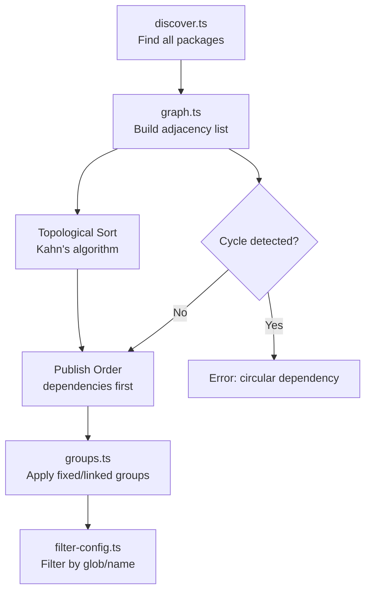

### Key Operations

| Operation | Module | Description |
|-----------|--------|-------------|
| Package discovery | `discover.ts` | Glob-based, skips `private: true` |
| Dependency graph | `graph.ts` | Adjacency list from internal deps |
| Topological sort | `graph.ts` | Kahn's algorithm, cycle detection |
| Group coordination | `groups.ts` | Fixed/linked version group resolution |
| Sibling dep updates | `ecosystem/*.ts` | Update internal dep versions |
| Lockfile sync | `ecosystem/*.ts` | Run install after version bump |

---

## Rollback System

### RollbackTracker Architecture

```typescript
interface RollbackAction<Ctx> {
  label: string                          // Human-readable description
  fn: (ctx: Ctx) => Promise<void>        // Undo function
  confirm?: boolean                      // Requires user confirmation (TTY only)
}

interface RollbackResult {
  succeeded: number
  failed: number
  skipped: number
  manualRecovery: string[]               // Steps user must do manually
}
```

### Rollback Action Registration Throughout Pipeline

```
┌────────────────────────────────────────────────────────────────────────┐
│             Rollback Actions Registered Per Phase                       │
└────────────────────────────────────────────────────────────────────────┘

Phase: Conditions
├─ npm login successful         → rollback: (no rollback, login persists)
├─ JSR scope created            → rollback: JsrClient.deleteScope(scope)
└─ JSR package created          → rollback: JsrClient.deletePackage(name)

Phase: Version Bump
├─ Manifest file modified       → rollback: writeFileSync(path, originalContent)
├─ CHANGELOG.md written         → rollback: writeFileSync(path, originalContent)
├─ git commit created           → rollback: git reset HEAD~1
└─ git tag created              → rollback: git tag -d {tag}
    (independent: one per package tag)

Phase: Publish
├─ workspace:* resolved         → rollback: restorePublishDependencies(backups)
├─ npm publish succeeded        → rollback: npm unpublish {name}@{version}
└─ crates publish succeeded     → rollback: cargo yank --vers {version}
    (jsr: no unpublish available)

Phase: Push
├─ git push --follow-tags       → rollback: git push --force origin {sha}:{branch}
│                                  (confirm: true — requires user approval)
└─ Tags pushed                  → rollback: git push origin :{tag}
    (independent: one per package tag)

Phase: GitHub Release
└─ Release created              → rollback: delete GitHub release via API
```

### Rollback Execution Flow

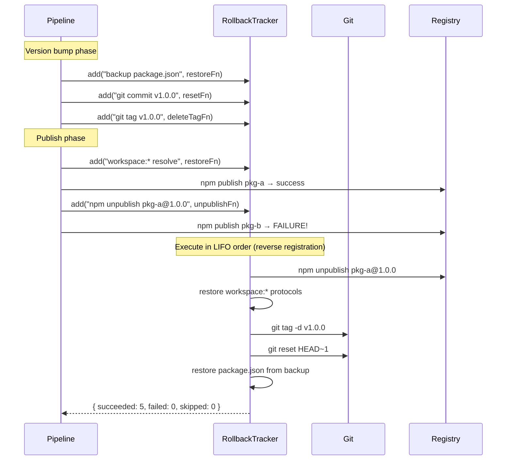

### Rollback Trigger Modes

```
┌──────────────┬────────────────────────────────────────────────────────┐
│ Trigger      │ Behavior                                              │
├──────────────┼────────────────────────────────────────────────────────┤
│ Task error   │ ctx.runtime.rollback.execute(ctx, {interactive: true})│
│              │ TTY: prompts for confirm-flagged actions               │
│              │ CI: auto-executes all actions                          │
├──────────────┼────────────────────────────────────────────────────────┤
│ SIGINT       │ ctx.runtime.rollback.execute(ctx, {sigint: true})     │
│ (Ctrl+C)     │ Skips confirm-flagged actions (no prompt possible)    │
│              │ Prints manual recovery steps for skipped actions       │
├──────────────┼────────────────────────────────────────────────────────┤
│ Dry-run      │ Version backups restored automatically                │
│              │ No rollback tracker needed (no side effects)           │
└──────────────┴────────────────────────────────────────────────────────┘

Confirm-flagged actions:
  └─ git push --force (destructive to remote) — only executes with explicit user approval
```

---

## CLI Package Architecture

### Command Structure

```
packages/pubm/src/
├── cli.ts                   Entry point (Commander program)
└── commands/
    ├── add.ts               Create changesets
    ├── changelog.ts         Generate changelog
    ├── changesets.ts         List pending changesets
    ├── init.ts              Initialize pubm config
    ├── init-prompts.ts      Interactive init wizard
    ├── init-workflows.ts    Generate CI workflow files
    ├── inspect.ts           Analyze package setup
    ├── migrate.ts           Migrate from other tools
    ├── secrets.ts           Manage registry tokens
    ├── setup-skills.ts      Install Claude Code plugin
    ├── status.ts            Show publish status
    ├── sync.ts              Sync version to files
    ├── update.ts            Self-update pubm
    └── version-cmd.ts       Show version info
```

### Binary Distribution

```
bin/cli.cjs (static wrapper)
     │
     ├── Detect platform + arch
     ├── Resolve: @pubm/<platform-arch>/bin/pubm
     └── Delegate execution to platform binary

Platform binaries built by:
  packages/pubm/platforms/<target>/build.ts
  → Bun.build({ compile: true, target: "bun-<os>-<arch>" })
```

---

## Asset Pipeline

### Six-Stage Flow

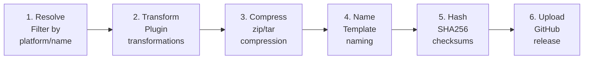

Each stage is hookable via the plugin system. Plugins can:
- Add/filter assets at resolve
- Transform assets (e.g., sign binaries)
- Override compression or naming
- Generate custom checksum manifests
- Upload to additional targets

---

## Build System

### Turborepo Pipeline

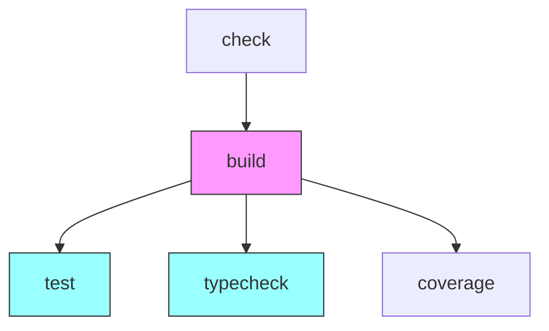

### Per-Package Build

| Package | Input | Output | Tool |
|---------|-------|--------|------|
| `@pubm/core` | `src/index.ts` | `dist/` (ESM + CJS + types) | `build.ts` (Bun) |
| `pubm` | `src/cli.ts` | `bin/cli.cjs` (wrapper) | static file |
| `@pubm/<platform>` | `src/cli.ts` | `bin/pubm` (native binary) | `Bun.build({ compile })` |
| `plugin-brew` | `src/index.ts` | `dist/` (ESM + types) | `build.ts` (Bun) |
| `plugin-external-version-sync` | `src/index.ts` | `dist/` (ESM + types) | `build.ts` (Bun) |

### Notable Build Details

- **listr2**: Bundled and patched (`patches/listr2.patch`) to avoid dependency issues
- **Platform binaries**: 12 targets cross-compiled via Bun's `--compile --target` flag
- **Global dependency**: `packages/pubm/package.json` is a Turbo global dependency (version changes trigger full rebuild)
