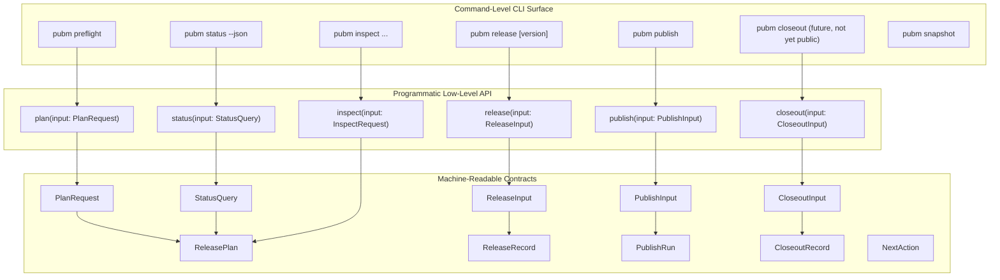

# Low-Level External Interface Design

**Date:** 2026-04-22  
**Status:** Draft  
**Scope:** Low-level release-platform interface for the post-migration architecture

This design defines the externally visible contracts between:

- the user-facing CLI (`pubm`),
- CI automation/backends,
- custom integrations (Web/API clients, automation services),
- and plugin/adapter authors.

It sits above engine internals and below user-level UX. The architecture rule remains:
no giant session object, no command context leakage, and each boundary uses
typed artifacts.

## Consumers and Their Responsibilities

- CLI adapter (`packages/pubm`)
  - Owns command parsing, flag normalization, i18n text output, and user prompts.
  - Binds user intent to `*Request` contracts and calls low-level services.
  - Maps exit codes to command semantics.
- CI automation
  - Uses command-level machine-readable outputs and status polling as orchestration input.
  - Calls `pubm preflight`, `pubm release`, `pubm publish`, and `pubm status --json`.
- Webapp / backend services
  - Use the programmatic interface (or wrapped CLI contracts) to inspect and drive
    publish workflows from server-side workflows and queues.
  - Rely on `StatusQuery` and `StatusEnvelope`.
- Custom tooling and SDK users
  - Use `@pubm/core` low-level API services directly.
  - Prefer idempotent calls and explicit `from` selectors.
- Plugin/adapter authors (relevant for next stage)
  - Consume stable platform records (`ReleasePlan`, `ReleaseRecord`, `PublishRun`, `CloseoutRecord`)
    and provide adapters that emit target/adapter metadata and perform publish/distribution/closeout work.

## Public Surface Layers



## Stability Tiers

### Stable (public, supported)

- `PlanRequest`
- `ReleaseInput`
- `PublishInput`
- `CloseoutInput`
- `StatusQuery`
- `ReleasePlan`
- `ReleaseRecord`
- `PublishRun`
- `CloseoutRecord`
- `NextAction`
- `StatusEnvelope`
- `ErrorEnvelope` (machine format)

### Experimental (opt-in)

- `InspectRequest`
- `InspectResult`
- `ExecutionState` projection APIs
- non-core target/protocol extension hooks that are not yet tied to stable plugin SPI
- dedicated `closeout` CLI command behavior (implementation is complete internally; CLI command remains not yet default public)

### Internal (not for external import)

- `ReleaseUnit`
- `SourceMutationSet`
- `TargetContract`
- `ArtifactSpec`
- `TargetCapabilities`
- `TargetState` and retry attempt internals
- orchestration/runtime context helpers and recovery plan internals

## Contract Profiles

### 1) PlanRequest (stable)

Command-level invocation contract for `preflight` and `snapshot`.

```ts
type WorkflowKind = "one-shot" | "split-ci" | "release-pr";
type ExecutionMode = "local" | "ci";

type PlanRequest =
  | { command: "preflight"; input: PreflightPlanRequest }
  | { command: "snapshot"; input: SnapshotPlanRequest };

type PreflightPlanRequest = {
  workflowKind: WorkflowKind;
  executionMode: ExecutionMode;
  versionSourceStrategy: "all" | "changesets" | "commits";
  tagStrategy: {
    requestedTag?: string;
    registryQualifiedTags: boolean;
  };
  explicitVersion?: string;
  scope?: {
    packageKeys?: string[];
    filters?: string[];
  };
  includeTargets?: {
    allowRegistry?: string[];
    allowDistribution?: string[];
  };
  prompts?: {
    allowPrompts: boolean;
    allowInteractiveSecrets: boolean;
    allowVersionChoicePrompt: boolean;
  };
  validation?: {
    test?: boolean;
    build?: boolean;
    prereleaseChecks?: boolean;
  };
  locale?: string;
};

type SnapshotPlanRequest = Omit<
  PreflightPlanRequest,
  "executionMode" | "prompts"
> & {
  executionMode: "local";
  scope: {
    includeAllPackages?: boolean;
  };
};
```

### 2) ReleaseInput (stable)

Minimal release handoff from plan -> release slice.

```ts
type ReleaseInput = {
  requestId: string;
  plan: ReleasePlan;
  repo: {
    cwd: string;
    branch: string;
    commitSha: string;
  };
  runContext: {
    allowDirtyTree: boolean;
    executionMode: ExecutionMode;
    invocationId?: string;
  };
};
```

### 3) PublishInput (stable)

Narrow publish command contract from CLI, CI, or automation.

```ts
type PublishInput = {
  requestId: string;
  workflowKind: WorkflowKind;
  executionMode: ExecutionMode;
  from: {
    releaseRecordId?: string;
    planId?: string;
    tag?: string;
  };
  scope?: {
    includeTargetKeys?: string[];
    includeKinds?: Array<"registry" | "distribution">;
    includeUnitKeys?: string[];
  };
  retry?: "failed" | "all";
  closeoutMode?: "auto" | "skip";
  continuePublishOnSoftFailure?: boolean;
};
```

Constraints:

- `from` resolves exactly one lineage (exactly one of `releaseRecordId`, `planId`, `tag`).
- scope filters cannot broaden beyond `ReleaseRecord`.

### 4) CloseoutInput (stable service contract)

Used by internal orchestration or plugin integrations; public CLI exposure can be added later.

```ts
type CloseoutInput = {
  requestId: string;
  publishRunId: string;
  releaseRecordId: string;
  closeoutScope?: {
    includeCloseoutKeys?: string[];
    includeKinds?: Array<"github_release" | "notification" | "deploy" | "assets">;
    forceTargets?: string[];
  };
  includeDistributionArtifacts?: boolean;
  retry?: "failed" | "all";
};
```

### 5) StatusQuery (stable)

Machine surface for automation and web backends.

```ts
type StatusQuery = {
  requestId: string;
  releaseRecordId?: string;
  publishRunId?: string;
  scope?: "latest" | "all";
  includeHistory?: boolean;
  includeTargets?: boolean;
  includePlan?: boolean;
  since?: string; // ISO timestamp
};
```

### 6) Core artifacts (stable)

```ts
type ReleasePlan = {
  schemaVersion: "1";
  id: string;
  createdAt: string;
  command: "preflight" | "snapshot";
  commitSha: string;
  configHash: string;
  state: "planned" | "invalid";
  units: ReleaseUnit[];
  validation: ValidationSummary;
  versionDecisions: Array<{
    unitKey: string;
    selectedVersion: string;
    source: string;
  }>;
  targetPlans: Array<{
    unitKey: string;
    targetKey: string;
    targetKind: "registry" | "distribution";
    adapterKey: string;
    orderGroup: string;
    requiredForCloseout: boolean;
  }>;
};

type ReleaseRecord = {
  schemaVersion: "1";
  id: string;
  planId: string;
  proposalId?: string;
  releaseSha: string;
  branch: string;
  tags: string[];
  unitVersions: Array<{ unitKey: string; version: string }>;
  publishTargets: PublishTargetRef[];
  closeoutTargets: CloseoutTargetRef[];
  manifestDigest: string;
  changelogDigest: string;
  policyWriteDigest: string;
  mutationDigest: string;
  createdAt: string;
  state:
    | "materializing"
    | "materialized"
    | "partially_materialized"
    | "failed_before_release"
    | "recovery_handoff"
    | "released";
};

type PublishRun = {
  schemaVersion: "1";
  id: string;
  releaseRecordId: string;
  startedAt: string;
  completedAt?: string;
  state: "running" | "partial" | "published" | "failed" | "compensated";
  requested: PublishInput;
  targetStates: Array<TargetExecutionState>;
  artifactBundleRefs: string[];
  nextAction: NextAction;
};

type CloseoutRecord = {
  schemaVersion: "1";
  id: string;
  releaseRecordId: string;
  publishRunId: string;
  startedAt: string;
  completedAt?: string;
  state: "closed" | "partial" | "failed";
  performedKinds: string[];
  nextAction: NextAction;
};

type NextAction = "release" | "publish" | "publish_retry_failed" | "publish_retry_all" | "resume_recovery" | "none";
```

`ReleaseUnit`, `PublishTargetRef`, `CloseoutTargetRef`, `TargetExecutionState`,
and `ValidationSummary` remain:

- in current phase, internal-facing artifacts for interoperability.
- should be versioned alongside stable records because they are part of durable persistence.

## Exported Operations (Minimal Signatures)

`low-level` service contracts are intentionally narrow and explicit:

```ts
interface PlanService {
  prepare(request: PlanRequest): Promise<Result<ReleasePlan, ErrorEnvelope>>;
}

interface ReleaseService {
  runRelease(input: ReleaseInput): Promise<Result<ReleaseRecord, ErrorEnvelope>>;
}

interface PublishService {
  runPublish(input: PublishInput): Promise<Result<PublishRun, ErrorEnvelope>>;
}

interface CloseoutService {
  runCloseout(input: CloseoutInput): Promise<Result<CloseoutRecord, ErrorEnvelope>>;
}

interface StatusService {
  query(input: StatusQuery): Promise<Result<StatusEnvelope, ErrorEnvelope>>;
}
```

Auxiliary services:

- `InspectService.inspectPackages()` and `InspectService.inspectTargets()` remain supported as operational tools.
- `PlanService.prepare` is called by `pubm preflight` and internal CI preparation flows.
- `ReleaseService.runRelease` is called by `pubm release` and split-CI handoff logic.
- `PublishService.runPublish` is called by `pubm publish` and can be resumed.
- `StatusService.query` is the canonical observability surface.

## Status Envelope and JSON Surface

Machine responses use a consistent envelope to keep automation integration stable:

```ts
type Result<T, E> = { ok: true; data: T } | { ok: false; error: E };

type ErrorEnvelope = {
  code: string;
  kind: "validation" | "state" | "io" | "dependency" | "auth" | "internal";
  message: string;
  nextAction?: NextAction;
  retryAfterSeconds?: number;
  targetKey?: string;
  field?: string;
  requestId?: string;
  command?: string;
  causedBy?: string;
};

type StatusEnvelope = {
  schemaVersion: "1";
  requestId: string;
  generatedAt: string;
  releaseRecordId?: string;
  publishRunId?: string;
  closeoutRecordId?: string;
  releaseState?: ReleaseRecord["state"];
  publishState?: PublishRun["state"];
  closeoutState?: CloseoutRecord["state"];
  failedTargets?: Array<{
    targetKey: string;
    phase: "release" | "publish" | "closeout";
    state: "failed" | "partial";
    reason: string;
  }>;
  nextAction: NextAction;
};
```

Serialization expectations:

- JSON is UTF-8, line-oriented when printed to stdout/stderr.
- All path-like values use `/` separators.
- Timestamps are ISO-8601 UTC (`YYYY-MM-DDTHH:mm:ss.sssZ`).
- IDs are opaque strings, stable for each artifact/run lineage.
- No secrets, raw tokens, or credentials are serialized.
- Contracts must be deterministically serializable (no `Map`, no cyclic references).

CLI command expectations:

- `--json` returns strictly contract JSON objects.
- Non-JSON mode may return user-friendly text but must preserve the same result codes.
- `pubm status` and `pubm preflight` are default machine-relevant commands; output is stable on `--json`.

## Error Model Expectations

- Input errors are explicit validation failures with `kind: "validation"` and should never leak stack traces in JSON.
- Workflow conflicts return `kind: "state"` and include `nextAction` when recovery is possible.
- Retryable transport or transient target failures return `kind: "dependency"` or `kind: "io"` with `retryAfterSeconds`.
- Auth failures return `kind: "auth"` and include the failed `targetKey` if applicable.
- Internal errors are `kind: "internal"` and should include `requestId` for support correlation.

Expected command/result behavior:

- `plan` failures:
  - malformed request -> validation error
  - outdated checkout/plan mismatch -> state error
- `release` failures:
  - partial materialization -> state error with a recoverable `nextAction`.
- `publish` failures:
  - target-level hard failure -> `publishRun.state = partial`, `nextAction = publish_retry_failed`.
  - non-recoverable orchestration failure -> `state = failed`, actionable reason.
- `status` always reports explicit `nextAction` and latest state if known; status call itself should avoid mutating state.

## Contract Versioning Policy

- All stable contracts include `schemaVersion` and are subject to semantic versioning in the release package.
- Additive changes:
  - adding optional fields
  - adding new enum members
  - adding new service methods (with defaults)  
  are non-breaking and may land in patch/minor depending on impact.
- Breaking changes:
  - removing/renaming required fields,
  - changing field meaning,
  - changing error code semantics for existing clients  
  require major release and migration notes.
- Experimental contracts may change without guarantee in minor versions until promoted to stable.

## What Not to Expose Yet

- The old process-level shared runtime/session object and mutable `ctx` bag.
- Plugin hook internals and task graphs from legacy phase pipeline.
- `Recovery` internals, rollback closures, and in-memory execution stacks.
- raw internal adapter host contexts and unbounded plugin command registration beyond stable SPI.
- Proposal transport and private closeout orchestration details beyond `CloseoutInput` and `CloseoutRecord`.

## Mapping to Current Architectural Decisions

- Separate service inputs: `PlanRequest`, `ReleaseInput`, `PublishInput`, `CloseoutInput`, `StatusQuery` replace shared-session handoffs.
- Stable records flow between slices:
  `Plan -> ReleasePlan -> ReleaseRecord -> PublishRun -> CloseoutRecord`.
- `closeout` remains separate from `publish` as a distinct service and record lineage.
- `pubm status` is the canonical observability command; status includes state and `nextAction`.
- typed artifacts are immutable snapshots and are the only durable handoff across process boundaries.
