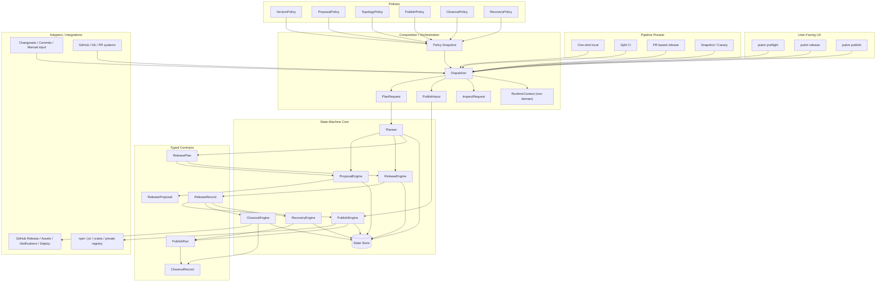
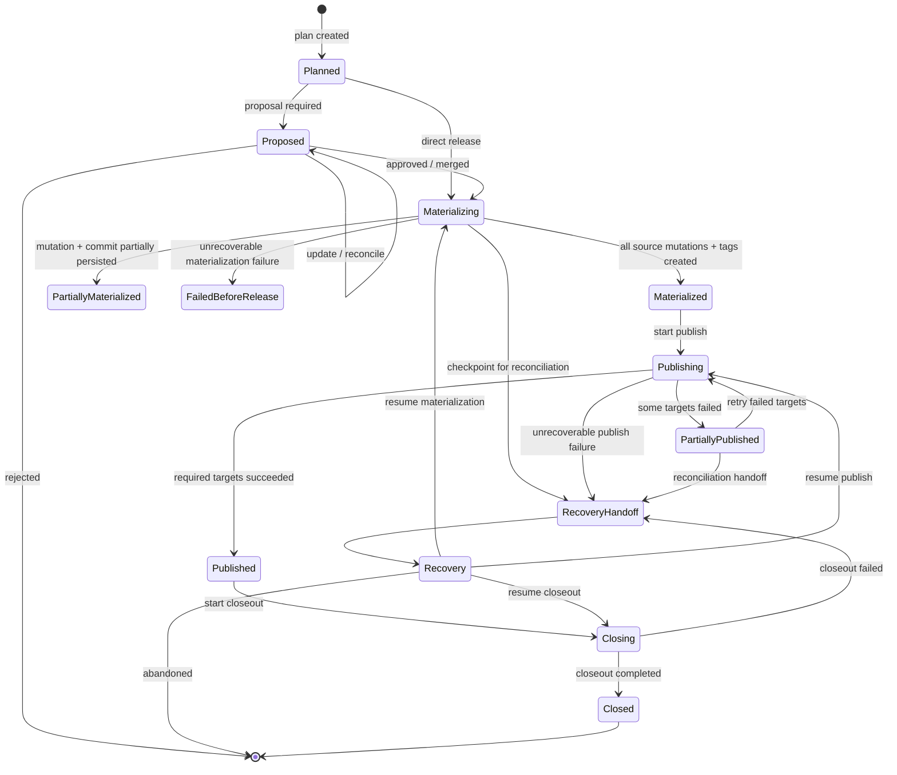
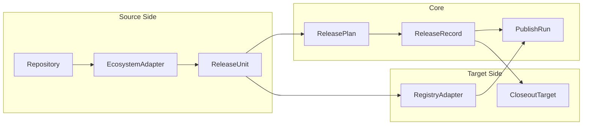
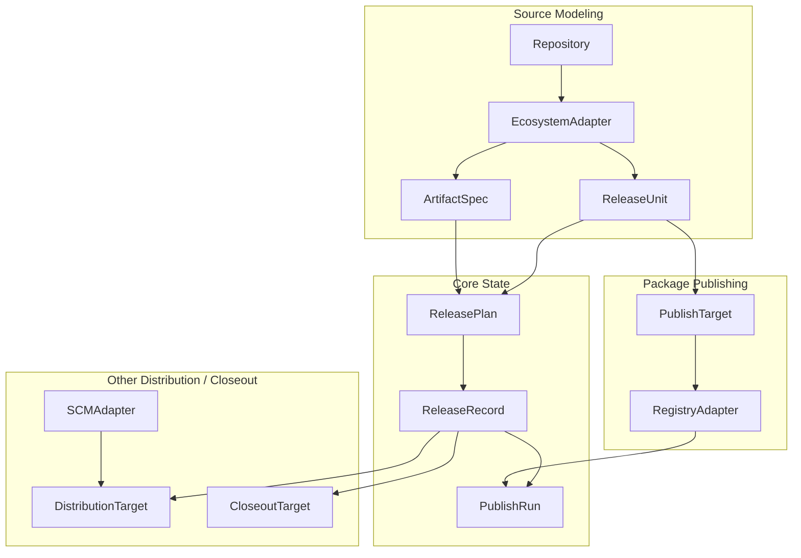
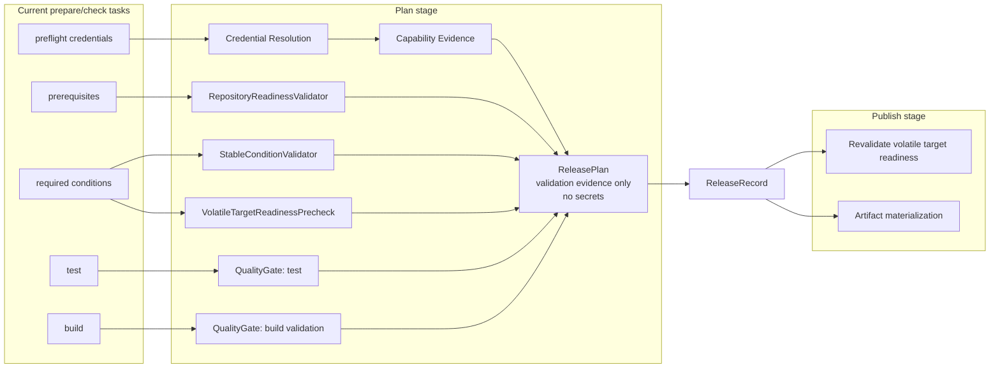

# Release Platform Architecture

**Date:** 2026-04-22
**Status:** Draft

## Goal

Redesign `pubm` from a single publish pipeline into a release platform that can:

- preserve a simple `preflight / release / publish` UX
- support deeper internal workflow states
- cover one-shot local flows and split CI flows
- model PR-based workflows such as `release-please`
- keep extensibility without collapsing into a pile of unrelated features

## Architecture Boundary

This architecture uses one hard rule:

- core domain slices exchange **typed artifacts** (for example `ReleasePlan`, `ReleaseRecord`, `PublishRun`, `ReleaseProposal`, `CloseoutRecord`).
- commands, workflow presets, and CLI entrypoints are composition only; they create orchestration envelopes and dispatch.
- composition boundaries use narrow slice-specific request contracts, not one large monolithic orchestration object.
- any shared `session` concept is runtime/orchestration-only and must remain out of domain contracts.

```ts
type PlanRequest =
  | { command: "preflight"; request: PreflightPlanRequest }
  | { command: "release"; request: ReleasePlanRequest }
  | { command: "snapshot"; request: SnapshotPlanRequest };
```

`PreflightPlanRequest`, `ReleasePlanRequest`, and `SnapshotPlanRequest`
are defined in [plan-slice-detailed-design](./2026-04-22-plan-slice-detailed-design.md) and represent planning-entry contracts.
`PublishInput` and `InspectRequest` are separate publish and inspect slice contracts.
`ReleaseInput` is the release-slice contract and is defined in
[release-slice-detailed-design](./2026-04-22-release-slice-detailed-design.md).

Each request shape is narrow and carries only command-relevant intent. Domain engines consume typed inputs (`PlanRequest`, `ReleaseInput`, `PublishInput`, `InspectRequest`) from orchestration, not shared session-style state.

## Core View

The user-facing model can stay simple:

- `preflight`
- `release`
- `publish`

But the internal core needs a richer state machine:

- `Plan`
- `Propose`
- `Release`
- `Publish`
- `Closeout`

`Recovery` is cross-cutting and can resume or compensate from failed states.

## Architecture



## State Machine



The release half of this state machine maps to `ReleaseRecordState`:

- `Materializing` -> `materializing`
- `Materialized` -> `materialized`
- `PartiallyMaterialized` -> `partially_materialized`
- `FailedBeforeRelease` -> `failed_before_release`
- `RecoveryHandoff` -> `recovery_handoff`

## Domain Objects

```ts
type ReleaseRecordState =
  | "materializing"
  | "materialized"
  | "partially_materialized"
  | "failed_before_release"
  | "recovery_handoff"
  | "released";

type NextAction =
  | "release"
  | "publish"
  | "publish_retry_failed"
  | "publish_retry_all"
  | "resume_recovery"
  | "none";

type ReleasePlan = {
  id: string;
  commitSha: string;
  configHash: string;
  units: ReleaseUnit[];
  targets: TargetSelection[];
  versionDecisions: VersionDecision[];
  changelogPreview: ChangelogPreview[];
  validation: ValidationEvidence;
  policyDigest: string;
};

type ProposalKind = "release_pr" | "preview_branch" | "manual_approval";

type ReleaseProposal = {
  id: string;
  planId: string;
  kind: ProposalKind;
  state: "open" | "updated" | "approved" | "rejected" | "merged";
  reviewUrl?: string;
};

type ReleaseRecord = {
  id: string;
  planId: string;
  proposalId?: string;
  releaseSha: string;
  branch: string;
  tags: string[];
  manifestDigest: string;
  changelogDigest: string;
  policyDigest: string;
  mutationDigest: string;
  unitVersions: {
    unitKey: string;
    version: string;
  }[];
  publishTargets: {
    unitKey: string;
    packagePath: string;
    targetKey: string;
    targetKind: "registry" | "distribution";
    adapterKey: string;
    orderGroup: string;
    orderIndex: number;
    artifactRef: string;
    artifactSpecRef: string;
    requiredForCloseout: boolean;
    requiredForProgress: boolean;
    closeoutDependencyKey?: string;
  }[];
  closeoutTargets: {
    closeoutKind: "githubRelease" | "notification" | "assets" | "deploy" | string;
    unitKey: string;
    targetKey: string;
    enabled: boolean;
    requiredForCloseout?: boolean;
  }[];
  createdAt: string;
  state: ReleaseRecordState;
};

type PublishRun = {
  id: string;
  releaseRecordId: string;
  targetStates: TargetState[];
  state: "running" | "partial" | "published" | "failed" | "compensated";
};

type CloseoutRecord = {
  id: string;
  releaseRecordId: string;
  state: "closed" | "partial" | "failed";
};

`releaseRecordId` fields in `PublishRun` and `CloseoutRecord` are explicit foreign keys to `ReleaseRecord.id`.

type ValidationEvidence = {
  repositoryReadiness: RepositoryReadinessEvidence;
  credentialResolution: CredentialResolutionEvidence[];
  capabilityEvidence: CapabilityEvidence[];
  stableConditions: StableConditionEvidence[];
  volatileTargetReadiness: VolatileTargetReadinessEvidence[];
  qualityGates: QualityGateEvidence[];
};

type RepositoryReadinessEvidence = {
  validator: "RepositoryReadinessValidator";
  branchPolicySatisfied: boolean;
  remotePolicySatisfied: boolean;
  workingTreeSatisfied: boolean;
  observedAt: string;
};

type CredentialResolutionEvidence = {
  targetKey: string;
  mechanism: "env" | "oidc" | "keychain" | "ci_secret";
  resolvedAt: string;
};

type CapabilityEvidence = {
  targetKey: string;
  checks: Array<"auth" | "publish_scope" | "dry_run">;
  observedAt: string;
};

type StableConditionEvidence = {
  key: string;
  satisfied: boolean;
};

type VolatileTargetReadinessEvidence = {
  targetKey: string;
  check: "version_available" | "registry_reachable" | "quota_ok" | "target_open";
  observedAt: string;
  mustRevalidateAtPublish: true;
};

type QualityGateEvidence = {
  gate: "test" | "build_validation";
  status: "passed" | "failed" | "skipped";
  observedAt: string;
};
```

`ReleaseRecordState` drives `ReleaseRecord.state` and status progression around materialization.
`NextAction` is the machine-action enum for `status --json`.

`ValidationEvidence` is evidence, not material. `ReleasePlan` can record that credentials were resolved and what capabilities were observed, but it must never persist secrets, raw tokens, or other credential material.

This makes each core step an explicit artifact handoff instead of shared mutable context:

- `Plan` accepts a narrow `PlanRequest` from orchestration and outputs a `ReleasePlan`.
- `Release` consumes `ReleasePlan` and outputs a `ReleaseRecord`.
- `Publish` consumes `ReleaseRecord` and outputs `PublishRun`.
- `Closeout` consumes `PublishRun` and outputs `CloseoutRecord`.

## Ecosystem And Registry

`Ecosystem` and `Registry` should both remain, but not as pipeline phases.

They should become separate adapter axes:

- `Ecosystem` = source-side packaging and workspace semantics
- `Registry` = package distribution target

They solve different problems and should not be merged.

### Keep `Ecosystem`

`Ecosystem` owns package semantics:

- manifest discovery
- workspace and package graph discovery
- package identity
- version read/write rules
- workspace protocol resolution
- build / pack semantics
- artifact production inputs

Examples:

- JavaScript ecosystem
- Rust ecosystem
- future ecosystems

### Keep `Registry`

`Registry` owns package publication semantics:

- auth and capability checks
- package existence / availability checks
- dry-run capability
- publish
- already-published detection
- channel / dist-tag support
- compensation support such as unpublish or yank when possible

Examples:

- npm
- jsr
- crates.io
- private package registries

### Add Separate Concepts For Non-Registry Targets

Do not overload `Registry` with everything.

Keep these separate:

- `ProposalTarget` or `SCMAdapter`
  - GitHub PR
  - Git provider operations
- `CloseoutTarget`
  - GitHub Release
  - release assets
  - notifications
  - deployment triggers

If `Registry` starts owning PRs, GitHub Releases, Homebrew tap updates, and notifications, it will become meaningless.

## How Ecosystem And Registry Bind To The New Core



## Ecosystem + Registry Composition



### Interpretation

- `EcosystemAdapter` describes what a releasable unit is and how artifacts are derived.
- `RegistryAdapter` publishes package units to package registries.
- `DistributionTarget` handles non-registry distribution channels that may depend on assets, SCM flows, or catalog updates.
- `CloseoutTarget` handles public announcement and post-publish bookkeeping.

This keeps `Ecosystem` and `Registry` meaningful while leaving room for non-registry targets.

### Binding Model

The key relation is:

- one `ReleaseUnit` belongs to one `Ecosystem`
- one `ReleaseUnit` can publish to many `Registry` targets
- one `ReleaseRecord` can feed many `CloseoutTarget`s

That implies a structure like:

```ts
type ReleaseUnit = {
  key: string;
  ecosystem: string;
  packagePath: string;
  packageName: string;
};

type PublishTarget = {
  unitKey: string;
  targetKind: "registry";
  registryKey: string;
};

type CloseoutTarget = {
  targetKind: "github_release" | "assets" | "notification" | "deploy";
};
```

## Engine Responsibilities

### Planner

Inputs:

- one normalized `PlanRequest` from orchestration (`PreflightPlanRequest`, `ReleasePlanRequest`, `SnapshotPlanRequest`)
- `Ecosystem` to discover packages, graphs, manifests, and versionable units
- `Registry` to resolve credentials into non-secret evidence, gather capability evidence, and precheck target readiness
- `RepositoryReadinessValidator` and quality gates to validate repository state, tests, and build validation

Produces:

- `ReleasePlan` with immutable validation evidence

### ProposalEngine

Inputs:

- `ReleasePlan`
- `SCMAdapter`

Produces:

- `ReleaseProposal`

### ReleaseEngine

Inputs:

- `ReleasePlan`
- optional `ReleaseProposal`
- `Ecosystem` to materialize manifests and version changes
- `SCMAdapter` to commit, tag, merge, or create release records

Produces:

- `ReleaseRecord`

### PublishEngine

Inputs:

- `ReleaseRecord`
- `PublishInput` (run selection + retry/closeout mode)
- `Target capabilities` loaded from adapter metadata (via `adapterKey`)
- `Ecosystem` to build or pack publishable artifacts
- `Registry` to publish each unit/target pair

Produces:

- `PublishRun`

### CloseoutEngine

Inputs:

- `PublishRun`
- `ReleaseRecord`
- `CloseoutTarget`

Produces:

- `CloseoutRecord`

## Brew Classification

### Short Position

`Brew` can be modeled as a first-class publish target, but it should probably not be modeled as a `Registry`.

The better long-term fit is:

- `RegistryAdapter` for package registries such as npm, jsr, crates, private registries
- `DistributionTarget` for channels such as Homebrew tap/core, winget manifests, scoop buckets, apt repo metadata, Docker image promotion, or CDN/catalog updates

### Why Not Call Brew A Registry?

Because the abstraction boundary becomes less truthful.

Homebrew publishing, especially the current `plugin-brew` implementation, is not primarily:

- uploading a package to a registry API
- checking whether a semver already exists in a package namespace
- publishing directly from an ecosystem manifest

It is primarily:

- consuming release assets
- generating or updating a formula
- cloning or modifying another repository
- pushing a branch or opening a PR
- depending on SCM access and review workflow

Those are distribution-catalog operations, not package-registry operations.

### Why It Is Still Tempting To Treat Brew Like A Registry

Because at the workflow level, it behaves like a publish target:

- it is part of the release distribution surface
- it has credentials and preflight checks
- it can succeed or fail independently
- it needs retry, compensation, and status tracking
- users may want to say "publish to npm + jsr + brew"

That instinct is valid.

The mistake is not making Brew first-class.
The mistake is making `Registry` the name of that first-class abstraction.

### Recommended Direction

If pubm wants a broader platform abstraction, distinguish publishable targets from closeout targets:

Then model targets like this:

```ts
type PublishableTargetKind = "registry" | "distribution";

type PublishTarget =
  | { kind: "registry"; key: "npm" | "jsr" | "crates" | string }
  | { kind: "distribution"; key: "brew" | "winget" | "scoop" | string };

type CloseoutTargetKind = "github_release" | "notify" | "assets" | "deploy";

type CloseoutTarget = { kind: CloseoutTargetKind; key: string };
```

In that model:

- `brewTap` is a `distribution` target
- `brewCore` is a `distribution` target with stronger SCM/approval semantics
- GitHub Release remains a `closeout` target

### Philosophy Fit

For `pubm`'s direction, the cleaner philosophy is:

- do not force every outward release action into `Registry`
- do make every outward release action a first-class target with state, policy, and retry semantics

That preserves the product story:

- `pubm` releases software to many channels
- some channels are registries
- some channels are installer catalogs
- some channels are announce/closeout surfaces

This is more future-proof than teaching users that "Homebrew is a registry" when the actual mechanics are PRs, formula repos, and release assets.

## Current Feature Mapping

| Current concern | New home |
|---|---|
| `preflight credentials` | Planner `Credential Resolution` + `Capability Evidence` |
| `prerequisites` | Planner `RepositoryReadinessValidator` |
| `required conditions` (stable) | Planner stable-condition validators |
| `required conditions` (volatile) | Planner precheck + Publish revalidation |
| `test` | Planner quality gate |
| `build` (validation) | Planner quality gate |
| `build` (artifact materialization) | PublishEngine via `Ecosystem` |
| changesets / commit analysis | VersionPolicy inside Planner |
| changelog preview | Planner |
| manifest version bump | ReleaseEngine via Ecosystem |
| changelog write | ReleaseEngine |
| commit / tag | ReleaseEngine via SCMAdapter |
| release PR | ProposalEngine |
| npm / jsr / crates publish | PublishEngine via Registry |
| GitHub Release / release assets | CloseoutEngine |
| rollback / retry / compensation | RecoveryEngine |

## Prepare/Check Task Remapping

The current `prepare` and `check` surface mixes repository facts, external target facts, and quality gates into a single bundle. The new architecture should separate those concerns so split-CI handoff is explicit instead of implicit.



### Mapping Rules

- `preflight credentials` should become two planner outputs:
  - `Credential Resolution`: prove that the configured mechanism can resolve usable credentials for each target.
  - `Capability Evidence`: prove what those resolved credentials are allowed to do.
- Invariant: `ReleasePlan` never stores secrets, tokens, or raw credential material. It stores only non-secret evidence such as mechanism, target, observed capability summary, timestamps, and pass/fail results.

- `prerequisites` should become `RepositoryReadinessValidator` in `Plan`.
  - This is where branch policy, remote policy, working tree cleanliness, and commit anchoring live.
  - These checks are stable relative to `commitSha` and `configHash`, so they belong in `ReleasePlan` evidence.

- `required conditions` should split into two categories:
  - Stable conditions: conditions whose truth is anchored by the planned repository state and policy snapshot. These live in `Plan`.
  - Volatile target readiness: conditions that can change between planning and publish, such as registry reachability, version availability, mutable permission state, or target openness.
  - Volatile checks should still be prechecked in `Plan` to fail fast, but they must be revalidated in `Publish` before external side effects.

- `test` is a `Plan` quality gate.
  - It answers whether the release candidate is acceptable, not whether an external target is currently ready.

- `build` must split into two different responsibilities:
  - `build validation` in `Plan`: prove that the release input can build and that the expected artifact spec is satisfiable.
  - `artifact materialization` in `Publish`: produce the actual artifacts that will be uploaded or attached.
  - `Publish` can verify that materialized artifacts still match the planned artifact spec, but it should not treat artifact creation as a substitute for the earlier build quality gate.

### Split-CI Timing Consequence

In split CI, the handoff is not "prepare already did everything." The timing must be:

1. `Plan` runs repository readiness validation, credential resolution, capability evidence gathering, stable-condition validation, volatile prechecks, tests, and build validation.
2. `Release` freezes the source mutation set and emits the `ReleaseRecord`.
3. `Publish` rehydrates fresh credentials, revalidates volatile target readiness, materializes artifacts, and then performs external side effects.

This timing distinction is why stable conditions belong in `ReleasePlan`, while volatile readiness must be checked twice: once to fail fast during planning and once to prove the target is still publishable at execution time.

## Representative Workflows

### One-Shot Local

```text
Plan -> Release -> Publish -> Closeout
```

### Split CI

```text
Plan -> Release
              -> Publish -> Closeout
```

### PR-Based Release (`release-please` style)

```text
Plan -> Propose -> Release -> Publish -> Closeout
```

### Snapshot / Canary

```text
Plan(snapshot policy) -> Release(ephemeral or lightweight) -> Publish -> Closeout(optional)
```

## Design Invariants

- `ReleasePlan` is immutable and replayable.
- `ReleasePlan` never stores secrets; it stores only non-secret readiness and capability evidence.
- `ReleaseProposal` is reviewable and updateable.
- `ReleaseRecord` is the source of truth for a release.
- Stable conditions can be trusted from `Plan` when they are anchored to the planned repository state and policy snapshot.
- Volatile target readiness must be prechecked in `Plan` and revalidated in `Publish`.
- `PublishRun` tracks state per target, not just globally.
- `build validation` and `artifact materialization` are separate responsibilities.
- `Closeout` must depend on publish outcomes, not run independently.
- `Ecosystem` is not a target concept.
- `Registry` is not a proposal or closeout concept.

## Recommendation

Keep `Ecosystem` and `Registry`, but narrow their meanings.

- `Ecosystem` should remain the source-side package semantics boundary.
- `Registry` should remain the package publication boundary.
- PR systems and Git operations should move into `SCMAdapter`.
- GitHub Release, assets, notifications, and deploy hooks should move into `CloseoutTarget`.

This keeps the architecture modular enough to support:

- the current one-shot `pubm` flow
- split CI
- PR-based workflows like `release-please`
- future hosted/platform execution
