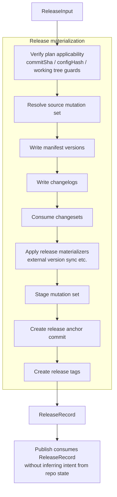
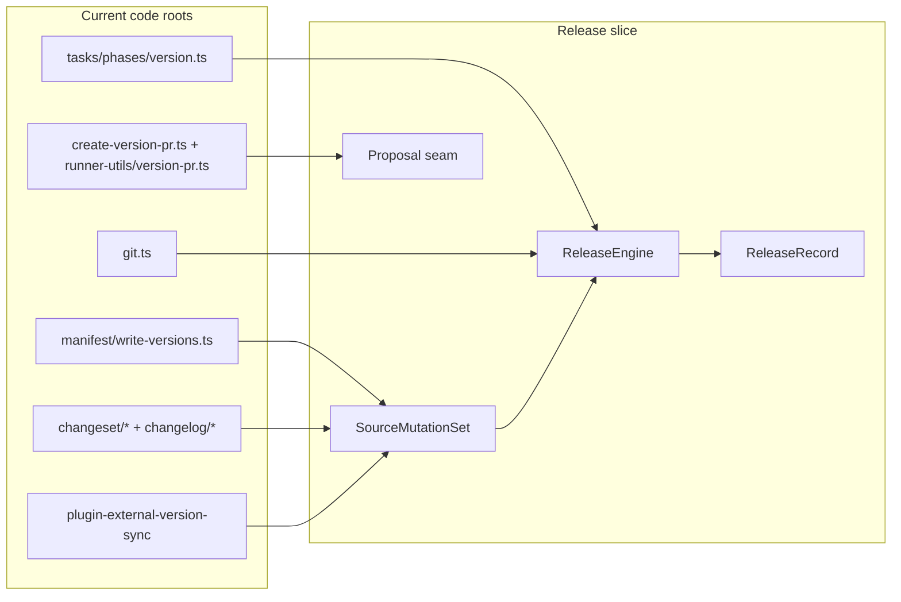

# Release Slice Detailed Design

**Date:** 2026-04-22  
**Status:** Draft  
**Scope:** Second concrete design slice after the planning layer: `ReleaseEngine`, source mutation set, `ReleaseRecord`, optional proposal seam, and `Release -> Publish` handoff.

**Depends on:**

- [release-platform-architecture](./2026-04-22-release-platform-architecture.md)
- [low-level-migration-scope-plan](./2026-04-22-low-level-migration-scope-plan.md)
- [plan-slice-detailed-design](./2026-04-22-plan-slice-detailed-design.md)
- [pubm-self-hosting-pipeline-comparison](./2026-04-22-pubm-self-hosting-pipeline-comparison.md)

## Goal

This slice defines how `Release` materializes a previously accepted `ReleasePlan` into durable source-of-truth state.

It replaces the current pattern where:

- `version.ts` writes manifests/changelogs and creates commits/tags
- runtime flags and mutated config define release scope
- CI later reconstructs intent from repo state

with an explicit contract:

```text
ReleaseInput (typed release snapshot + plan) -> ReleaseEngine -> ReleaseRecord -> Publish
```

This slice is about source mutation and release anchoring only.

It is **not** about:

- registry publish execution
- artifact ownership beyond release-time references
- `ExecutionState` / retry persistence
- plugin API redesign

## Release Materialization Pipeline



## Current Sources Feeding The Release Slice



## ReleaseEngine

`ReleaseEngine` is the owner of all durable source mutations that turn a `ReleasePlan` into a releasable source-of-truth state.

### ReleaseInput

`ReleaseEngine` consumes a single typed input object, not a shared runtime context bag.
`ReleaseInput` is the release-slice boundary contract defined here, and it is referenced by external and architecture docs as the only release handoff contract.
It is intentionally narrow and should never be expanded into a broad orchestration/session shape.

```ts
type ReleaseInput = {
  plan: ReleasePlan;
  repo: {
    cwd: string;
    commitSha: string;
    branch: string;
  };
  runContext: {
    allowDirtyTree: boolean;
    invocationId?: string;
  };
};
```

### What Release owns

- consuming one immutable `ReleaseInput` (`plan` and repo/applicability snapshot)
- verifying `ReleaseInput.plan` still applies
- deriving the exact source mutation set
- writing source mutations
- staging, committing, tagging
- emitting a persisted `ReleaseRecord`

### What Release does not own

- choosing versions
- choosing release scope
- re-running planning prompts
- target-side publish execution
- GitHub Release finalization
- retry/resume state

### Current mapping

Current `Release` behavior is split across:

- [packages/core/src/tasks/phases/version.ts](/Users/classting/Workspace/temp/pubm/packages/core/src/tasks/phases/version.ts)
- [packages/core/src/manifest/write-versions.ts](/Users/classting/Workspace/temp/pubm/packages/core/src/manifest/write-versions.ts)
- `changeset/*`
- `changelog/*`
- [packages/core/src/git.ts](/Users/classting/Workspace/temp/pubm/packages/core/src/git.ts)

The new design collapses those into one engine boundary with explicit input/output artifacts.

## SourceMutationSet

`SourceMutationSet` is the deterministic release-time write plan derived from `ReleasePlan`.

Its job is to make release writes explicit before the engine starts mutating the repo.

### Proposed shape

```ts
type SourceMutationSet = {
  manifestWrites: {
    unitKey: string;
    filePath: string;
    nextVersion: string;
  }[];

  changelogWrites: {
    unitKey: string;
    filePath: string;
    nextVersion: string;
    previewDigest: string;
  }[];

  changesetConsumptions: {
    filePath: string;
  }[];

  policyWrites: {
    kind: "external_version_sync" | string;
    filePath: string;
    digestHint?: string;
  }[];

  commitPlan: {
    message: string;
  };

  tagPlan: {
    tag: string;
    unitKey?: string;
  }[];
};
```

### What belongs in the mutation set

- manifest version writes
- changelog writes
- changeset deletion/consumption
- release materializer writes such as external version sync
- commit message plan
- tag creation plan

### What does not belong in the mutation set

- registry publish work
- asset uploads
- GitHub Release objects
- brew updates
- notifications

### Deterministic vs guarded parts

Deterministic from `ReleasePlan`:

- selected unit set
- version decisions
- changelog preview inputs
- tag policy
- commit summary structure

Guarded at execution time:

- current repo still matches planned snapshot
- target tag names are still available
- working tree has not drifted unexpectedly

The guarded checks are not new planning decisions. They only protect the applicability of the plan.

## External Version Sync As Release Materialization

`externalVersionSync` should be treated as a release materializer, not as an arbitrary phase hook.

In the current system it is implemented as `afterVersion`, but semantically it is part of the source mutation set because it:

- depends on the resolved release version
- mutates tracked repo files
- must happen before commit/tagging

That means:

- it belongs in `Release`
- it should be represented in `SourceMutationSet.policyWrites`
- it should contribute to the resulting mutation digests in `ReleaseRecord`

This keeps repo-specific policy writes visible instead of hiding them behind lifecycle hook timing.

## Proposal Seam

`Propose` remains optional, but the Release slice must leave a clean seam for it.

### Direct release

```text
ReleaseInput -> ReleaseEngine -> ReleaseRecord
```

### PR-based release

```text
ReleaseInput -> ProposalEngine -> approved proposal -> ReleaseEngine -> ReleaseRecord
```

### Shared contract

`ReleaseEngine` should consume one of:

- a direct `ReleaseInput` containing an immutable `ReleasePlan`
- an approved proposal that points to an immutable `planId`, then materialization input is converted into `ReleaseInput`

The important rule is:

- `Propose` may review or gate a plan
- `Propose` must not redefine release scope or version intent after approval

### Current mapping

The current PR seam is split across:

- [packages/core/src/tasks/create-version-pr.ts](/Users/classting/Workspace/temp/pubm/packages/core/src/tasks/create-version-pr.ts)
- [packages/core/src/tasks/runner-utils/version-pr.ts](/Users/classting/Workspace/temp/pubm/packages/core/src/tasks/runner-utils/version-pr.ts)

That code should eventually move behind a proper proposal transport, but the first release-slice design only needs to guarantee that the seam exists.

## ReleaseRecord

`ReleaseRecord` is the durable output of `ReleaseEngine`.

It is the source-of-truth artifact that `Publish` must consume instead of rediscovering release intent from repo state.

### Proposed shape

```ts
type ReleaseRecord = {
  id: string;
  planId: string;
  proposalId?: string;

  releaseSha: string;
  branch: string;
  tags: string[];

  manifestDigest: string;
  changelogDigest: string;
  policyWriteDigest: string;
  mutationDigest: string;

  unitVersions: {
    unitKey: string;
    version: string;
  }[];

  publishTargets: {
    unitKey: string;
    packagePath: string;
    targetKey: string;
    targetKind: "registry" | "distribution";
    adapterKey: string;
    orderGroup: string;
    orderIndex: number;
    artifactRef: string;
    artifactSpecRef: string;
    requiredForCloseout: boolean;
    requiredForProgress: boolean;
    closeoutDependencyKey?: string;
  }[];

  closeoutTargets: {
    closeoutKind: "githubRelease" | "notification" | "assets" | "deploy" | string;
    unitKey: string;
    targetKey: string;
    enabled: boolean;
    requiredForCloseout?: boolean;
  }[];

  createdAt: string;
  state:
    | "materializing"
    | "materialized"
    | "partially_materialized"
    | "failed_before_release"
    | "recovery_handoff"
    | "released";
};
```

### Invariants

- `ReleaseRecord` is immutable once emitted.
- `ReleaseRecord` must point back to exactly one `ReleasePlan`.
- `releaseSha` is the commit that materializes the release source of truth.
- `tags` are the actual release anchor refs created from the plan.
- `publishTargets` is the complete frozen publish snapshot used by `Publish`.
- `closeoutTargets` is for `Closeout` only and is not part of publish execution ownership.
- `Publish` must not infer target set/version from mutable manifest state if `ReleaseRecord` is available.

### What ReleaseRecord replaces

Current implicit handoff assumptions:

- `Version Packages` commit convention
- tags visible in the checkout
- current manifest versions
- mutable runtime version state

The new contract is:

- `Publish` loads `ReleaseRecord`
- repo state only verifies the record, not defines it

## Release Algorithm

### Input

- immutable `ReleaseInput`

### Output

- immutable `ReleaseRecord`

### Recommended passes

1. **Verify applicability**
   - check `commitSha`
   - check `configHash`
   - check working tree drift policy
2. **Derive `SourceMutationSet`**
   - manifests
   - changelogs
   - changeset consumption
   - policy writes
   - commit plan
   - tag plan
3. **Apply filesystem mutations**
   - write manifests
   - write changelogs
   - delete consumed changesets
   - apply policy writes
4. **Stage mutation set**
5. **Create release anchor commit**
6. **Create tags**
7. **Compute digests and emit `ReleaseRecord`**

### Ordering rules

- manifest writes happen before changelog writes only if changelog generation depends on next version
- policy writes like external version sync happen before staging and commit
- commit happens before tags
- excluded units must never receive tags even if they participated in planning

### Failure model

Failures before commit:

- safe to abort locally
- may restore from local backups/rollback helpers in current implementation
- release attempt state is represented as `failed_before_release` when an execution checkpoint is captured
- otherwise, status remains `materializing` and no durable record is emitted

Failures after commit but before tags complete:

- release is partially materialized
- state must be `partially_materialized` so status/recovery can resume without guessing
- must emit enough structured failure context for later recovery/reconciliation

This document does not finalize the recovery model, but it requires `ReleaseEngine` to stop assuming “either nothing happened or everything happened”.

## Release To Publish Handoff

`Publish` consumes `ReleaseRecord`.

### What Publish is allowed to trust

- exact released versions
- selected unit set
- exact tag set
- `releaseSha`
- publishable target snapshot (`publishTargets`) including target kind, target/key, artifact refs, order/group, and gating flags

### What Publish must not infer anymore

- release scope from current `ctx.config.packages`
- versions from manifest files
- tag strategy from CLI options
- changeset usage from runtime flags

### What Publish may still verify

- checkout is at `releaseSha`
- required tags exist
- recorded digests still match current checked-out content if the workflow expects that guarantee

That is verification, not inference.

### Split-CI implication

For split-CI:

1. local or prepare-side execution emits `ReleaseRecord`
2. CI loads `ReleaseRecord`
3. CI publish executes from that record

This is especially important for self-hosting, where current CI publish reconstructs an independent plan from checked-out package manifests. That reconstruction path should disappear.

## Current To Future Mapping

| Current code root | New Release-slice role |
|---|---|
| `tasks/phases/version.ts` | core `ReleaseEngine` orchestration |
| `manifest/write-versions.ts` | manifest writer used by `SourceMutationSet` |
| `changeset/reader.ts` + `changeset/changelog.ts` | changeset consumption and changelog writes |
| `plugin-external-version-sync` | release materializer policy |
| `git.ts` | release anchor transport for commit/tag operations |
| `create-version-pr.ts` | proposal transport seam |
| `runner-utils/version-pr.ts` | temporary current bridge for proposal branch/PR behavior |
| `runtime.versionPlan` | replaced by `ReleaseInput.plan` |
| `Version Packages` commit convention | replaced by persisted `ReleaseRecord` as the real handoff artifact |

## Initial Implementation Bias

For the first implementation pass:

- keep existing manifest/changelog/git write logic where possible
- move ownership before rewriting algorithms
- emit `ReleaseRecord` even if current publish still has compatibility fallbacks initially

That allows:

- `Release` to become explicit first
- `Publish` to migrate afterward without needing a big-bang rewrite of source mutation logic

## Decision Summary

This slice locks six decisions:

1. `ReleaseEngine` owns durable source mutation, not release intent discovery.
2. `SourceMutationSet` makes release writes explicit before execution.
3. external version sync is release materialization policy, not arbitrary hook timing.
4. `ReleaseRecord` is the handoff artifact for `Publish`.
5. `Publish` must consume `ReleaseRecord`, not infer release intent from repo state.
6. `Propose` is an optional gate in front of `Release`, not an alternative release-definition engine.

Everything in the next slice should assume that `ReleasePlan` and `ReleaseRecord` are now the canonical planning and release contracts.
