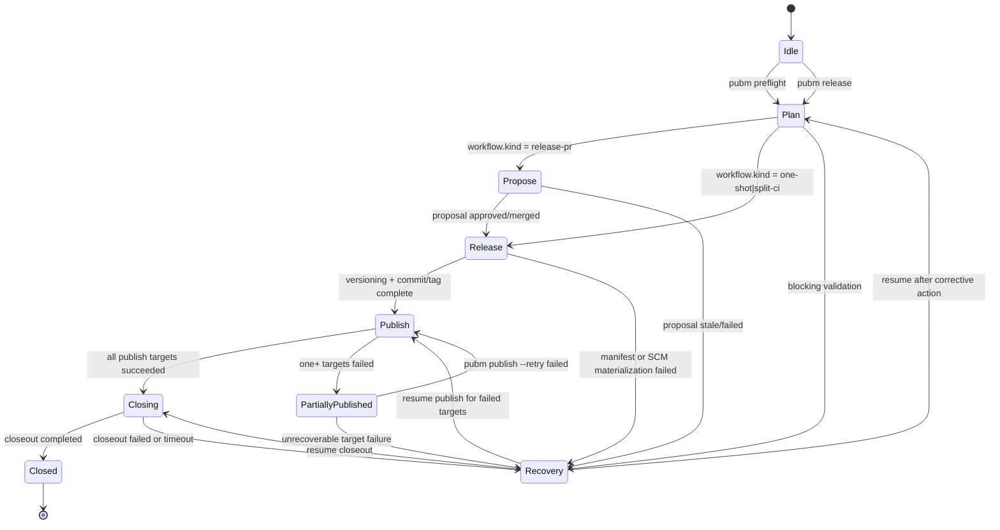
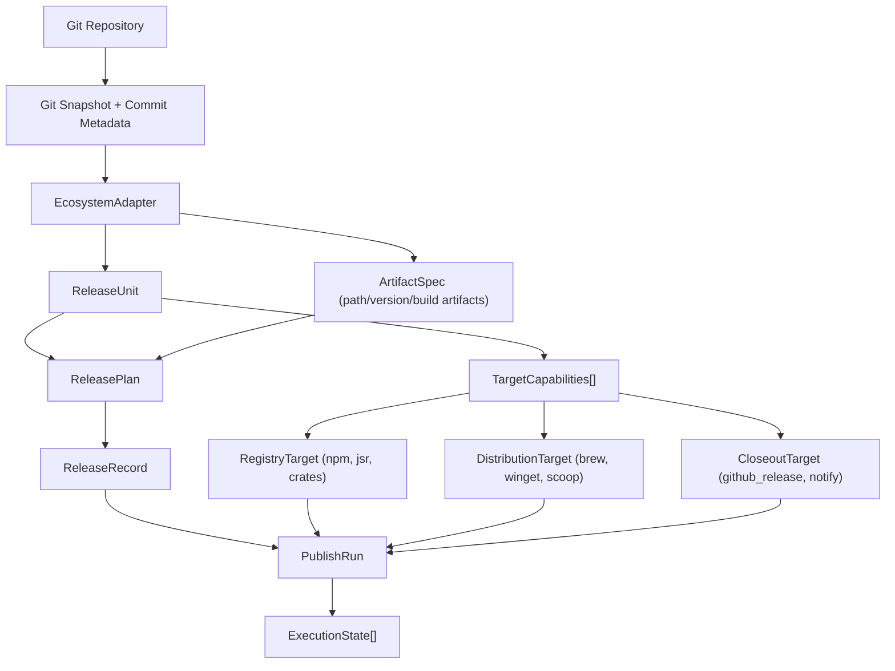
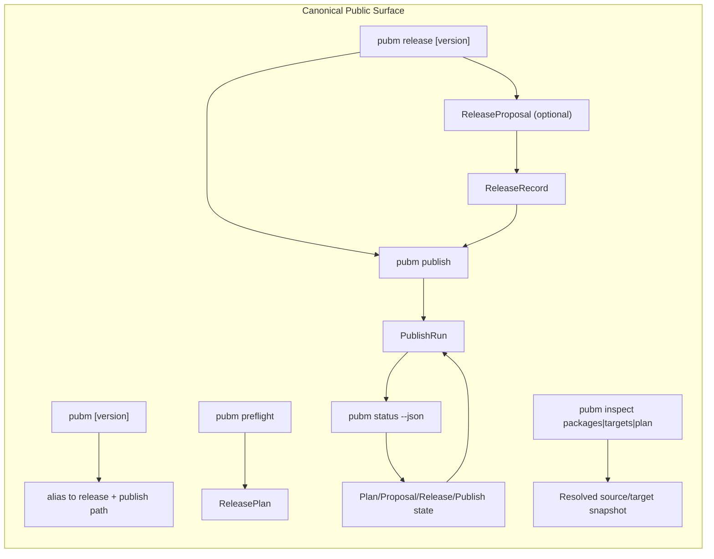
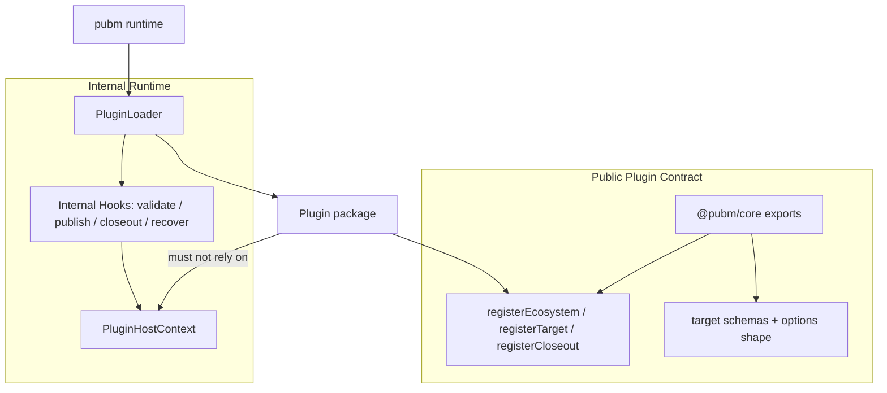
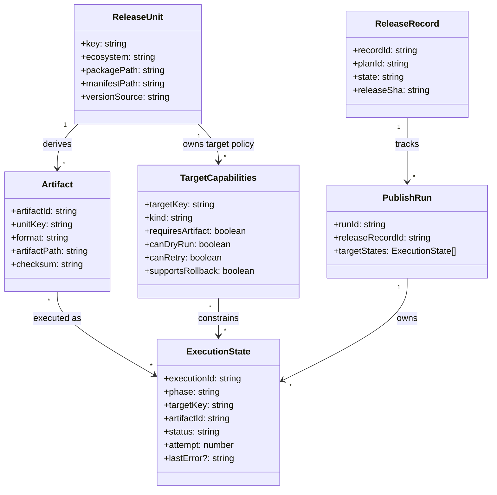

# Visual Architecture and Interface Guide

**Date:** 2026-04-22
**Status:** Draft  
**Scope:** Architecture and external interface planning docs for pubm

## Rule for Future Architecture/Interface Plans

Every future architecture or interface planning doc in `docs/plans` must include:

1. a concise text model of behavior and tradeoffs
2. at least one Mermaid diagram using concrete terms from actual pubm contracts
3. one section that maps the diagram elements back to the source design docs (`release-platform-architecture` / `external-interface-v1`)

This avoids abstract-only plans and keeps implementation, docs, and API intent aligned.

## 1. Core State-Machine Architecture

## 2. Ecosystem / Artifact / Target Composition

## 3. CLI Command Surface and Flow

## 4. Concrete Config Structure

```mermaid
flowchart TB
  CFG["pubm.config.ts"] --> WF["workflow"]
  CFG --> REL["release"]
  CFG --> PKG["packages"]
  CFG --> TGT["targets"]
  CFG --> VAL["validation"]
  CFG --> REC["recovery"]
  CFG --> PLG["plugins"]

  WF --> WFKind["workflow.kind: one-shot|split-ci|release-pr"]
  WF --> WFBranch["workflow.branch"]
  WF --> WFProposal["workflow.proposal: none|release_pr|manual"]

  REL --> VS["release.versioning.strategy"]
  REL --> VSrc["release.versioning.source"]
  REL --> CT["release.changelog.enabled/format"]
  REL --> TT["release.versioning.snapshotTemplate"]
  REL --> QTAG["release.versioning.registryQualifiedTags"]

  PKG --> PkgItem["packages[] = { path, manifestPath? }"]

  TGT --> Reg["targets.registries[]"]
  TGT --> Dist["targets.distributions[]"]
  TGT --> Close["targets.closeout.githubRelease.mode"]

  VAL --> Tests["validation.tests"]
  VAL --> Build["validation.build"]
  VAL --> Dry["validation.dryRunPublish"]

  REC --> Strategy["recovery.strategy"]
  REC --> Rollback["recovery.allowCompensation"]

  PLG --> PluginList["plugins[]"]
  PluginList --> PluginDef["pluginPath + options"]
```

## 5. Plugin Interface Boundary (Public vs Internal)

## 6. ReleaseUnit / Artifact / TargetCapabilities / ExecutionState Relationship

## Diagram assets

Keep these six standalone `.mmd` files as the render source:

- `docs/visuals/release-platform-core.mmd`
- `docs/visuals/distribution-model.mmd`
- `docs/visuals/cli-surface.mmd`
- `docs/visuals/config-surface.mmd`
- `docs/visuals/plugin-boundary.mmd`
- `docs/visuals/runtime-contracts.mmd`
