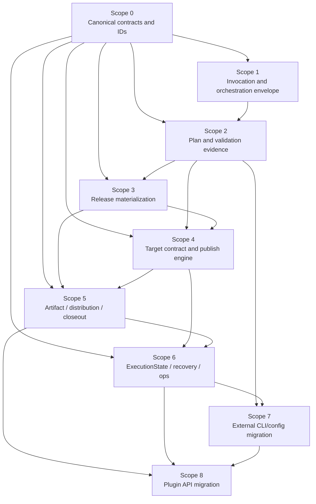
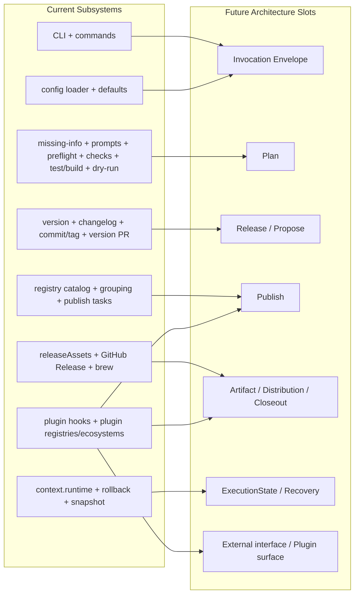

# Low-Level Migration Scope Plan

**Date:** 2026-04-22  
**Status:** Draft  
**Depends on:**

- [release-platform-architecture](./2026-04-22-release-platform-architecture.md)
- [external-interface-v1](./2026-04-22-external-interface-v1.md)
- [pubm-self-hosting-pipeline-comparison](./2026-04-22-pubm-self-hosting-pipeline-comparison.md)

## Goal

The top-level architecture is now defined well enough:

- user-facing: `preflight / release / publish`
- internal core: `Plan -> Propose -> Release -> Publish -> Closeout`

The next step is not a big-bang rewrite.

The next step is to:

1. inventory the current system in concrete subsystem boundaries
2. cut the migration into bounded scopes
3. sequence those scopes so each one can attach current code to the new architecture without forcing a full rewrite

This document is the scope map for that lower-level design work.

The migration sequence must keep the rule explicit:

- command parsing/pipeline selection is orchestration composition;
- core domains only exchange typed artifacts; and
- command invocation contracts at composition boundaries are narrow and command-specific (or a narrow union), never a broad shared session object;
- any shared `"session"` concept is process-level/orchestration runtime, not a durable domain boundary.

## Current System Inventory

The current codebase is already modular, but the execution model is not.

| Subsystem | Current code roots | What it owns today | Future attachment point |
|---|---|---|---|
| Invocation + CLI surface | `packages/pubm/src/cli.ts`, `packages/pubm/src/commands/*`, `packages/core/src/options.ts`, `packages/core/src/utils/resolve-phases.ts` | root publish command, phase/mode parsing, subcommands, direct seeding of `ctx.runtime.versionPlan` | external interface + orchestration composition layer |
| Config ingestion | `packages/core/src/config/{loader,defaults,types}.ts` | config execution, defaults, package discovery, resolved config shaping, plugin config loading | config model + orchestration input |
| Planning + validation | `packages/core/src/tasks/required-missing-information.ts`, `packages/core/src/tasks/prompts/*`, `packages/core/src/tasks/phases/preflight.ts`, `packages/core/src/tasks/{preflight,prerequisites-check,required-conditions-check}.ts`, `packages/core/src/tasks/phases/{test-build,dry-run}.ts` | version choice, prerelease tag selection, token collection, repo checks, target checks, tests/build, dry-run publish validation | `Plan` |
| Release materialization | `packages/core/src/tasks/phases/version.ts`, `packages/core/src/manifest/write-versions.ts`, `packages/core/src/changeset/*`, `packages/core/src/changelog/*`, `packages/core/src/git.ts`, `packages/core/src/tasks/create-version-pr.ts` | manifest version bumps, changelog writes, changeset consumption, commit/tag, optional PR flow | `Release` and optional `Propose` |
| Source-side package model | `packages/core/src/ecosystem/*`, `packages/core/src/monorepo/*`, `packages/core/src/manifest/*`, `packages/core/src/utils/package-key.ts` | package discovery, identity, package graph, manifest read/write, test/build command resolution, lockfile sync | `ReleaseUnit` + source-side adapters |
| Target execution | `packages/core/src/registry/*`, `packages/core/src/tasks/{npm,jsr,crates,custom-registry}.ts`, `packages/core/src/tasks/{grouping,task-factory}.ts`, `packages/core/src/tasks/runner-utils/publish-tasks.ts` | registry descriptors, auth metadata, ordering/concurrency, publish/dry-run tasks, ecosystem-to-registry grouping | `Publish` target contract |
| Asset / distribution / closeout | `packages/core/src/assets/*`, `packages/core/src/tasks/github-release.ts`, `packages/core/src/tasks/phases/push-release.ts`, `packages/plugins/plugin-brew/*`, `pubm.config.ts` `releaseAssets` | asset pipeline, GitHub Release creation/upload, brew updates, release notes, post-publish side effects | `Artifact`, `DistributionTarget`, `CloseoutTarget` |
| Runtime state + recovery | `packages/core/src/context.ts`, `packages/core/src/utils/rollback.ts`, `packages/core/src/tasks/runner-utils/rollback-handlers.ts`, `packages/core/src/tasks/snapshot-runner.ts` | legacy mutable runtime bag, in-memory rollback closures, temp backups, snapshot orchestration | `ExecutionState` + `Recovery` |
| Plugin system | `packages/core/src/plugin/{types,runner}.ts`, official plugins under `packages/plugins/*` | phase hooks, asset hooks, registry/ecosystem registration, plugin commands/checks/credentials | future plugin contracts |
| Auxiliary workflows | `status`, `inspect`, `snapshot`, `changesets`, `migrate`, `secrets`, `sync`, `init`, `update` | operational support, inspection, migration, authoring, setup | ops surface on top of new core |

## Scope Decomposition Principles

The scopes should not be cut by folder alone.

They should be cut by four boundaries:

| Boundary type | Question |
|---|---|
| Durable state boundary | Does this scope introduce or depend on a new persisted artifact such as `ReleasePlan`, `ReleaseRecord`, `PublishRun`, or `ExecutionState`? |
| Source vs target boundary | Is this scope about source mutation or external target side effects? |
| Public interface boundary | Does this scope change what users or plugins see, or only internal execution? |
| Timing boundary | Is this a plan-time fact, a release-time mutation, a publish-time side effect, or a closeout-time announcement? |

From those boundaries, the migration rules are:

1. extract stable contracts before rewriting orchestration
2. keep source-side package logic stable while target-side execution is refactored
3. do not redesign public config and plugin APIs until internal contracts stop moving
4. treat self-hosting as a forcing function, not a special-case implementation path

## Scope Dependency Map

## Current Subsystems To Future Slots

## Scope Catalog

### Scope 0: Canonical Contracts And IDs

| Field | Detail |
|---|---|
| Goal | Freeze the minimum contracts that later scopes can depend on without rewriting them again |
| Current code roots | `packages/core/src/context.ts`, `packages/core/src/utils/package-key.ts`, `packages/core/src/config/types.ts`, `packages/core/src/assets/types.ts`, `packages/core/src/tasks/grouping.ts` |
| Future attachment point | `ReleaseUnit`, `Artifact`, `TargetCapabilities`, `ExecutionState`, `ReleasePlan`, `ReleaseRecord`, `PublishRun`, `CloseoutRecord` |
| In scope | canonical identifiers, package identity rules, path-key vs package-key normalization, plan/record/run shapes, invariants for secret-free validation evidence |
| Out of scope | CLI rewrite, publish implementation rewrite, plugin API redesign |
| Why first | every other scope depends on these contracts staying put |

Notes:

- today `path` and `packageKey = path::ecosystem` both exist
- today `versionPlan` is the de facto execution contract
- this scope must replace mutable runtime context as contract with explicit, typed artifacts

### Scope 1: Invocation And Orchestration Envelope

| Field | Detail |
|---|---|
| Goal | Extract one orchestration boundary between CLI parsing and engine execution |
| Current code roots | `packages/pubm/src/cli.ts`, `packages/core/src/options.ts`, `packages/core/src/utils/resolve-phases.ts`, `packages/core/src/tasks/required-missing-information.ts`, `packages/core/src/tasks/prompts/*` |
| Future attachment point | `PlanRequest` contracts that feed `Plan` |
| In scope | mode/phase normalization, command contract normalization, version planning centralization, package filtering, tag selection, prompt strategy, `changesetConsumed` ownership, `PlanRequest` assembly |
| Out of scope | config loader rewrite, registry publish rewrite, artifact model |
| Why now | this is the smallest high-leverage seam and removes duplicated version-plan logic |

Notes:

- `cli.ts` currently seeds `ctx.runtime.versionPlan` in multiple branches
- prompt flows also synthesize planning inputs independently
- after this scope, the runner should consume one immutable invocation artifact from orchestration instead of piecing planning inputs together from CLI branches
- the invocation artifact should be a narrow planning `PlanRequest` contract (for example preflight / snapshot), with release composition lowering separately into `ReleaseInput`, not a large shared session shape

### Scope 2: Plan And Validation Evidence

| Field | Detail |
|---|---|
| Goal | Convert today’s prepare/check surface into an explicit `Plan` stage |
| Current code roots | `packages/core/src/tasks/phases/preflight.ts`, `packages/core/src/tasks/preflight.ts`, `packages/core/src/tasks/prerequisites-check.ts`, `packages/core/src/tasks/required-conditions-check.ts`, `packages/core/src/tasks/phases/test-build.ts`, `packages/core/src/tasks/phases/dry-run.ts` |
| Future attachment point | `Planner`, `ValidationEvidence`, `Credential Resolution`, `Capability Evidence`, `RepositoryReadinessValidator`, quality gates |
| In scope | secret-free credential evidence, stable-condition validation, volatile readiness prechecks, test/build validation, dry-run publish validation, immutable `ReleasePlan` |
| Out of scope | version writes, commit/tag, registry publish, GitHub Release |
| Why now | without a real `Plan`, later scopes still rely on implicit runtime state |

Notes:

- split-CI makes this scope essential because publish-time volatile checks must be revalidated later
- this scope should keep current validation logic but change its output boundary

### Scope 3: Release Materialization

| Field | Detail |
|---|---|
| Goal | Isolate all source mutations behind `Release` and optional `Propose` |
| Current code roots | `packages/core/src/tasks/phases/version.ts`, `packages/core/src/manifest/write-versions.ts`, `packages/core/src/changeset/*`, `packages/core/src/changelog/*`, `packages/core/src/git.ts`, `packages/core/src/tasks/create-version-pr.ts`, `packages/plugins/plugin-external-version-sync/*` |
| Future attachment point | `ReleaseEngine`, optional `ProposalEngine`, `ReleaseRecord` |
| In scope | manifest writes, changelog writes, changeset consumption, external version sync as release materialization policy, commit/tag, version PR/release PR seam |
| Out of scope | registry target execution, GitHub Release finalization, recovery persistence |
| Why here | after `ReleasePlan` exists, source mutation should become a pure consumer of the plan |

Notes:

- `externalVersionSync` should move from `afterVersion` hook semantics to explicit release materialization semantics
- this scope should make `ReleaseRecord` the CI handoff artifact

### Scope 4: Target Contract And Publish Engine

| Field | Detail |
|---|---|
| Goal | Replace phase-coupled registry execution with a stable target execution contract |
| Current code roots | `packages/core/src/registry/*`, `packages/core/src/tasks/{grouping,task-factory}.ts`, `packages/core/src/tasks/{npm,jsr,crates,custom-registry}.ts`, `packages/core/src/tasks/runner-utils/publish-tasks.ts`, `packages/core/src/tasks/dry-run-publish.ts` |
| Future attachment point | `TargetPlan`, `PublishEngine`, `PublishRun`, target capabilities |
| In scope | publish grouping/ordering, target capability declaration, publish-time revalidation, per-target execution state, registry target execution |
| Out of scope | artifact ownership, GitHub Release, plugin API stabilization |
| Why here | current registry extension is orchestration-coupled through Listr tasks and phase timing |

Notes:

- source-side inputs can stay `ResolvedPackageConfig + packageKey` in the first pass
- this lets discovery/version writing remain stable while target execution is modernized

### Scope 5: Artifact / Distribution / Closeout

| Field | Detail |
|---|---|
| Goal | Introduce first-class artifacts and separate distribution from closeout |
| Current code roots | `packages/core/src/assets/*`, `packages/core/src/tasks/runner-utils/manifest-handling.ts`, `packages/core/src/tasks/github-release.ts`, `packages/core/src/tasks/phases/push-release.ts`, `packages/plugins/plugin-brew/*`, `pubm.config.ts` `releaseAssets` |
| Future attachment point | `Artifact` manifest, `DistributionTarget`, `CloseoutTarget`, `CloseoutEngine` |
| In scope | per-unit artifact ownership, GitHub Release draft/publish split, asset upload ownership, brew as distribution target, artifact URLs/checksum contracts |
| Out of scope | general plugin API redesign, full recovery redesign |
| Why here | today GitHub Release is the post-publish hub and brew is hidden behind `afterRelease` |

Notes:

- this is the best first slice for untangling self-hosting-specific closeout behavior
- it also prevents GitHub Release from staying an overloaded “release + distribution + announcement” bucket

### Scope 6: ExecutionState / Recovery / Ops Surface

| Field | Detail |
|---|---|
| Goal | Replace process-local runtime/rollback assumptions with resumable execution state |
| Current code roots | `packages/core/src/context.ts`, `packages/core/src/utils/rollback.ts`, `packages/core/src/tasks/runner-utils/rollback-handlers.ts`, `packages/core/src/tasks/snapshot-runner.ts`, `packages/pubm/src/commands/{status,snapshot,inspect}.ts` |
| Future attachment point | `ExecutionState`, `RecoveryEngine`, `status --json`, retry/resume surface |
| In scope | persisted run IDs, per-target attempts, snapshot strategy alignment, resume/retry, status command redesign, rollback-to-reconcile transition |
| Out of scope | new plugin API surface |
| Why here | current rollback is in-memory closures; current snapshot is effectively a second orchestrator |

Notes:

- this scope should not try to preserve closure-based rollback as the primary model
- it should convert rollback thinking into reconciliation thinking

### Scope 7: External CLI And Config Migration

| Field | Detail |
|---|---|
| Goal | Move public surface onto the new engines without breaking everything at once |
| Current code roots | `packages/pubm/src/cli.ts`, `packages/pubm/src/commands/*`, `packages/core/src/config/types.ts`, `packages/core/src/config/defaults.ts` |
| Future attachment point | canonical `preflight / release / publish / status` surface and grouped config |
| In scope | command aliases, config grouping, deprecation path for `--mode` / `--phase`, mapping of `snapshot`, `inspect`, `changesets`, `migrate`, `secrets`, `sync`, and `status --json` contract |
| Out of scope | deep engine redesign |
| Why late | public interface should sit on stable internal contracts, not drive them prematurely |

Notes:

- many current commands are operational tooling, not part of the core release state machine
- that is fine, but they should hang off the new model instead of bypassing it
- `status --json` depends on `ExecutionState`/`NextAction` work from Scope 6, so public CLI/canonical command alignment should not start until after Scope 6 emits that typed contract

### Scope 8: Plugin API Migration

| Field | Detail |
|---|---|
| Goal | Re-open extensibility on top of stable internal contracts |
| Current code roots | `packages/core/src/plugin/{types,runner}.ts`, `packages/plugins/plugin-brew/*`, `packages/plugins/plugin-external-version-sync/*` |
| Future attachment point | new plugin contract for observe/check/target/distribution/closeout behavior |
| In scope | compatibility layer for old hooks, explicit target adapters, explicit release-materializer extensions, read-only event model where possible |
| Out of scope | unstable engine internals, arbitrary mutable lifecycle hooks |
| Why last | current plugins are tightly phase-coupled; exposing a new public surface before the engine settles would freeze the wrong abstractions |

Notes:

- plugin-registered ecosystems/registries currently arrive too late in the lifecycle
- the plugin system should eventually depend on `Plan`, `ReleaseRecord`, `PublishRun`, and `CloseoutRecord`, not current phase names

## Recommended Sequential Order

The recommended order is:

1. **Scope 0**
2. **Scope 1**
3. **Scope 2**
4. **Scope 3**
5. **Scope 4**
6. **Scope 5**
7. **Scope 6**
8. **Scope 7**
9. **Scope 8**

The reasoning is:

| Order | Why |
|---|---|
| `0 -> 1` | freeze contracts, then stop duplicating orchestration-to-plan glue |
| `1 -> 2` | once invocation is centralized, plan-time validation can produce a real `ReleasePlan` |
| `2 -> 3` | release materialization should consume the plan, not rediscover state |
| `3 -> 4` | publish should consume `ReleaseRecord`, not mutable repo/runtime assumptions |
| `4 -> 5` | artifacts/distribution/closeout should sit on stable target execution and release records |
| `5 -> 6` | only after publish/closeout boundaries exist can retry/resume state be modeled cleanly |
| `6 -> 7` | `status --json` can be stabilized only after Scope 6 defines ExecutionState/NextAction |
| `7 -> 8` | public CLI/config and plugin APIs should be the last things to stabilize |

## Best Initial Seams For Incremental Work

Three incremental seams are especially strong.

### Seam A: CLI To PlanRequest Boundary

Current boundary:

- Commander / `cli.ts` directly seeds runtime execution state

Target boundary:

- `ResolvedPubmConfig + normalized CLI state -> PlanRequest` (narrow union of preflight / snapshot planning contracts, with release composition lowering into `ReleaseInput`)

Why it is the best first engineering slice:

- small blast radius
- high leverage
- removes duplicated `versionPlan` synthesis
- does not require immediate publish-engine rewrites

### Seam B: Grouping To Target Contract

Current boundary:

- `packageKey` grouping feeds registry descriptors and Listr task factories directly

Target boundary:

- `ResolvedPackageConfig + packageKey -> TargetPlan -> PublishEngine`

Why it is the best second slice:

- isolates the most phase-coupled part of target execution
- preserves discovery and manifest mutation initially
- creates a clean bridge to `PublishRun`

### Seam C: releaseAssets To Artifact/Distribution/Closeout

Current boundary:

- GitHub Release currently owns asset preparation, asset upload, and brew side effects

Target boundary:

- `Artifact` manifest feeds `DistributionTarget` and `CloseoutTarget`

Why it is the best third slice:

- untangles GitHub Release from distribution
- makes self-hosting easier to model correctly
- gives brew a truthful home without overloading `Registry`

## What Not To Do

Avoid these failure modes:

| Bad move | Why it hurts |
|---|---|
| rewrite CLI/config and plugin API before core contracts settle | freezes unstable abstractions |
| redesign discovery and target execution at the same time | mixes source-side and target-side concerns |
| keep `versionPlan` as the hidden canonical contract | prevents real `ReleasePlan` / `ReleaseRecord` adoption |
| move brew into `Registry` just to make it fit current code | creates the wrong long-term model |
| preserve closure-based rollback as the core recovery model | blocks persistent retry/resume |

## Immediate Next Design Steps

If this scope map is accepted, the next detailed design passes should be:

1. **Scope 0 spec**
   - exact type shapes and invariants
2. **Scope 1 spec**
   - command-specific request contracts and their union, plus CLI branching collapse
3. **Scope 4 spec**
   - target contract and `PublishRun` state model

That order gives the fastest path from broad architecture into an implementable migration backbone.
