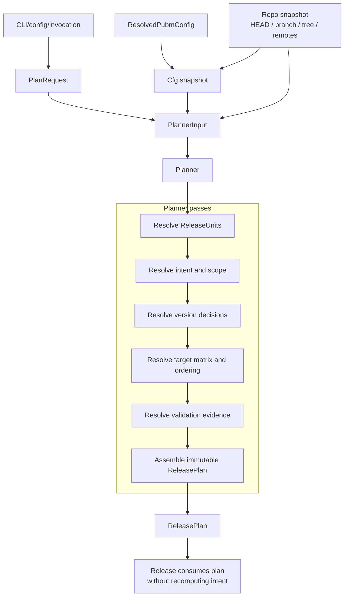
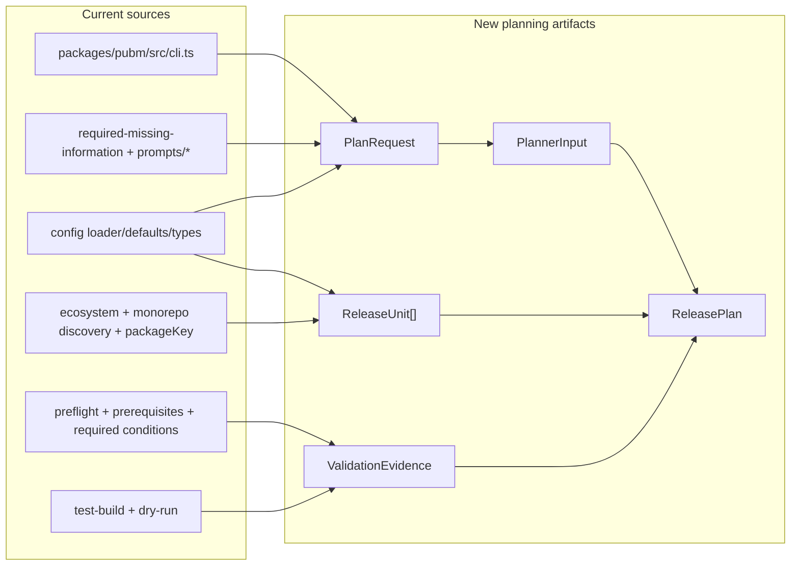

# Plan Slice Detailed Design

**Date:** 2026-04-22  
**Status:** Draft  
**Scope:** First concrete design slice for the new architecture: `ReleaseUnit`, `PlanRequest`, `PlannerInput`, `ReleasePlan`, `ValidationEvidence`, `Planner`, and `Plan -> Release` handoff.

**Depends on:**

- [release-platform-architecture](./2026-04-22-release-platform-architecture.md)
- [low-level-external-interface-design](./2026-04-22-low-level-external-interface-design.md)
- [low-level-migration-scope-plan](./2026-04-22-low-level-migration-scope-plan.md)
- [external-interface-v1](./2026-04-22-external-interface-v1.md)
- [pubm-self-hosting-pipeline-comparison](./2026-04-22-pubm-self-hosting-pipeline-comparison.md)

## Goal

This document defines the first stable execution contract in the new architecture.

It replaces today's implicit planning model:

- `cli.ts` branching
- `ctx.runtime.versionPlan`
- prompt-side package filtering
- prepare-time mutable runtime state

with an explicit chain:

```text
CLI/config/invocation -> PlanRequest -> PlannerInput -> Planner -> ReleasePlan -> ReleaseInput
```

This slice does **not** redesign full publish execution, artifact ownership, or plugin APIs. It only defines the planning contract that later scopes will consume.

## Scope Boundary

In scope:

- `ReleaseUnit`
- `PlanRequest` (composition request contract)
- `ReleasePlan`
- `PlannerInput`
- `ValidationEvidence`
- `Planner` input/output contract
- `Plan -> Release` trust boundary

Out of scope:

- `PublishEngine` internals
- final `Artifact` shape beyond planning preview
- plugin public API redesign
- recovery persistence details

## Planner Pipeline



## Current Sources Feeding The Plan Slice



## ReleaseUnit

`ReleaseUnit` is the canonical release graph node.

It is the smallest source-side entity that can:

- receive a version decision
- participate in dependency-aware planning
- own target selections
- be referenced by publish/closeout state later

### Proposed shape

```ts
type ReleaseUnitKey = string;

type ReleaseUnit = {
  key: ReleaseUnitKey;
  ecosystem: string;
  sourcePath: string;
  manifestPath: string;
  canonicalName: string;
  currentVersion: string;
  dependencyKeys: ReleaseUnitKey[];
  declaredTargetKeys: string[];
  releaseExcluded: boolean;
};
```

### Identity rules

- `key` must be stable within one repo layout and config snapshot.
- `key` should be derived from current `packageKey(path::ecosystem)` rules so migration can be incremental.
- `sourcePath` is the package root.
- `manifestPath` is the primary version source file for that unit.
- `canonicalName` is the display/package name resolved from the ecosystem manifest.

### What ReleaseUnit owns

- source identity
- ecosystem membership
- current version
- dependency edges to other release units
- declared targets from config/default ecosystem mapping
- release exclusion flag

### What ReleaseUnit does not own

- next version
- changelog preview
- validation outcomes
- publish status
- generated artifacts
- proposal/release metadata

### Mapping from current code

Current equivalents are split across:

- `ResolvedPackageConfig` in [config/types.ts](/Users/classting/Workspace/temp/pubm/packages/core/src/config/types.ts:18)
- `packageKey` in [package-key.ts](/Users/classting/Workspace/temp/pubm/packages/core/src/utils/package-key.ts:3)
- discovery/graph data in `monorepo/*`

The first implementation pass should reuse current `packageKey` semantics and wrap them into `ReleaseUnit` instead of replacing identity rules immediately.

## PlanRequest

This slice follows the
[closed core, open edge](./2026-04-22-low-level-external-interface-design.md#closed-core-open-edge)
rule: workflow selection stays open through `workflowRef`, while planner-owned
execution state such as `executionMode`, target topology, and evidence surfaces
stay narrowly typed.

`PlanRequest` is the thin, composition-layer intent request produced before planning starts.

It is the contract between:

- CLI / commands / config-driven invocation
- prompt-driven missing-information flows
- `PlannerInput` composition

The key constraint is narrowness:

- no single monolithic session/object
- command-specific contracts only
- common commands can evolve independently without widening the base artifact

```ts
type PlanRequest =
  | { command: "preflight"; input: PreflightPlanRequest }
  | { command: "snapshot"; input: SnapshotPlanRequest }
```

### `PreflightPlanRequest`

```ts
type PreflightPlanRequest = {
  workflowRef: string;
  executionMode: "local" | "ci";
  versionSourceStrategy: "all" | "changesets" | "commits";
  explicitVersion?: string;
  tagStrategy: {
    requestedTag?: string;
    registryQualifiedTags: boolean;
  };
  scope: {
    filters?: string[];
    includePackageKeys?: string[];
  };
  targetSelection?: {
    includeTargetKeys?: string[];
    includeAdapterKeys?: string[];
  };
  prompting: {
    allowPrompts: boolean;
    allowInteractiveSecrets: boolean;
    allowVersionChoicePrompt: boolean;
  };
  validation: {
    runPrerequisites: boolean;
    runConditions: boolean;
    runTests: boolean;
    runBuildValidation: boolean;
    runDryRunValidation: boolean;
  };
};
```

`pubm release` may compose a `PreflightPlanRequest` into a `ReleasePlan`, but the stable next handoff is `ReleaseInput`; planning does not expose a separate release-planning request contract.

### `PublishInput`

```ts
type PublishInput = {
  workflowRef: string;
  executionMode: "local" | "ci";
  from?: {
    planId?: string;
    releaseRecordId?: string;
    tag?: string;
  };
  retry?: "failed" | "all";
  closeoutMode?: "auto" | "skip";
  scope?: {
    includePackageKeys?: string[];
    includeTargetKeys?: string[];
    includeAdapterKeys?: string[];
  };
  prompting: {
    allowPrompts: false;
    allowInteractiveSecrets: false;
    allowVersionChoicePrompt: false;
  };
  validation: {
    runPrerequisites: false;
    runConditions: false;
    runTests: false;
    runBuildValidation: false;
    runDryRunValidation: false;
  };
};
```

### `SnapshotPlanRequest`

```ts
type SnapshotPlanRequest = {
  workflowRef: string;
  executionMode: "local" | "ci";
  snapshot: {
    tag: string;
    includeBuildMetadata: boolean;
  };
  scope: {
    includePackageKeys?: string[];
  };
};
```

### `InspectRequest`

```ts
type InspectRequest = {
  executionMode: "local" | "ci";
  requestedTarget: "plan" | "targets" | "packages";
  scope?: {
    includePackageKeys?: string[];
  };
};
```

### What `PlanRequest` deliberately excludes

- resolved `ReleaseUnit[]`
- final version decisions
- target matrix
- credential material
- repository validation outcomes
- changelog preview
- publish ordering

### Mapping from current code

Current `PlanRequest` inputs are scattered across:

- `packages/pubm/src/cli.ts`
- `packages/core/src/options.ts`
- `packages/core/src/utils/resolve-phases.ts`
- `required-missing-information`
- `prompts/*`

The current problem is that `cli.ts` and prompt handlers both synthesize execution state directly into `ctx.runtime.versionPlan`. `PlanRequest` exists to stop that duplication before planner logic starts.

## ReleasePlan

`ReleasePlan` is the immutable output of `Planner`.

It is the source of truth for:

- release scope
- version decisions
- target scope
- plan-time validation evidence

It is the only thing `Release` should need in order to materialize source changes.
`ReleaseInput` is the next-slice contract and is defined in [release-slice-detailed-design](./2026-04-22-release-slice-detailed-design.md).

### Proposed shape

```ts
type ReleasePlan = {
  id: string;
  commitSha: string;
  branch: string;
  configHash: string;

  command: {
    invocationKind: "preflight" | "snapshot";
    workflowRef: string;
    executionMode: "local" | "ci";
    versionSourceStrategy: "all" | "changesets" | "commits";
    explicitVersion?: string;
    requestedTag?: string;
    registryQualifiedTags: boolean;
  };
  units: ReleaseUnit[];

  selectedUnitKeys: string[];
  versionDecisions: {
    unitKey: string;
    currentVersion: string;
    nextVersion: string;
    source: "explicit" | "changeset" | "commit" | "snapshot";
  }[];

  changelogPreview: {
    unitKey: string;
    entries: string[];
  }[];

  targetPlan: {
    unitKey: string;
    targetKey: string;
    targetCategory: string;
    targetRef: string;
    contractRef: string;
    adapterKey: string;
    orderGroup: string;
    artifactSpecRef: string;
    requiredForCloseout: boolean;
    requiredForProgress: boolean;
  }[];

  assetPreview: {
    unitKey: string;
    assetSpecKey: string;
    filePatterns: string[];
  }[];

  validation: ValidationEvidence;
};
```

`targetPlan` intentionally excludes closeout-only targets; closeout handling is owned by the separate Closeout slice.

`targetPlan` uses open-edge target identity: `targetCategory` for grouping and UX,
`targetRef` and `contractRef` for bound behavior, and `targetKey` plus
`adapterKey` for concrete destination and executor identity.

### Invariants

- `ReleasePlan` is immutable once created.
- `ReleasePlan` is secret-free.
- `ReleasePlan` must fully replace today's combination of:
  - `ctx.runtime.versionPlan`
  - `ctx.runtime.tag`
  - `ctx.runtime.changesetConsumed`
  - mutated `ctx.config.packages` scope
- `ReleasePlan` must be sufficient for `Release` to execute without asking planning questions again.

### What can still change after ReleasePlan

- volatile target readiness
- freshly rehydrated credentials
- artifact materialization outcomes
- publish/closeout success or failure

Those changes belong to later stages, not to `ReleasePlan`.

## ValidationEvidence

`ValidationEvidence` is the proof bundle attached to `ReleasePlan`.

Its purpose is twofold:

1. capture why a plan was accepted
2. define exactly what must be revalidated later

### Proposed shape

```ts
type ValidationEvidence = {
  credentials: CredentialEvidence[];
  capabilities: CapabilityEvidence[];
  repositoryReadiness: RepositoryReadinessEvidence[];
  stableConditions: StableConditionEvidence[];
  volatilePrechecks: VolatileTargetReadinessEvidence[];
  qualityGates: QualityGateEvidence[];
  dryRunValidation: DryRunEvidence[];
};
```

### CredentialEvidence

Proves that a credential resolution mechanism succeeded.

```ts
type CredentialEvidence = {
  targetKey: string;
  adapterKey?: string;
  mechanism: "env" | "secure-store" | "prompt" | "plugin";
  resolverKey?: string;
  resolved: boolean;
  observedAt: string;
};
```

Invariant:

- never store token values
- never store raw secret material

### CapabilityEvidence

Proves what an already-resolved credential appears to be allowed to do.

```ts
type CapabilityEvidence = {
  targetKey: string;
  adapterKey?: string;
  capabilityKeys: string[];
  satisfied: boolean;
  observedAt: string;
};
```

Examples:

- publish to npm
- publish to jsr
- create GitHub release draft
- push brew tap branch

### RepositoryReadinessEvidence

Stable checks anchored to repo snapshot.

```ts
type RepositoryReadinessEvidence = {
  checkKey: string;
  satisfied: boolean;
  details?: string;
};
```

Examples for `checkKey`:

- `branch`
- `remote-sync`
- `clean-tree`
- `commit-anchor`
- `tag-safety`

### StableConditionEvidence

Plan-time checks that are anchored to the planned repo/config state.

```ts
type StableConditionEvidence = {
  conditionKey: string;
  satisfied: boolean;
  details?: string;
};
```

Examples:

- config validity
- script existence
- package graph validity
- registry-qualified tag requirement

### VolatileTargetReadinessEvidence

Checks that can drift between plan-time and publish-time.

```ts
type VolatileTargetReadinessEvidence = {
  targetKey: string;
  adapterKey?: string;
  checkKey: string;
  satisfied: boolean;
  details?: string;
  observedAt: string;
};
```

Examples:

- registry reachability
- mutable package/version availability
- mutable permission state
- external repo openness

Invariant:

- all volatile checks may be prechecked in `Plan`
- none of them can be trusted indefinitely
- all of them must be revalidated in `Publish`

### QualityGateEvidence

Quality checks that answer whether the candidate is releasable.

```ts
type QualityGateEvidence = {
  gateKey: string;
  satisfied: boolean;
  outputs?: string[];
};
```

Examples for `gateKey`:

- `test`
- `build-validation`

Important split:

- `build-validation` is a `Plan` concern
- `artifact materialization` is a `Publish` concern

### DryRunEvidence

Proof that target-side dry-run validation succeeded under planned versions and scope.

```ts
type DryRunEvidence = {
  targetKey: string;
  adapterKey?: string;
  checkKey: string;
  satisfied: boolean;
  details?: string;
  observedAt: string;
};
```

This includes current `dry-run publish` style checks, but records them as planning evidence instead of leaving them as incidental runtime output.

## Planner Contract

### Input

```ts
type PlannerInput = {
  planRequest: PlanRequest;
  config: ResolvedPubmConfig;
  repo: {
    cwd: string;
    headSha: string;
    branch: string;
  };
};
```

### Output

- `ReleasePlan`

### Non-goals

The planner must not:

- write manifests
- write changelogs
- create commits or tags
- publish anything
- upload assets
- persist secrets

### Internal passes

Recommended internal order:

1. **Resolve release units**
   - discovery
   - package identity
   - package graph
2. **Resolve requested scope**
   - filters
   - command intent
   - release exclusions
3. **Resolve versions**
   - explicit version, changesets, commits, snapshot policy
4. **Resolve targets**
   - per-unit target matrix
   - `targetKey` / `adapterKey` binding
   - ordering groups
5. **Resolve validation evidence**
   - credentials
   - capabilities
   - readiness checks
   - test/build/dry-run
6. **Assemble immutable plan**

### Failure model

Planner failures are:

- invalid input
- unresolved required information
- blocked repository readiness
- missing or insufficient capabilities
- failed quality gates
- failed dry-run validation

No partial plan should be emitted on failure.

## Plan To Release Handoff

`Release` consumes `ReleasePlan`.

### What Release is allowed to trust

- selected release scope
- version decisions
- changelog preview inputs
- tag policy
- stable repository/config assumptions anchored to the planned snapshot

### What Release must not recompute

- which units are in scope
- what the next version is
- what tag mode was chosen
- whether changesets were used
- whether the run is one-shot vs split-ci

### What Release may refresh defensively

- current repo still matches `commitSha` / `configHash`
- working tree was not unexpectedly modified between planning and release

That is not a new planning pass. It is only a guard that the plan is still applicable.

### Split-CI implication

In split-CI:

1. `PlanRequest` and `PlannerInput` produce `ReleasePlan`
2. `Release` materializes source-of-truth and emits `ReleaseRecord`
3. later CI publish consumes `ReleaseRecord`, not planning logic

That means CI publish should no longer reconstruct release intent from checked-out manifests.

## Current To Future Mapping

| Current code root | New Plan-slice role |
|---|---|
| `packages/pubm/src/cli.ts` | produce `PlanRequest` variants, not runtime release state |
| `packages/core/src/options.ts` | normalize CLI/config input into command-specific request shapes |
| `packages/core/src/utils/resolve-phases.ts` | become intent-to-phase mapping for request/command request contracts |
| `required-missing-information.ts` | become a missing-input resolver feeding `PlanRequest` / `PlannerInput` |
| `prompts/*` | become prompt strategies for unresolved plan inputs |
| `prerequisites-check.ts` | produce `RepositoryReadinessEvidence` |
| `required-conditions-check.ts` | produce `StableConditionEvidence` and `VolatileTargetReadinessEvidence` |
| `phases/test-build.ts` | produce `QualityGateEvidence` |
| `phases/dry-run.ts` | produce `DryRunEvidence` |
| `context.ts` `runtime.versionPlan` | replaced by persisted/immutable `ReleasePlan` |
| `filter-config.ts` scope mutation | replaced by `ReleasePlan.selectedUnitKeys` |

## Initial Implementation Bias

For the first implementation pass of this design:

- keep existing discovery and package identity rules
- keep existing validation logic bodies where possible
- change the boundary and ownership first

That means:

- wrap current outputs into command request variants
- wrap current package discovery into `ReleaseUnit`
- wrap current checks into `ValidationEvidence`
- stop storing canonical release intent in mutable runtime state

## Decision Summary

This slice locks five decisions:

1. `ReleaseUnit` is the canonical source-side release node.
2. `PlanRequest` is the normalized invocation contract.
3. `ReleasePlan` replaces hidden runtime planning state.
4. `ValidationEvidence` is secret-free and explicitly split into stable vs volatile evidence.
5. `Release` may consume the plan, but must not recompute release intent.

Everything after this document should build on those contracts, not bypass them.
