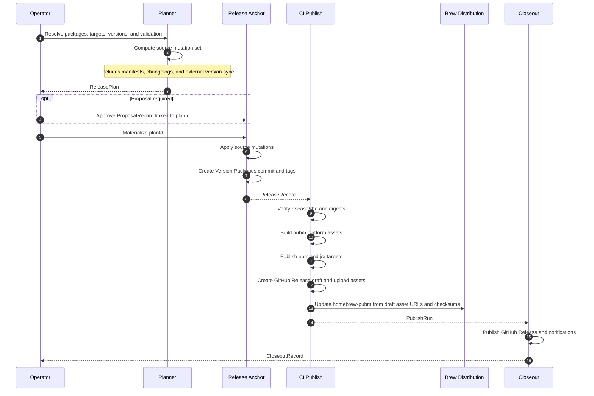

# pubm Self-Hosting Pipeline Comparison

**Date:** 2026-04-22  
**Status:** Draft

## Goal

Describe how this repository currently self-hosts `pubm`, then compare that flow against the proposed release-platform architecture for a split-CI default.

## 1. What "pubm publishes pubm" means in this repository

In this repo, "pubm publishes pubm" means the repository uses the `pubm` CLI and `@pubm/core` release engine to version and publish the packages that make up `pubm` itself.

The self-hosted release surface is defined in `pubm.config.ts`:

- `versioning: "independent"`
- `packages`:
  - `packages/core`
  - `packages/pubm`
  - `packages/pubm/platforms/*`
  - `packages/plugins/plugin-external-version-sync`
  - `packages/plugins/plugin-brew`
- `excludeRelease: ["packages/pubm/platforms/*"]`
- `releaseAssets` only for `packages/pubm`, from `platforms/{platform}/bin/pubm`, named `pubm-{platform}`

That gives this repository two different release shapes at once:

| Unit | Current publish targets | Notes |
|---|---|---|
| `packages/core` (`@pubm/core`) | npm, jsr | `package.json` implies npm and `packages/core/jsr.json` implies jsr |
| `packages/pubm` (`pubm`) | npm | Main CLI package |
| `packages/pubm/platforms/*` (`@pubm/<platform>`) | npm | Published as platform packages and used as `optionalDependencies` of `pubm` |
| `packages/plugins/plugin-external-version-sync` | npm | Official plugin package |
| `packages/plugins/plugin-brew` | npm | Official plugin package |

Important repo-specific consequences:

- The root repo is a private workspace orchestrator, not the published package.
- The published `pubm` package depends on the platform packages through `optionalDependencies`.
- Platform packages are versioned and published, but `excludeRelease` removes them from per-package Git tags and GitHub Releases.
- Homebrew is not published as a registry package. It is updated from release assets through `@pubm/plugin-brew`.
- External version sync is part of self-hosting because the version bump also updates:
  - `website/src/i18n/landing.ts`
  - `plugins/pubm-plugin/.claude-plugin/plugin.json`
  - `.claude-plugin/marketplace.json` (`metadata.version` and `plugins.0.version`)
- That sync uses the `packages/core` version as the source version in independent mode.

The root scripts make the self-hosting intent explicit:

- `bun run release` -> `pubm --mode ci --phase prepare`
- `bun run release:ci` -> `pubm --mode ci --phase publish`

## 2. Current self-hosting pipeline

### 2.1 Operational shape

Today the repo uses a two-step self-hosting workflow:

1. A maintainer runs the prepare half of the pipeline locally or in a controlled release job.
2. The resulting `Version Packages` commit pushed to `main` triggers `.github/workflows/release.yml`, which runs the publish half in GitHub Actions.

The runner ordering in `packages/core/src/tasks/runner.ts` is:

`preflight -> test -> build -> version -> publish -> dry-run -> push -> release`

In practice, the enabled tasks depend on the selected phase:

- `--mode ci --phase prepare` enables preflight, test, build, version, dry-run, and push
- `--mode ci --phase publish` enables plugin credential loading, publish, and release creation

### 2.2 Current prepare half

The current prepare step is the root script:

```bash
bun run release
```

which resolves to:

```bash
pubm --mode ci --phase prepare
```

Concrete tasks:

1. Resolve a runtime `versionPlan`
   - In `packages/pubm/src/cli.ts`, CI prepare calls `requiredMissingInformationTasks()`.
   - That step either uses an existing version plan or prompts/derives one.
   - For this repo, the version phase later consumes changesets when present and writes per-package changelogs.

2. Run CI-prepare preflight
   - `runCiPreparePreflight()` collects registry tokens for configured registries.
   - It also collects plugin credentials, including `PUBM_BREW_GITHUB_TOKEN`.
   - It can sync those tokens into GitHub Secrets before continuing.
   - Then it runs prerequisite and required-condition checks.

3. Run tests and build
   - The normal task runner then executes test and build tasks before any version mutation is committed.

4. Materialize the version bump
   - `createVersionTask()` writes new versions across all configured packages.
   - In independent mode it writes per-package changelogs and deletes consumed changeset files.
   - It stages all versioned files after plugin hooks complete.

5. Run external version sync during `afterVersion`
   - `@pubm/plugin-external-version-sync` runs in `afterVersion`.
   - In this repo it picks the `packages/core` version and rewrites:
     - `website/src/i18n/landing.ts`
     - `plugins/pubm-plugin/.claude-plugin/plugin.json`
     - `.claude-plugin/marketplace.json`
   - It also registers rollback handlers for the original file contents.

6. Create the self-hosting release commit and tags
   - The version task creates a single `Version Packages` commit containing package version writes, changelog updates, and external version sync edits.
   - It creates per-package tags for releasable units.
   - Because `excludeRelease` matches `packages/pubm/platforms/*`, platform packages do not get per-package release tags even though they were versioned.

7. Run dry-run publish validation after versioning
   - In CI prepare, `createDryRunTasks()` is enabled even though real publish is disabled.
   - It resolves workspace protocols, applies the planned versions, runs registry dry-runs, then restores manifests and lockfiles.
   - For this repo that means npm dry-runs for all npm-targeted packages and a jsr dry-run for `packages/core`.

8. Push the branch and tags
   - `createPushTask()` pushes the branch and follow-tags.
   - The pushed `Version Packages` commit is the current handoff artifact to GitHub Actions.

### 2.3 Current GitHub Actions publish half

The current release workflow is `.github/workflows/release.yml`.

Trigger and job details:

- Trigger: push to `main`
- Additional condition: `github.event.head_commit.message` must start with `Version Packages`
- Runner: `macos-latest`
- Setup:
  - checkout with `fetch-depth: 0`
  - setup Bun
  - cache Bun packages
  - setup Node 24 with npm registry URL
  - `bun install --frozen-lockfile`
  - `bun run build`
- Publish command:

```bash
bunx pubm --mode ci --phase publish
```

with:

- `NODE_AUTH_TOKEN`
- `JSR_TOKEN`
- `GITHUB_TOKEN`
- `PUBM_BREW_GITHUB_TOKEN`

### 2.4 Current publish-phase internals

Concrete tasks in the publish half:

1. Reconstruct `versionPlan` from the checked-out manifests
   - In `packages/pubm/src/cli.ts`, CI publish does not consume a persisted release record.
   - It reads the versions already present in the checkout and rebuilds `ctx.runtime.versionPlan` from those manifest versions.
   - In independent mode, each package path contributes its own version directly from the repository snapshot.

2. Load plugin credentials from environment only
   - `runCiPublishPluginCreds()` reads plugin credentials without prompting.
   - For this repo, that matters for `PUBM_BREW_GITHUB_TOKEN`.

3. Enter publish phase
   - `beforePublish` hooks run first.
   - Workspace protocol dependencies are resolved to concrete versions.
   - `collectPublishTasks()` groups tasks by ecosystem and registry and runs them concurrently.

4. Publish registry packages
   - npm publish tasks run for every package with a `package.json` that infers npm.
   - In this repo that means:
     - `@pubm/core`
     - `pubm`
     - every `packages/pubm/platforms/*` package
     - `@pubm/plugin-external-version-sync`
     - `@pubm/plugin-brew`
   - npm tasks pre-check whether the exact version is already published and skip if so.
   - jsr publish runs only for `packages/core`, because `packages/core/jsr.json` infers jsr and `packages/pubm` does not have a `jsr.json`.
   - jsr also pre-checks whether the version is already published and skips if so.

5. Restore workspace protocol manifests and run `afterPublish`
   - The publish phase restores any temporary manifest rewrites and then runs `afterPublish`.

6. Create GitHub Releases in the same publish run
   - `createReleaseTask()` currently lives in the runner after publish, but still inside the same publish job.
   - In independent mode it creates one GitHub Release per non-excluded package tag.
   - Platform packages are skipped here because `excludeRelease` matches them.

7. Build and upload release assets for `pubm`
   - Release assets are only configured for `packages/pubm`.
   - `prepareReleaseAssets()` resolves `platforms/{platform}/bin/pubm` and names each uploaded file `pubm-{platform}`.
   - Those assets are attached to the GitHub Release for the `pubm` package.

8. Run Homebrew update as `afterRelease`
   - `@pubm/plugin-brew` runs in `afterRelease`.
   - For this repo it filters to `packageName: "pubm"`, converts release assets into formula assets, updates `Formula/pubm.rb`, and then pushes directly or falls back to opening a PR in `syi0808/homebrew-pubm`.

### 2.5 Current handoff artifacts

The current design does not persist a first-class machine-readable release record.

The effective handoff artifacts today are:

| Artifact | Current role |
|---|---|
| `ctx.runtime.versionPlan` | In-memory plan only; exists inside one process |
| `Version Packages` commit | Main durable handoff between prepare and publish |
| Git tags | Durable release identity for non-excluded packages |
| Checked-out manifest versions in CI | Publish input for `--phase publish` |
| GitHub Release + release assets | Created inside the publish run itself |
| Tap-repo commit or PR | Also created inside the publish run itself |

This is the main architectural constraint: publish reconstructs intent from the repository snapshot instead of consuming an immutable release record.

### 2.6 Current detailed flow

```mermaid
%%{init: {"htmlLabels": false}}%%
flowchart TB
  subgraph Local["Local or controlled prepare run"]
    A0["Operator runs bun run release"]
    A1["CLI runs pubm --mode ci --phase prepare"]
    A2["requiredMissingInformationTasks\n- resolve versionPlan\n- choose prerelease dist-tag when needed"]
    A3["runCiPreparePreflight\n- collect registry tokens\n- collect plugin credentials\n- optionally sync GitHub Secrets"]
    A4["Validation gates\n- prerequisites\n- required conditions"]
    A5["Runner tasks\n- test\n- build"]
    A6["Version task\n- write package versions\n- write per-package changelogs\n- delete consumed changesets"]
    A7["externalVersionSync afterVersion\n- landing.ts\n- plugin.json\n- marketplace.json"]
    A8["Create self-hosting release commit and tags\n- commit Version Packages\n- tag non-excluded packages only"]
    A9["CI prepare dry-run validation\n- resolve workspace protocols\n- apply planned versions\n- npm and jsr dry-runs\n- restore manifests and lockfiles"]
    A10["Push task\n- push branch and follow-tags"]
  end

  subgraph Trigger["GitHub Actions trigger"]
    T1["Push to main with head commit message starting Version Packages"]
    T2["release.yml job\n- macos-latest\n- checkout\n- bun install\n- bun run build"]
  end

  subgraph Publish["CI publish and post-publish side effects"]
    P0["Run bunx pubm --mode ci --phase publish"]
    P1["CLI rebuilds versionPlan from checked-out manifest versions\n- no persisted release record"]
    P2["runCiPublishPluginCreds\n- load PUBM_BREW_GITHUB_TOKEN from env"]
    P3["Publish phase\n- beforePublish\n- resolve workspace protocols\n- collect publish tasks"]
    P4["npm publish tasks\n- core\n- pubm\n- platform packages\n- plugin-external-version-sync\n- plugin-brew"]
    P5["jsr publish task\n- packages/core only"]
    P6["Restore workspace protocols and run afterPublish"]
    P7["createReleaseTask\n- GitHub Release per non-excluded package tag"]
    P8["pubm asset pipeline\n- packagePath packages/pubm\n- files platforms/{platform}/bin/pubm\n- asset names pubm-{platform}"]
    P9["brewTap afterRelease\n- update Formula/pubm.rb\n- push or PR to syi0808/homebrew-pubm"]
  end

  A0 --> A1 --> A2 --> A3 --> A4 --> A5 --> A6 --> A7 --> A8 --> A9 --> A10
  A10 --> T1 --> T2 --> P0 --> P1 --> P2 --> P3
  P3 --> P4
  P3 --> P5
  P4 --> P6
  P5 --> P6
  P6 --> P7 --> P8 --> P9
```



## 3. Future self-hosting pipeline under the new architecture

### 3.1 Naming used here

The architecture documents use `Plan -> Propose -> Release -> Publish -> Closeout`.

For this self-hosting comparison, I will use **Release Anchor** as the concrete name for the self-hosting release-materialization step. It maps to the architecture's `ReleaseEngine`, but emphasizes the main split-CI property: this is the point where the repository state becomes an immutable release input for later CI publish.

So the future self-hosting flow is:

`Plan -> Propose (optional) -> Release Anchor -> Publish -> Announce / Closeout`

### 3.2 Future split-CI default

The default split-CI self-hosting flow should be:

1. Local or controlled prepare computes and freezes a `ReleasePlan`
2. Optional proposal flow creates or updates a `ProposalRecord`
3. Release Anchor materializes source mutations and emits a `ReleaseRecord`
4. CI publish consumes that `ReleaseRecord`
5. Final closeout publishes the GitHub Release draft and any notifications

### 3.3 Future state artifacts

The new architecture already defines the core records. For self-hosting, the concrete artifacts should be:

| Artifact | Produced by | Self-hosting contents |
|---|---|---|
| `ReleasePlan` | Planner | units, target graph, version decisions, changelog preview, validation evidence, planned source mutations, asset spec |
| `ProposalRecord` | ProposalEngine | optional release PR or manual approval record linked to the plan |
| `ReleaseRecord` | Release Anchor | `releaseSha`, tags, digests for manifests/changelogs/source mutations, target selection, asset manifest inputs |
| `PublishRun` | PublishEngine | per-target results for npm, jsr, draft GitHub Release, and brew distribution update |
| `CloseoutRecord` | CloseoutEngine | final release publication and notification status |

For this repo, the `ReleasePlan` should include at least:

- release units:
  - `packages/core`
  - `packages/pubm`
  - `packages/pubm/platforms/*`
  - `packages/plugins/plugin-external-version-sync`
  - `packages/plugins/plugin-brew`
- registry targets:
  - npm for all package.json units
  - jsr for `packages/core`
- distribution targets:
  - brew tap update for `syi0808/homebrew-pubm`
- closeout targets:
  - GitHub Release draft/publication
  - notifications or other final closeout outputs
- asset spec:
  - `packages/pubm`
  - `platforms/{platform}/bin/pubm`
  - output names `pubm-{platform}`
- planned source mutations:
  - package manifests
  - package changelogs
  - external version sync targets keyed from the planned `packages/core` version

### 3.4 Future Plan stage

Concrete tasks:

1. Discover release units and target taxonomy
   - registry targets stay separate from distribution targets and closeout targets
   - npm and jsr remain registry targets
   - brew becomes a distribution target
   - GitHub Release becomes a closeout target

2. Resolve versions and changelog previews
   - compute the independent version decisions for each package
   - preview the package changelog writes that will later be materialized

3. Compute the planned source mutation set
   - package manifest version writes
   - package changelog writes
   - external version sync writes
   - For this repo, external version sync still derives from the `packages/core` version, but it becomes part of the planned mutation set rather than an implicit plugin side effect.

4. Validate all publish-critical assumptions before release materialization
   - branch, remote, and working tree state
   - token and capability checks
   - test and build validation
   - publish dry-run validation
   - release asset existence for `packages/pubm/platforms/*/bin/pubm`

5. Freeze an immutable `ReleasePlan`
   - include `commitSha`, config hash, version decisions, target graph, validation evidence, and planned mutation digests

### 3.5 Future Propose stage (optional)

This stage is optional for self-hosting, but should remain available:

- create or update a `ProposalRecord`
- request review or approval
- keep the plan immutable while the proposal changes state
- do not mutate manifests or changelogs here

For a direct maintainer flow, this stage can be skipped.

### 3.6 Future Release Anchor stage

Concrete tasks:

1. Materialize the frozen source mutation set from `ReleasePlan`
   - apply package version writes
   - apply package changelog writes
   - apply external version sync writes

2. Create the repository anchor for publish
   - create the `Version Packages` commit
   - create tags according to release policy
   - platform packages can remain publishable units without becoming GitHub Release units

3. Emit the immutable `ReleaseRecord`
   - `planId`
   - `releaseSha`
   - tags
   - manifest digest
   - changelog digest
   - source-mutation digest
   - asset spec digest

This is the critical change from the current design: CI publish should consume this record, not infer intent from whatever manifest versions happen to exist in the checked-out repository.

### 3.7 Future Publish stage

Concrete tasks:

1. CI selects a `ReleaseRecord`
   - by default the latest unreleased record, or an explicit record identifier

2. Verify the release anchor before publishing
   - checkout `releaseSha`
   - verify record digests against the working tree
   - verify the asset spec still matches the built outputs

3. Build artifacts and publish registries
   - build the repository
   - materialize the `pubm-{platform}` asset set
   - publish npm targets:
     - `@pubm/core`
     - `pubm`
     - platform packages
     - `@pubm/plugin-external-version-sync`
     - `@pubm/plugin-brew`
   - publish jsr target:
     - `packages/core`

4. Create GitHub Release draft from the release record and built assets
   - attach the asset manifest derived from `packages/pubm`
   - use the release record as the source of version and note selection

5. Run brew as a distribution target
   - update `syi0808/homebrew-pubm`
   - consume draft release asset URLs and checksums instead of re-deriving them ad hoc from the release hook context

6. Persist `PublishRun`
   - record target-level status for npm, jsr, brew, and draft closeout preparation

### 3.8 Future Announce / Closeout stage

Concrete tasks:

1. Consume the `PublishRun`
   - require the release record and publish outcomes
   - do not recalculate versions here

2. Finalize public release surfaces
   - publish the GitHub Release draft
   - run notifications or other closeout targets

3. Persist `CloseoutRecord`
   - final URLs
   - final status
   - any partial or failed closeout actions

One necessary implementation nuance:

- The architecture doc places GitHub Release in `CloseoutEngine`.
- Your requested split-CI flow wants draft creation during CI publish, then final publication during closeout.
- The clean interpretation is: draft creation becomes closeout preparation at the publish/closeout boundary, while final publication remains a true closeout action.

### 3.9 Where external version sync moves

Current placement:

- `afterVersion` plugin side effect inside the version task
- visible only at runtime, after planning and before commit staging

Future placement:

- planned during `Plan`
- materialized during `Release Anchor`
- hashed into `ReleaseRecord`
- never re-run during `Publish` or `Closeout`

That is the correct boundary because those files are source-of-truth repository mutations, not registry publishes and not closeout announcements.

### 3.10 Future detailed flow

```mermaid
%%{init: {"htmlLabels": false}}%%
flowchart TB
  subgraph Plan["Plan"]
    F0["Operator runs preflight or split-CI release preparation"]
    F1["Discover release units and targets\n- npm registry targets\n- jsr registry target\n- brew distribution target\n- GitHub Release closeout target"]
    F2["Resolve version decisions and changelog preview"]
    F3["Build planned source mutation set\n- manifest writes\n- changelog writes\n- external version sync writes from packages/core version"]
    F4["Validation and dry-run\n- branch and remote checks\n- tokens and capabilities\n- test and build\n- publish dry-run\n- asset existence"]
    F5["Freeze immutable ReleasePlan\n- planId\n- commitSha\n- config hash\n- target graph\n- mutation digests"]
  end

  subgraph Propose["Propose (optional)"]
    G0["Create or update ProposalRecord"]
    G1["Approval or merge gate"]
  end

  subgraph Anchor["Release Anchor"]
    R0["Materialize from ReleasePlan"]
    R1["Apply source mutations\n- package versions\n- package changelogs\n- external version sync files"]
    R2["Create Version Packages commit and policy tags"]
    R3["Emit immutable ReleaseRecord\n- releaseSha\n- tags\n- manifest and changelog digests\n- source mutation digest\n- asset spec digest"]
  end

  subgraph Publish["CI Publish"]
    P0["Select ReleaseRecord"]
    P1["Checkout releaseSha and verify digests"]
    P2["Build and materialize pubm asset set\n- pubm-{platform}"]
    P3["Publish registry targets"]
    P4["npm targets\n- core\n- pubm\n- platforms\n- plugins"]
    P5["jsr target\n- packages/core"]
    P6["Create GitHub Release draft from ReleaseRecord and assets"]
    P7["Run brew distribution target using draft asset URLs and checksums"]
    P8["Persist PublishRun with target-level states"]
  end

  subgraph Closeout["Announce / Closeout"]
    C0["Consume PublishRun and release draft"]
    C1["Publish GitHub Release draft"]
    C2["Send notifications and final bookkeeping"]
    C3["Persist CloseoutRecord"]
  end

  F0 --> F1 --> F2 --> F3 --> F4 --> F5
  F5 --> R0
  F5 --> G0 --> G1 --> R0
  R0 --> R1 --> R2 --> R3 --> P0 --> P1 --> P2 --> P3
  P3 --> P4
  P3 --> P5
  P4 --> P6
  P5 --> P6
  P6 --> P7 --> P8 --> C0 --> C1 --> C2 --> C3
```



## 4. Comparison of major differences

| Area | Current design | Future architecture | Why it matters for self-hosting |
|---|---|---|---|
| Publish handoff | `Version Packages` commit and tags are the durable handoff | `ReleaseRecord` is the durable handoff | CI no longer has to infer intent from repository state |
| Plan visibility | `versionPlan` exists only in process memory | `ReleasePlan` is explicit and replayable | Easier audit, retry, and hosted execution |
| Version source for CI publish | Re-read from checked-out manifests in `--phase publish` | Read from `ReleaseRecord` and verify digests | Prevents accidental drift between prepare and publish |
| External version sync | `afterVersion` side effect | Planned mutation plus release-materialized source update | Makes non-package version files first-class release inputs |
| Platform packages | Versioned and npm-published, but excluded from release tags and GitHub Releases | Can stay publishable units while release policy decides whether they become release units | Separates package publication from announcement surfaces |
| GitHub Release | Created inside the publish run by `createReleaseTask()` | Draft created from release record, final publication handled in closeout | Better separation between publish and announcement |
| Homebrew | `afterRelease` plugin side effect attached to GitHub Release creation | First-class distribution target that consumes release assets | Honest modeling and target-level status |
| Retry and recovery | Mostly rollback-oriented, no persisted per-target publish state | `PublishRun` and `CloseoutRecord` persist target states | Supports resume, retry-failed, and hosted workflows |
| Target taxonomy | Registries plus plugin side effects | registry vs distribution vs closeout targets | Keeps npm/jsr/brew/GitHub Release from collapsing into one abstraction |
| Observability | Workflow state is reconstructed from git state and side effects | Plan, proposal, release, publish, and closeout records are inspectable | Better CI contract and debugging story |

## 5. Artifact handoff diagram



## Repository anchors used for this comparison

- `pubm.config.ts`
- `package.json`
- `.github/workflows/release.yml`
- `packages/pubm/src/cli.ts`
- `packages/core/src/tasks/runner.ts`
- `packages/core/src/tasks/phases/preflight.ts`
- `packages/core/src/tasks/phases/version.ts`
- `packages/core/src/tasks/phases/publish.ts`
- `packages/core/src/tasks/phases/dry-run.ts`
- `packages/core/src/tasks/phases/push-release.ts`
- `packages/core/src/tasks/npm.ts`
- `packages/core/src/tasks/jsr.ts`
- `packages/plugins/plugin-external-version-sync/src/index.ts`
- `packages/plugins/plugin-brew/src/brew-tap.ts`
- `docs/plans/release-platform-redesign/2026-04-22-release-platform-architecture.md`
- `docs/plans/release-platform-redesign/2026-04-22-external-interface-v1.md`
