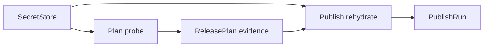

# Credential Capability And Preflight Boundary Design

**Date:** 2026-04-23  
**Status:** Draft  
**Scope:** Implementation-anchor spec for the credential, capability, and preflight boundary in the release-platform migration

**Depends on:**

- [Release Platform Architecture](./2026-04-22-release-platform-architecture.md)
- [Plan Slice Detailed Design](./2026-04-22-plan-slice-detailed-design.md)
- [Publish Slice Detailed Design](./2026-04-22-publish-slice-detailed-design.md)
- [Low-Level External Interface Design](./2026-04-22-low-level-external-interface-design.md)
- [External Interface V1](./2026-04-22-external-interface-v1.md)
- [Operational Surface Design](./2026-04-23-operational-surface-design.md)
- [Plugin SPI Design](./2026-04-23-plugin-spi-design.md)
- [Execution State And Recovery Design](./2026-04-23-execution-state-and-recovery-design.md)
- [pubm Self-Hosting Pipeline Comparison](./2026-04-22-pubm-self-hosting-pipeline-comparison.md)

## Goal

Define one concrete boundary for:

- how secrets are resolved without entering durable workflow records
- how preflight proves credential usability and observed capability
- what must be revalidated at publish time
- where OTP and step-up auth belong
- how plugins participate without widening the core artifact model
- where `pubm secrets sync` and GitHub Actions secret management stop

This memo is intentionally narrower than the full platform design. It does not redefine `ReleasePlan`, `ReleaseRecord`, or `PublishRun`; it anchors how the credential and capability parts of those artifacts should work.

## Core Decisions

1. `ReleasePlan` and later durable artifacts store evidence, never secret material, OTP values, refresh tokens, cookies, or session handles.
2. Secret resolution is a runtime concern behind a `SecretStore` boundary; capability probing is an adapter concern that consumes short-lived secret access and emits non-secret evidence.
3. Preflight is allowed to fail fast on credential and capability problems, but publish must always re-resolve secrets and revalidate volatile checks before side effects.
4. OTP and other step-up auth flows are runtime-only execution state. Preflight may record that a flow is required; it should not rely on durable storage of the flow output.
5. Plugin participation in plan-time secret resolution stays experimental, consistent with [Plugin SPI Design](./2026-04-23-plugin-spi-design.md). Stable publish and closeout adapters consume the host secret boundary but do not own durable secret persistence.
6. GitHub secret sync is an ops-surface bridge, not part of the canonical `preflight -> release -> publish` lineage from [Operational Surface Design](./2026-04-23-operational-surface-design.md).

## Boundary Diagram



The important split is the same one called out in [Release Platform Architecture](./2026-04-22-release-platform-architecture.md) and [Execution State And Recovery Design](./2026-04-23-execution-state-and-recovery-design.md): artifacts are durable and secret-free; secret resolution and auth sessions are mutable and external to those artifacts.

## Data Classification

| Data | Examples | Durable workflow artifact | Allowed store |
|---|---|---|---|
| Secret material | registry token, GitHub token, refresh token, password, session cookie, OTP code | No | secret store or runtime memory only |
| Secret locator | env var name, secure-store item name, GitHub secret mapping key | Config or ops command input only; not copied into release artifacts by default | config, ops settings |
| Credential resolution evidence | `targetKey`, `mechanismKey`, `resolverKey`, `resolvedAt` | Yes | `ReleasePlan.validationEvidence` |
| Capability evidence | `capabilityKeys`, `subjectKey`, `observedAt` | Yes | `ReleasePlan.validationEvidence` |
| Volatile readiness evidence | target openness, version availability, mutable permission result | Yes | `ReleasePlan.validationEvidence` |
| Auth challenge/session state | OTP prompt handle, browser login cursor, device code polling state | No | runtime memory and execution store only if the state is non-secret and resumable |

Rules:

- Exact secret values never enter `ReleasePlan`, `ReleaseRecord`, `PublishRun`, `CloseoutRecord`, `ExecutionState`, `StatusEnvelope`, logs, or JSON command output.
- Secret locators may exist in config or ops mappings, but they should not be mirrored into release artifacts unless there is a clear non-sensitive audit need.
- `CredentialResolutionEvidence` proves that a mechanism worked at `observedAt`; it does not grant publish authority by itself.
- `CapabilityEvidence` proves an observed permission or feature at `observedAt`; it is not a durable authorization guarantee.

This follows the secret-free artifact rules already stated in [Low-Level External Interface Design](./2026-04-22-low-level-external-interface-design.md), [Plan Slice Detailed Design](./2026-04-22-plan-slice-detailed-design.md), and [Release Platform Architecture](./2026-04-22-release-platform-architecture.md).

## Secret Store Interface

The core runtime needs one secret-resolution interface. It should resolve credentials for planning and execution without forcing the rest of the system to handle raw strings directly.

```ts
type CredentialRequirement = {
  subjectKey: string;
  targetKey?: string;
  adapterKey?: string;
  credentialKey: string;
  contractRef?: string;
  optional?: boolean;
};

type SecretResolutionRequest = {
  requirement: CredentialRequirement;
  purpose: "plan-probe" | "publish-execution" | "closeout-execution" | "ops-sync";
  executionMode: "local" | "ci";
  allowPrompt: boolean;
  allowPersistentSave: boolean;
};

type SecretLease = {
  mechanismKey: string;
  resolverKey?: string;
  acquiredAt: string;
  expiresAt?: string;
  withMaterial<T>(fn: (material: unknown) => Promise<T>): Promise<T>;
  invalidate(reason: "expired" | "used" | "probe-failed" | "challenge-required" | "execution-failed"): Promise<void>;
};

interface SecretStore {
  resolve(request: SecretResolutionRequest): Promise<SecretLease>;
  save?(request: {
    requirement: CredentialRequirement;
    material: unknown;
    mechanismKey: string;
  }): Promise<{ savedAt: string }>;
  forget?(subjectKey: string): Promise<void>;
}
```

Interface rules:

- `resolve()` is the only required capability.
- `SecretLease` is intentionally handle-shaped. Implementations should prefer callback access over returning raw secret values.
- `mechanismKey` should map to the evidence terminology already used in [Release Platform Architecture](./2026-04-22-release-platform-architecture.md): `env`, `secure-store`, `prompt`, `plugin`, and future mechanisms on the same open seam.
- `save()` is optional and exists for explicit operator-approved persistence such as `saveToken`; it must never write into workflow artifacts.
- The secret store is not responsible for capability probing, publish execution, or GitHub secret sync destination writes.

Recommended built-in mechanisms:

- `env`: resolve from current process environment
- `secure-store`: resolve from OS keychain or equivalent
- `prompt`: resolve from a one-shot interactive prompt with optional save
- `plugin`: delegate resolution to an experimental plugin-owned resolver

## Credential Resolution Phases

Credential handling should be split into six phases.

### Phase 0: Declare Requirements

Target adapters and closeout adapters declare `CredentialRequirement` inputs as part of target planning metadata.

Examples:

- npm publish target requires a registry publish token
- jsr publish target requires a jsr token
- GitHub-release closeout target requires a GitHub API token
- brew distribution/closeout flow requires a GitHub token scoped to the tap repository

This phase is declarative. No secrets are touched yet.

### Phase 1: Resolve Mechanism Viability In `Plan`

`Plan` asks `SecretStore.resolve({ purpose: "plan-probe" })` for each required credential that is relevant to the selected target set.

Expected result:

- success yields a `SecretLease`
- planner records `CredentialResolutionEvidence`
- planner does not persist the lease or material

This is the point where [Plan Slice Detailed Design](./2026-04-22-plan-slice-detailed-design.md) and [Release Platform Architecture](./2026-04-22-release-platform-architecture.md) meet the concrete runtime boundary.

### Phase 2: Probe Capability Evidence In `Plan`

After resolution, the relevant adapter consumes the lease and emits non-secret evidence:

- `CapabilityEvidence`
- `VolatileTargetReadinessEvidence`
- optional non-secret auth hints such as "step-up required at publish"

This is where the system distinguishes:

- "a token exists and can be loaded"
- from "that token appears able to publish, create releases, or push a tap branch"

### Phase 3: Freeze Secret-Free Evidence In `ReleasePlan`

Only evidence crosses the `Plan -> Release` boundary:

- resolution mechanism and timestamps
- capability keys and pass/fail results
- volatile check evidence and timestamps

Leases are invalidated or allowed to expire. No live auth material is carried into `ReleaseRecord`.

### Phase 4: Rehydrate In `Publish` Or `Closeout`

Immediately before first side effects, `Publish` or `Closeout` reacquires credentials using `purpose: "publish-execution"` or `purpose: "closeout-execution"`.

This follows the execution boundary in [Publish Slice Detailed Design](./2026-04-22-publish-slice-detailed-design.md) and the split-CI handoff rules in [Execution State And Recovery Design](./2026-04-23-execution-state-and-recovery-design.md).

### Phase 5: Revalidate Volatile State

Freshly resolved credentials are used to re-run checks that may have drifted since preflight:

- mutable package/version availability
- registry or API reachability
- org/repo membership
- publish or closeout permissions tied to current token/session
- external target openness

Publish must treat plan-time evidence as advisory for fast-fail and operator visibility, not as permission it can trust indefinitely.

### Phase 6: Retry, Resume, And Reconcile

Any retry after delay, process restart, or ambiguity repeats Phase 4 and Phase 5.

Rules:

- stale leases are never reused across process boundaries
- retry and reconcile may reuse evidence history for diagnosis, but not secret material
- manual operator re-entry of credentials or OTP is allowed when the previous auth context has expired

## Capability Evidence vs Secret Material

The boundary should stay explicit:

- `CredentialResolutionEvidence` answers "can the configured mechanism resolve something usable for this subject?"
- `CapabilityEvidence` answers "what did the resolved credential appear able to do when observed?"
- `VolatileTargetReadinessEvidence` answers "was the mutable target state acceptable when observed?"

None of those records are secret material.

They must not contain:

- token strings
- redacted token fragments
- OTP values
- session cookies
- browser callback URLs containing bearer material
- refresh tokens or long-lived auth exchanges

Allowed durable examples:

- `mechanismKey: "env"`
- `resolverKey: "builtin:npm-token"`
- `capabilityKeys: ["publish-package", "dry-run-publish"]`
- `checkKey: "version-available"`
- `checkKey: "tap-repo-write-access"`
- `observedAt: "2026-04-23T10:12:00.000Z"`

Notable rule:

- if a capability can change with token TTL, org membership, registry state, or repo state, it is not sufficient to record it only as plan-time capability evidence; it must also participate in publish-time volatile revalidation

## Volatile Revalidation Contract

Target adapters already have `requiresVolatileRecheck` in the target-adapter direction from [Monorepo And Target Adapter Design](./2026-04-23-monorepo-and-target-adapter-design.md). This document tightens how that flag should be interpreted:

1. `requiresVolatileRecheck` should be treated as true by default for any credentialed external target unless there is a strong reason otherwise.
2. Publish and closeout must rerun any check whose truth can drift independently of the repository snapshot.
3. A successful preflight probe does not authorize skipping publish-time auth checks.
4. Split-CI boundaries must assume all auth- or target-dependent evidence may be stale by the time a later job runs.

Recommended probe classes:

- stable enough for `Plan` evidence only:
  - local config shape
  - target declaration completeness
  - package-to-target mapping
- always volatile:
  - package version still unpublished
  - registry/org permissions
  - GitHub repository write access
  - current token/session validity
  - OTP or step-up challenge freshness

## OTP And Auth Flows

OTP, device-code, browser, and similar step-up flows should be modeled as runtime auth choreography layered on top of base secret resolution.

Rules:

1. Base credentials come from `SecretStore`; challenge responses do not.
2. OTP codes and browser/device auth state are never written to durable workflow artifacts.
3. Preflight should avoid consuming one-time challenges unless a target has no lower-cost probe and the workflow explicitly allows interactive validation.
4. Publish owns the final step-up auth needed for the real side effect.
5. If CI cannot satisfy an interactive auth flow non-interactively, preflight should fail with an auth/validation result that clearly says publish is blocked in CI.

Recommended runtime split:

- `SecretStore`: resolve long-lived or reusable credential source
- adapter or auth helper: request step-up challenge when needed
- runtime memory or execution store: hold non-secret resumable auth cursor state only if resume/reconcile needs it

Examples:

- npm-style OTP: plan verifies base token resolution and any non-destructive permission probe; publish prompts for OTP only when the registry actually requires it for the publish action
- GitHub browser/device auth: plan may record that an interactive GitHub auth path exists, but publish or closeout must complete the flow in the current process
- refreshed session token: if a secure-store mechanism intentionally rotates and persists a new long-lived token, that persistence happens inside the secret mechanism, not in release artifacts

## Plugin Participation

This boundary should follow the stability split in [Plugin SPI Design](./2026-04-23-plugin-spi-design.md).

### Experimental Plan-Time Participation

Plugins may participate in credential handling at plan time by:

- declaring credential requirements
- providing secret resolvers through the `plugin` mechanism
- contributing capability probes
- contributing volatile readiness checks

Constraints:

- plugins return evidence, not secret material, across slice boundaries
- plugins may hold secret material only inside the active resolution/probe call
- plugins must not persist secrets in plugin-owned durable records or ad hoc files
- plugin resolvers must obey the same logging and serialization rules as built-ins

### Stable Publish And Closeout Participation

Stable publish/closeout adapters may:

- request secret resolution from the host `SecretStore`
- perform execution-time capability checks
- execute side effects with fresh credentials
- emit non-secret target state into `PublishRun` or `CloseoutRecord`

They may not:

- smuggle raw credential material into target state
- bypass the host boundary by reading arbitrary secret sources directly unless that behavior is the declared secret mechanism
- write GitHub secrets or other external secret-manager state as part of publish/closeout side effects

### Official Plugin Implications

- `plugin-brew` should separate its credentialed publish/distribution work from repo-closeout work, consistent with [Plugin SPI Design](./2026-04-23-plugin-spi-design.md)
- `plugin-external-version-sync` should remain outside this boundary because it is source mutation without secret handling

## GitHub Secret Sync Boundary

The current self-hosting flow described in [pubm Self-Hosting Pipeline Comparison](./2026-04-22-pubm-self-hosting-pipeline-comparison.md) allows prepare-time credential collection to optionally sync GitHub Secrets inline. The new boundary should make that behavior explicit and separate.

### Boundary Decision

`pubm secrets sync` is the canonical command that writes to GitHub Actions secrets or similar external secret destinations. It belongs to the ops surface defined in [Operational Surface Design](./2026-04-23-operational-surface-design.md) and the public command set in [External Interface V1](./2026-04-22-external-interface-v1.md).

`pubm preflight` may:

- verify that the configured source secret can be resolved locally
- verify that required CI secret mappings are configured
- optionally read destination metadata when a non-secret existence check is available

`pubm preflight` must not:

- upsert GitHub secrets as an implicit side effect
- treat GitHub secret sync success as part of `ReleasePlan` lineage
- persist GitHub secret values, encrypted blobs, or sync payloads into workflow artifacts

### Separate Destination Interface

To keep the boundary clean, GitHub secret sync should use a separate destination-facing interface rather than overloading `SecretStore`:

```ts
type SecretSyncEntry = {
  destinationKey: string;
  sourceRequirement: CredentialRequirement;
};

interface SecretDestination {
  sync(request: {
    destinationRef: string;
    entries: SecretSyncEntry[];
    mode: "validate-only" | "upsert";
  }): Promise<{
    syncedAt: string;
    results: Array<{ destinationKey: string; status: "validated" | "updated" | "unchanged" | "failed" }>;
  }>;
}
```

`pubm secrets sync` composes:

- source secret resolution via `SecretStore`
- destination writes via `SecretDestination`

The core release workflow composes only the first half.

This preserves the model that once a publish job starts in GitHub Actions, the runtime sees normal env-based resolution again. GitHub secret storage is therefore an environment/bootstrap concern, not a release-artifact concern.

## Logging, JSON, And Audit Rules

Consistent with [Low-Level External Interface Design](./2026-04-22-low-level-external-interface-design.md):

- no JSON output includes raw tokens, OTP values, or secret-store payloads
- auth failures return target/subject identifiers and reason classes, not secret fragments
- logs may mention `targetKey`, `subjectKey`, `mechanismKey`, `resolverKey`, `capabilityKey`, and timestamps
- logs should not echo secret locator details unless those details are already intentionally public config

Recommended audit posture:

- audit the fact that a credential was resolved
- audit the mechanism used
- audit observed capability summary
- audit whether publish-time revalidation passed
- do not audit the secret itself

## Unresolved Risks

- Some registries may not expose a safe capability probe that avoids consuming the real publish path; those targets may need weaker preflight evidence or target-specific auth hints.
- OTP and step-up auth resume semantics are still underspecified when a process crashes mid-challenge; only non-secret resumable cursors should enter `ExecutionState`.
- Plugin-provided secret resolvers expand the attack surface; they need stronger host controls around logging, exception formatting, and memory lifetime.
- Secret locator names may themselves reveal internal infrastructure conventions; the default should be to keep them in config and ops commands, not workflow artifacts.
- GitHub secret sync validation may be constrained by destination APIs that do not expose enough non-secret metadata to prove drift cleanly.
- Long-lived closeout flows that depend on GitHub or external SCM permissions can drift between preflight and closeout even after publish succeeds; closeout must follow the same fresh-resolution rule as publish.

## Decision Summary

- Keep one runtime `SecretStore` boundary for secret resolution and one separate ops-only `SecretDestination` boundary for GitHub secret sync.
- Persist credential resolution, capability, and volatile-readiness evidence in `ReleasePlan`; never persist secret material.
- Always reacquire credentials and rerun volatile checks in publish and closeout.
- Treat OTP and step-up auth as runtime-only execution state.
- Let plugins participate through host-provided secret and evidence seams, but keep plan-time secret SPI experimental until the workflow contracts settle.
