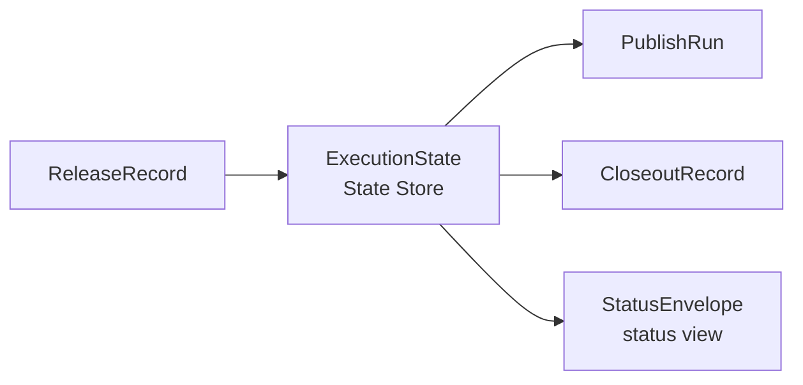

# Execution State And Recovery Design

**Date:** 2026-04-23
**Status:** Draft
**Scope:** Canonical `ExecutionState`, state-store boundaries, retry/resume/reconcile/compensation semantics, and split-CI handoff.

## Goal

Define the missing runtime-state layer under the 2026-04-22 architecture set so `pubm` can recover from partial release, publish, and closeout execution without depending on:

- `ctx.runtime` as a process-local mutable bag
- `RollbackTracker` closures as the primary recovery mechanism
- checked-out repository state as an implicit handoff contract

This design keeps the existing direction from:

- [Release Platform Architecture](./2026-04-22-release-platform-architecture.md)
- [Low-Level External Interface Design](./2026-04-22-low-level-external-interface-design.md)
- [Release Slice Detailed Design](./2026-04-22-release-slice-detailed-design.md)
- [Publish Slice Detailed Design](./2026-04-22-publish-slice-detailed-design.md)
- [External Interface V1](./2026-04-22-external-interface-v1.md)
- [Low-Level Migration Scope Plan](./2026-04-22-low-level-migration-scope-plan.md)
- [pubm Self-Hosting Pipeline Comparison](./2026-04-22-pubm-self-hosting-pipeline-comparison.md)

## Decision Summary

- `ReleasePlan`, `ReleaseRecord`, `PublishRun`, and `CloseoutRecord` remain the durable typed artifacts exchanged across slice boundaries.
- `ExecutionState` becomes the canonical mutable lineage state inside the architecture's `State Store`.
- `StatusEnvelope` remains the stable external status view; `ExecutionState` stays internal/experimental.
- Recovery is reconcile-first, not rollback-first. Compensation is optional and subordinate to reconciliation.
- Split-CI handoff is artifact-driven: later jobs consume persisted records plus persisted `ExecutionState`, never `ctx.runtime`.

## Closed Core, Open Edge Rule

`ExecutionState` should keep engine-owned lifecycle fields closed: phase, checkpoint cursor, recovery mode, and execution status are all core vocabulary.

Extension-owned execution surfaces should stay open and reference-based:

- workflow selection should be recorded through `workflowRef`, not a closed global enum
- recovery should track `targetKey`, `targetCategory`, and optional contract refs
- plugin or adapter families should be identified through capabilities and target contracts, not a closed target-class enum
- immutable records still define the durable contract; mutable execution state only points at them

## Canonical Model

`ExecutionState` is the only mutable state object that spans release, publish, closeout, and recovery for one lineage.

It does not duplicate release intent. Intent stays in `ReleasePlan` and `ReleaseRecord`.

It does track:

- current phase cursor
- per-target execution status and attempt count
- recovery reason and required operator action
- durable checkpoints needed for resume or reconcile
- pointers to immutable attempt artifacts

```ts
type ExecutionPhase = "release" | "publish" | "closeout" | "recovery";

type RecoveryMode =
  | "none"
  | "retry_failed"
  | "retry_all"
  | "resume"
  | "reconcile"
  | "compensate";

type ExecutionState = {
  schemaVersion: "1";
  lineageId: string;
  workflowRef: string;
  planId: string;
  releaseRecordId?: string;
  currentPublishRunId?: string;
  currentCloseoutRecordId?: string;
  phase: ExecutionPhase;
  nextAction: NextAction;
  releaseState?: ReleaseRecord["state"];
  publishState?: PublishRun["state"];
  closeoutState?: CloseoutRecord["state"];
  checkpoints: ExecutionCheckpoint[];
  targetStates: TargetExecutionState[];
  recovery: {
    mode: RecoveryMode;
    reason?:
      | "target_failure"
      | "post_mutation_uncertainty"
      | "external_drift"
      | "manual_pause"
      | "orchestrator_crash";
    requiresOperator: boolean;
    summary?: string;
  };
  createdAt: string;
  updatedAt: string;
};

type ExecutionCheckpoint = {
  checkpointId: string;
  phase: "release" | "publish" | "closeout";
  cursor:
    | "source_mutations_applied"
    | "release_commit_created"
    | "release_tags_created"
    | "target_group_started"
    | "target_group_finished"
    | "closeout_started"
    | "closeout_finished";
  status: "pending" | "applied" | "uncertain" | "reconciled";
  recordedAt: string;
};

type TargetExecutionState = {
  targetKey: string;
  unitKey: string;
  targetCategory: string;
  targetContractRef?: string;
  status:
    | "queued"
    | "running"
    | "succeeded"
    | "failed"
    | "compensated"
    | "blocked";
  attempt: number;
  requiredForProgress: boolean;
  requiredForCloseout: boolean;
  reconcileRequired: boolean;
  externalRef?: string;
  lastErrorCode?: string;
  updatedAt: string;
};
```

### Canonicality rule

- `ExecutionState` is the source of truth for in-flight and recovery state.
- Immutable artifacts are the source of truth for released intent and completed attempt snapshots.
- `StatusEnvelope` is the externally stable status view assembled from both, with `ExecutionState` winning whenever a workflow is still active or in recovery.

This resolves the current ambiguity where records want immutable semantics, but status still needs a live view.



## Store Boundaries

| Store | Owns | Mutable | Cross-process | Must not contain |
|---|---|---|---|---|
| Artifact store | `ReleasePlan`, `ReleaseRecord`, `PublishRun`, `CloseoutRecord` | No | Yes | secrets, live cursors, prompt handles |
| Execution store | `ExecutionState`, checkpoint history, attempt counters, recovery work items | Yes | Yes | raw tokens, rollback closures, open file handles |
| Secret store | credential material resolved through env, secure store, or prompt flows | Yes | Yes, by mechanism-specific means | plan data, execution cursors |
| Runtime memory | `PluginRunner`, promise dedupe, temp dirs, manifest backups, current task handles | Yes | No | authoritative workflow state |

### Boundary rules

- Engines may read immutable artifacts, but only `ExecutionState` may carry mutable cursors.
- `ReleasePlan` and `ReleaseRecord` never store secrets; they keep only non-secret evidence and release intent.
- `PublishRun` and `CloseoutRecord` are attempt snapshots copied from the latest canonical execution data when an attempt ends.
- `StatusService` reads from the artifact store and execution store only; it must not inspect ad hoc process memory.
- The current `ctx.runtime.versionPlan`, `ctx.runtime.rollback`, `workspaceBackups`, and token retry promises are migration inputs, not future durable contracts.

## Attempt And Lineage Semantics

- One lineage starts at `ReleasePlan.id` and continues through release, publish, closeout, and recovery.
- `ReleaseRecord` anchors the publishable lineage once source materialization reaches a durable release boundary.
- Each publish invocation creates a new publish attempt. The final snapshot of that attempt is a `PublishRun`.
- Each closeout invocation creates a new closeout attempt. The final snapshot is a `CloseoutRecord`.
- `ExecutionState.targetStates[].attempt` is cumulative across attempts for the same lineage, so `retry failed` and `retry all` do not lose history.

This keeps immutable attempt records and mutable lineage state from collapsing into one object.

## Recovery Semantics

### Retry

Retry means "start a new attempt from existing lineage state."

- `retry=failed` may select only targets currently marked `failed`.
- `retry=all` may rerun all selected non-skipped targets within the existing `ReleaseRecord` scope.
- retry always increments `TargetExecutionState.attempt`.
- retry is blocked if any selected target or checkpoint is still `uncertain`; reconcile must happen first.
- retry never recomputes versions, target selection, or tags.

The public `nextAction` values stay aligned with the 2026-04-22 docs:

- `publish_retry_failed`
- `publish_retry_all`

### Resume

Resume means "continue the same phase from a known durable checkpoint."

- resume is allowed only when the checkpoint cursor is deterministic and the unfinished work is still well-scoped
- resume keeps the same lineage and phase intent
- resume is narrower than retry; it does not reselect work that already finished cleanly

Examples:

- release can resume tag creation after `release_commit_created`
- publish can resume remaining target groups after a process crash if no completed target is ambiguous
- closeout can resume remaining closeout targets after a timeout

If a process died after an external side effect may already have happened, resume must first degrade into reconcile.

### Reconcile

Reconcile means "compare `ExecutionState` against external truth and repair the state model before more mutations."

Reconcile is mandatory after:

- process crash or timeout after an external call started
- network ambiguity after a publish or closeout request
- split-CI handoff when the local store and current checkout may have drifted
- manual corrective action outside `pubm`

Reconcile rules:

- git state is checked against `releaseSha`, tags, and known release checkpoints
- built-in registry-category targets are checked against version existence and target-specific publish evidence
- other target categories are checked using their own external identifiers and contract-specific evidence when available
- each ambiguous checkpoint or target becomes either `reconciled -> succeeded`, `reconciled -> failed`, or remains blocked for manual action

Reconcile is the replacement for closure-based rollback as the default mental model.

### Compensation

Compensation means "apply an explicit inverse action after reconciliation proves what happened."

- compensation is opt-in per target capability
- compensation is never assumed to exist for all registries or closeout targets
- compensation runs only after reconcile has reduced uncertainty
- successful compensation may set target status to `compensated`
- partial or failed compensation leads back to `resume_recovery`, not silent success

Compensation is a safety valve, not the primary workflow contract.

## Split-CI Handoff Design

The split-CI handoff remains centered on immutable artifacts, not repository reconstruction.

### Handoff contract

Prepare/release side must persist:

- `ReleasePlan`
- `ReleaseRecord`
- `ExecutionState`

Publish/closeout side must load them by lineage and then:

1. verify the checkout against `ReleaseRecord.releaseSha`
2. rehydrate fresh credentials from the configured secret mechanism
3. revalidate volatile target readiness
4. continue from `ExecutionState`

### Default storage direction

For v1, the logical model should support a filesystem-backed store that can be uploaded as a CI artifact between jobs. A later hosted or remote state backend can implement the same logical boundary without changing the contracts above.

### Why this is different from the current flow

Current self-hosting reconstructs publish intent from:

- checked-out manifest versions
- tags in git
- process-local `versionPlan`

The new handoff is:

- `ReleaseRecord` defines what should be published
- `ExecutionState` defines what has already happened and what is safe to do next

That matches the 2026-04-22 direction that typed artifacts are the only durable handoff across process boundaries while still giving recovery a canonical mutable home.

## Status View Assembly

`pubm status --json` stays the canonical public observability command.

Assembly rules:

- `releaseState`, `publishState`, and `closeoutState` use the existing enum vocabulary from the 2026-04-22 docs
- `nextAction` is derived from `ExecutionState.recovery.mode` plus the latest terminal attempt snapshot
- failed target reporting comes from `ExecutionState.targetStates`, narrowed to the latest relevant phase
- when no active lineage exists, status can fall back to immutable record lookup only

This keeps the external JSON shape stable while allowing a better internal recovery model.

## Diagram Mapping

- `ReleaseRecord` in the diagram is the durable release handoff defined in [release-slice-detailed-design](./2026-04-22-release-slice-detailed-design.md).
- `PublishRun` and `CloseoutRecord` are the attempt snapshots defined in [publish-slice-detailed-design](./2026-04-22-publish-slice-detailed-design.md) and [low-level-external-interface-design](./2026-04-22-low-level-external-interface-design.md).
- `StatusEnvelope` is the stable machine-readable status view from [low-level-external-interface-design](./2026-04-22-low-level-external-interface-design.md) and [external-interface-v1](./2026-04-22-external-interface-v1.md).
- `ExecutionState` occupies the `State Store` role from [release-platform-architecture](./2026-04-22-release-platform-architecture.md) and closes the scope gap called out in [low-level-migration-scope-plan](./2026-04-22-low-level-migration-scope-plan.md).

## Unresolved Risks

- The repo still needs a precise concurrency and locking rule for two operators or CI jobs touching the same lineage at once.
- Some targets may not expose enough authoritative external evidence for clean reconcile after timeouts or partial network failures.
- The exact boundary between "resume current attempt" and "emit a new attempt snapshot" needs a concrete persistence rule in implementation.
- Plugin targets will need explicit capability flags and stable contract refs for `reconcile` and `compensate`; otherwise recovery quality will vary widely by target category.
- A filesystem-backed state store is pragmatic for v1, but remote/store-backed implementations may be needed for hosted control planes or long-lived recovery workflows.

## Recommendation

Implement recovery around one canonical persisted `ExecutionState` per lineage, keep release/publish/closeout artifacts immutable, and treat reconcile as the default bridge between uncertain execution and safe next actions.
