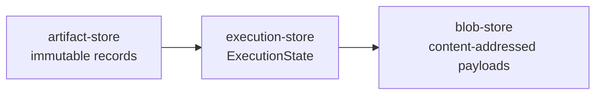

# Lineage Store V1 Design

**Date:** 2026-04-23  
**Status:** Draft  
**Scope:** Filesystem-backed implementation anchor for the architecture `State Store`, covering immutable lineage artifacts, mutable execution state, blob persistence, CI handoff, and recovery-safe mutation rules.

## Goal

Define a concrete V1 `Lineage Store` that implements the logical storage boundary introduced in:

- [2026-04-22 Release Platform Architecture](./2026-04-22-release-platform-architecture.md)
- [2026-04-22 Low-Level External Interface Design](./2026-04-22-low-level-external-interface-design.md)
- [2026-04-22 Release Slice Detailed Design](./2026-04-22-release-slice-detailed-design.md)
- [2026-04-22 Publish Slice Detailed Design](./2026-04-22-publish-slice-detailed-design.md)
- [2026-04-22 pubm Self-Hosting Pipeline Comparison](./2026-04-22-pubm-self-hosting-pipeline-comparison.md)
- [2026-04-23 Architecture Evolution Principles](./2026-04-23-architecture-evolution-principles.md)
- [2026-04-23 Execution State And Recovery Design](./2026-04-23-execution-state-and-recovery-design.md)
- [2026-04-23 Artifact and Closeout Design](./2026-04-23-artifact-and-closeout-design.md)

This document is intentionally more concrete than the other design memos. It is the implementation anchor for how `pubm` persists one release lineage safely on local disk and hands that lineage across CI jobs.

## Decision Summary

- V1 uses a repo-local filesystem store rooted at `.pubm/lineage-store/v1`.
- The store is split into three closed engine-owned families:
  - `artifact-store`: immutable typed records such as `ReleasePlan`, `ReleaseRecord`, `PublishRun`, `CloseoutRecord`, and `ArtifactBundle`
  - `execution-store`: one canonical mutable `ExecutionState` lineage plus derived selector indexes and lock state
  - `blob-store`: content-addressed large payloads and export bundles
- `lineageId` is exactly `ReleasePlan.id`. No second lineage identifier is introduced.
- Immutable records are append-only. Mutable lineage state is copy-on-write by revision under a lineage lock.
- `PublishRun` and `CloseoutRecord` remain terminal attempt snapshots. Resume mutates `ExecutionState`; retry creates a new terminal snapshot only when the retried attempt ends.
- The whole store can be uploaded as a CI artifact, but V1 also defines a lineage-scoped export/import format for smaller handoff payloads.

## Closed Core, Open Edge Rule

Storage layout follows the same rule as the architecture:

- closed core:
  - store families
  - record families
  - lock semantics
  - revision semantics
  - retention classes
- open edge:
  - `workflowRef`
  - `proposalRef`
  - `targetKey`
  - `targetRef`
  - `contractRef`
  - `closeoutDependencyKey`
  - plugin-owned metadata inside durable records

New workflow presets, targets, policies, or plugins must fit inside existing record shapes and string refs. They must not require new top-level directories or new storage enums.

## Store Split

| Store | Source of truth for | Mutability | Typical contents | Must not contain |
|---|---|---|---|---|
| `artifact-store` | immutable lineage artifacts | append-only | `ReleasePlan`, `ReleaseRecord`, `PublishRun`, `CloseoutRecord`, `ArtifactBundle` | locks, temp files, live cursors, secrets |
| `execution-store` | canonical mutable lineage state | replace-by-revision | `ExecutionState`, selector indexes, lease files, import conflict reports | raw blobs, large binaries, credentials |
| `blob-store` | content-addressed binary payloads | append-only plus GC | built release assets, imported asset payloads, export archives | lifecycle state, retry cursors, target status |



### Boundary rules

- `artifact-store` answers "what durable records exist for this lineage?"
- `execution-store` answers "what is the safe next action right now?"
- `blob-store` answers "where are the bytes for durable assets or exports?"
- `StatusEnvelope` is projected from `artifact-store` plus `execution-store`; it must not depend on `blob-store`.
- `blob-store` references are implementation-only. Public contracts still expose `artifactBundleRefs` and typed record IDs from the 2026-04-22 and 2026-04-23 docs.

## Filesystem Layout

Default root:

```text
.pubm/lineage-store/v1/
```

Concrete layout:

```text
.pubm/lineage-store/v1/
  artifact-store/
    release-plans/
      plan_<id>.json
    release-records/
      rel_<id>.json
    publish-runs/
      run_<id>.json
    closeout-records/
      close_<id>.json
    artifact-bundles/
      bundle_<id>.json

  execution-store/
    lineages/
      plan_<id>/
        current.json
        revisions/
          000001.json
          000002.json
        conflicts/
          import_<id>.json
    indexes/
      by-release-record/
        rel_<id>.json
      by-publish-run/
        run_<id>.json
      by-closeout-record/
        close_<id>.json
      by-tag/
        sha256-<tag-digest>.json
    locks/
      store.lock/
        lease.json
      lineages/
        plan_<id>.lock/
          lease.json

  blob-store/
    content/
      sha256/
        ab/
          cd/
            sha256-<digest>.blob
    refs/
      bundles/
        bundle_<id>.json
    exports/
      xfer_<id>/
        manifest.json
        payload/
```

### Layout notes

- `artifact-store` files are human-readable JSON UTF-8.
- `execution-store/lineages/<lineageId>/current.json` is the only mutable pointer for one lineage.
- `execution-store/lineages/<lineageId>/revisions/*.json` are immutable full-state revisions.
- `execution-store/indexes/*` are derived caches. They can be rebuilt from immutable records plus current lineage state.
- `blob-store/content` is content-addressed by SHA-256 and sharded by digest prefix.
- `blob-store/refs/bundles/<bundleId>.json` is the store-local join from `ArtifactBundle` to concrete blob digests. This keeps large payload linkage out of the stable public record surface.

## ID Rules

The 2026-04-22 interface docs say IDs are opaque strings. V1 keeps that public rule while standardizing generated IDs internally.

### Generated IDs

Recommended V1 prefixes:

- `plan_<ulid>` for `ReleasePlan.id`
- `rel_<ulid>` for `ReleaseRecord.id`
- `run_<ulid>` for `PublishRun.id`
- `close_<ulid>` for `CloseoutRecord.id`
- `bundle_<ulid>` for `ArtifactBundle.id`
- `xfer_<ulid>` for export bundles
- `sha256-<64 hex chars>` for blob identifiers

### Lineage identity

- `lineageId = ReleasePlan.id`
- `ReleaseRecord.planId` must equal `lineageId`
- `PublishRun.releaseRecordId` and `CloseoutRecord.releaseRecordId` resolve back to the same `lineageId` through immutable records or derived indexes

### ID constraints

- IDs are path-safe ASCII generated by the store.
- IDs must not encode `targetKey`, `workflowRef`, branch name, or plugin identity.
- Open-edge refs remain inside record payloads, not inside filenames.
- Imported artifacts keep their original IDs if they already match the V1 path-safe format; otherwise import should fail rather than silently rewrite durable IDs.

## Execution Revision Model

V1 stores mutable lineage state as immutable revisions plus one atomic pointer.

### `current.json`

`current.json` is a small envelope:

```json
{
  "schemaVersion": "1",
  "lineageId": "plan_...",
  "revision": 12,
  "currentRevisionFile": "revisions/000012.json",
  "updatedAt": "2026-04-23T00:00:00.000Z"
}
```

### Revision payload

Each `revisions/<n>.json` contains one full `ExecutionState` plus store metadata needed for concurrency-safe replacement:

- `lineageId`
- `revision`
- `previousRevision`
- `writtenAt`
- `writerId`
- `executionState`

`ExecutionState` remains the architecture-owned object from [2026-04-23 Execution State And Recovery Design](./2026-04-23-execution-state-and-recovery-design.md). The revision envelope is implementation-only.

### Why this shape

- readers always have one committed pointer
- writers never mutate historical revisions
- crash recovery is simpler because orphaned future revisions are harmless
- retention can compact old revisions without touching immutable attempt records

## Atomic Write And Update Rules

All write rules are same-filesystem rules. Temp files must live in the same parent directory as the final file so rename stays atomic.

### Immutable artifact creation

For files in `artifact-store` and `blob-store/content`:

1. Serialize deterministically to UTF-8 bytes.
2. Write `<name>.tmp.<writerId>` with create-new semantics.
3. `fsync` the temp file.
4. Rename temp file to final path.
5. `fsync` the parent directory.

If the final path already exists:

- if bytes are identical, treat as idempotent success
- if bytes differ, fail with store corruption or conflicting writer error

Immutable files are never updated in place.

### Mutable lineage update

For `execution-store/lineages/<lineageId>`:

1. Acquire the lineage lock.
2. Read `current.json`.
3. Compute the next revision number.
4. Write the full revision file under `revisions/`.
5. `fsync` the revision file.
6. Atomically replace `current.json` to point to the new revision.
7. Update derived indexes.
8. Release the lineage lock.

If the process crashes:

- before step 6: old `current.json` still points to the previous committed state
- after step 6 but before step 7: state is still correct; missing indexes are rebuildable

### Index update rule

`execution-store/indexes/*` are never the source of truth. They are updated only after the record or revision they reference is fully committed.

This means:

- correctness depends on committed record files plus `current.json`
- performance depends on indexes
- store open or import may rebuild indexes opportunistically

## Locking And Concurrency

V1 uses advisory filesystem leases, not in-memory mutexes.

### Lock granularity

- one lineage lock per `lineageId`
- one store lock for operations that span multiple lineages or GC the blob store

### Lock representation

Acquiring a lock means atomically creating a directory:

```text
execution-store/locks/lineages/<lineageId>.lock/
```

with a `lease.json` file:

```json
{
  "schemaVersion": "1",
  "lockType": "lineage",
  "lineageId": "plan_...",
  "ownerId": "writer_...",
  "operation": "publish|closeout|reconcile|import|gc",
  "startedAt": "2026-04-23T00:00:00.000Z",
  "expiresAt": "2026-04-23T00:00:30.000Z",
  "hostname": "ci-runner",
  "pid": 12345
}
```

### Lease rules

- writers refresh `expiresAt` on a heartbeat while they own the lock
- readers do not need locks and only read committed files
- only one mutable writer may operate on a lineage at once
- `publish`, `closeout`, `resume`, `retry`, `reconcile`, and lineage import all require the lineage lock

### Stale lock rule

If `expiresAt` has passed:

- a new writer may take the store lock
- move the stale lineage lock into a timestamped `conflicts/` record
- acquire a fresh lineage lock
- force the next mutable action through `recovery.mode = "reconcile"` with reason `orchestrator_crash`

V1 should prefer safe handoff plus reconcile over optimistic lock stealing.

### Multi-lineage operations

`gc`, whole-store export, and import of multiple lineages must:

1. acquire the store lock
2. acquire lineage locks in sorted `lineageId` order
3. perform the operation
4. release lineage locks
5. release the store lock

This prevents deadlocks between concurrent import/export or GC work.

## Attempt Snapshot Rules

This section settles the persistence boundary left open in [2026-04-23 Execution State And Recovery Design](./2026-04-23-execution-state-and-recovery-design.md).

### Rule

- `ExecutionState` is the live mutable view during an in-flight attempt.
- `PublishRun` and `CloseoutRecord` are written only when an attempt reaches a terminal outcome.
- Resume does not emit a new immutable attempt record.
- Retry does emit a new immutable attempt record, but only when that retried attempt ends.

### Practical effect

- crash during publish before terminal outcome:
  - update `ExecutionState`
  - no `PublishRun` is created yet
  - next action is usually `resume_recovery`
- publish attempt ends in `partial`:
  - write one immutable `PublishRun`
  - update `ExecutionState.currentPublishRunId`
  - set `nextAction = publish_retry_failed` or `publish_retry_all`
- retry failed targets:
  - mutate `ExecutionState.targetStates[].attempt`
  - run the new attempt
  - emit a new `PublishRun` when the retried attempt terminates

### Ordering rule for terminal publish attempts

When a publish attempt finishes:

1. commit referenced blobs
2. commit bundle blob refs
3. commit `ArtifactBundle`
4. commit `PublishRun`
5. update `ExecutionState` to point at `PublishRun.id`

When a closeout attempt finishes:

1. commit any new closeout-side immutable artifacts
2. commit `CloseoutRecord`
3. update `ExecutionState` to point at `CloseoutRecord.id`

This preserves the invariant that mutable state never points at a missing immutable snapshot.

## Retention And GC

GC is lineage-rooted, not file-age-rooted.

### Retention classes

- active:
  - lineage has a live lock, non-terminal phase, or `recovery.mode != "none"`
  - never GC
- recoverable:
  - lineage is unlocked but `nextAction != "none"`
  - never GC
- terminal:
  - no live lock
  - `recovery.mode = "none"`
  - `nextAction = "none"`
  - eligible for retention policy
- pinned:
  - explicit export pin or operator pin file
  - never GC until unpinned

### Default V1 retention

- terminal lineage JSON artifacts: keep for 30 days
- terminal execution revisions older than the current revision: compact after 7 days
- blob payloads reachable only from expired terminal lineages: delete after 7 days
- export bundles in `blob-store/exports`: delete after 7 days unless pinned

### GC algorithm

1. Acquire the store lock.
2. Build the root set from active, recoverable, and pinned lineages.
3. Traverse reachable immutable records from those lineages:
   - `ReleasePlan`
   - `ReleaseRecord`
   - `PublishRun`
   - `CloseoutRecord`
   - `ArtifactBundle`
4. Collect referenced blob digests from bundle refs.
5. Delete unreferenced blobs and expired export bundles.
6. Compact expired execution revisions for terminal lineages.
7. Optionally remove fully expired terminal lineages and their immutable artifacts last.

### GC safety rules

- never delete a blob until no retained `ArtifactBundle` references it
- never delete immutable attempt snapshots while the lineage is recoverable
- never run GC without the store lock

## CI Artifact Handoff

The storage direction from [2026-04-23 Execution State And Recovery Design](./2026-04-23-execution-state-and-recovery-design.md) is adopted directly: V1 is filesystem-backed so the store itself can move between jobs.

### Supported handoff modes

1. Whole-store handoff
   - upload `.pubm/lineage-store/v1`
   - simplest implementation
   - best for single-lineage CI pipelines

2. Lineage-scoped export
   - export only selected lineages plus referenced immutable artifacts and blobs
   - smaller payload
   - preferred when runners share unrelated workspaces or multiple lineages accumulate locally

### Export manifest

`blob-store/exports/<xferId>/manifest.json` should include:

- `schemaVersion`
- `exportId`
- `exportedAt`
- `lineageIds`
- `releaseRecordIds`
- `publishRunIds`
- `closeoutRecordIds`
- `artifactBundleIds`
- `blobDigests`
- `storeRootVersion`
- `sourceHostname`

### Export rules

- export acquires the store lock plus selected lineage locks
- export copies only committed files
- export manifest digests every included file
- export creates a temporary pin for included lineages until the export is complete

### Import rules

Import is idempotent for immutable data and conservative for mutable lineage state.

1. Acquire the store lock.
2. Verify manifest schema and file digests.
3. Copy blobs first with immutable create-new semantics.
4. Copy immutable artifact files next.
5. For each imported lineage:
   - if the lineage does not exist locally, import its `current.json` and reachable revisions
   - if local and imported `current.json` point to the same revision content, treat as no-op
   - if the local lineage is active or recoverable and the imported revision differs, fail import and write a conflict record
   - if the local lineage is terminal and the imported revision is newer, replace local `current.json` under the lineage lock and archive the prior pointer as a conflict backup
6. Rebuild indexes for imported IDs.

### Why import is conservative

Two runners mutating the same lineage independently is exactly the case that should degrade into reconcile or operator review, not silent last-writer-wins replacement.

## Lookup Rules

V1 must support the selectors already present in [2026-04-22 Low-Level External Interface Design](./2026-04-22-low-level-external-interface-design.md).

### `PublishInput.from`

- `planId`: resolve directly to `lineageId`
- `releaseRecordId`: resolve through `execution-store/indexes/by-release-record`
- `tag`: resolve through `execution-store/indexes/by-tag`

### `StatusQuery`

- `releaseRecordId`, `publishRunId`, and `closeoutRecordId` resolve through derived indexes
- if indexes are missing, the store may rebuild them by scanning immutable record families

## Unresolved Risks

- Filesystem lease semantics are only as good as the underlying filesystem. Local disk is fine; some network filesystems may make stale-lock detection unreliable.
- Import conflict handling is intentionally conservative. A later hosted or remote backend may want a stronger lineage-merge protocol than "fail and reconcile."
- `blob-store/refs/bundles/*.json` is an implementation-only join for V1. The repo may later decide to fold blob refs into the internal `Artifact` or `ArtifactBundle` shape once that contract stabilizes.
- Thirty-day JSON retention and seven-day blob retention are pragmatic defaults, not product guarantees. Large self-hosted asset sets may need policy knobs.
- Some target categories still lack strong external evidence for reconcile. The store can preserve uncertainty correctly, but it cannot invent proof that a side effect happened.
- Whole-store upload is easy, but large binary bundles can make CI artifacts expensive. Export filters or remote blob storage may be needed sooner than remote execution state.

## Recommendation

Implement `Lineage Store V1` as `.pubm/lineage-store/v1` with strict `artifact-store` / `execution-store` / `blob-store` separation, copy-on-write `ExecutionState` revisions under lineage leases, terminal-only `PublishRun` and `CloseoutRecord` snapshots, and conservative lineage-scoped import/export for split CI handoff.
