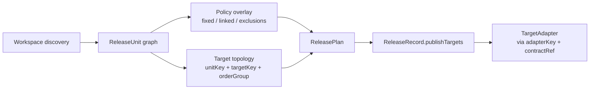

# Monorepo And Target Adapter Design

**Date:** 2026-04-23  
**Status:** Draft  
**Scope:** Concrete design for monorepo mechanics, mixed-ecosystem `ReleaseUnit` graph rules, policy vs topology mapping, and the low-level target adapter contract that bridges current registry abstractions to the new target model.

**Depends on:**

- [release-platform-architecture](./2026-04-22-release-platform-architecture.md)
- [plan-slice-detailed-design](./2026-04-22-plan-slice-detailed-design.md)
- [publish-slice-detailed-design](./2026-04-22-publish-slice-detailed-design.md)
- [low-level-migration-scope-plan](./2026-04-22-low-level-migration-scope-plan.md)

## Goal

This document narrows two gaps left intentionally open in the April 22 design set:

- how current workspace discovery and monorepo rules become a durable `ReleaseUnit` graph,
- how current registry descriptors and task factories become the low-level adapter seam for `TargetContract` and `TargetCapabilities`.

The goal is to keep terminology aligned with the current architecture direction:

- `Ecosystem` remains the source-side adapter axis,
- `ReleaseUnit` remains the canonical source-side graph node,
- built-in registries remain first-class examples, but the target adapter seam should stay open through `targetCategory`, `targetKey`, `adapterKey`, and `contractRef`,
- `TargetContract` and `TargetCapabilities` remain the publish-time execution boundary.

## Scope Boundary

In scope:

- monorepo discovery normalization into `ReleaseUnit[]`,
- mixed-ecosystem dependency and target graph rules,
- separation of topology from policy,
- low-level target adapter contract, including built-in registry/distribution examples,
- migration mapping from current `registry/*`, `monorepo/*`, and publish grouping code.

Out of scope:

- final plugin API redesign,
- full `ReleaseEngine` mutation internals,
- closeout target redesign,
- changeset or commit analysis redesign beyond policy placement.

## Design Overview



The important split is:

- graph and target topology are stable planning outputs,
- versioning and inclusion rules are policy overlays,
- execution behavior is adapter metadata loaded by `adapterKey` and interpreted through `contractRef` at publish time.

## Closed Core, Open Edge Rule

This slice keeps planner-owned graph state and engine-owned execution state closed, but it should not model extension seams as exhaustive built-in target kinds.

- `targetKey` identifies the concrete configured destination instance
- `targetCategory` is an open classification used for grouping, UX, and policy defaults
- `adapterKey` identifies the executable behavior family
- `contractRef` identifies the contract schema the adapter implements
- built-in categories such as `registry` and `distribution` are examples, not the only legal future edge shapes

## Monorepo / ReleaseUnit Graph Rules

### Canonical Node

`ReleaseUnit` remains the canonical source-side graph node as defined in [plan-slice-detailed-design](./2026-04-22-plan-slice-detailed-design.md#releaseunit).

For the first migration pass:

- `ReleaseUnit.key` should continue to use current `packageKey(path::ecosystem)` semantics,
- `sourcePath` should remain the package root directory,
- `ecosystem` should come from `Ecosystem` detection or explicit config binding,
- `canonicalName` should come from the ecosystem manifest reader,
- `declaredTargetKeys` should be the normalized target declarations attached to that unit.

This keeps migration incremental and avoids a repo-wide identity rewrite before the planner and publish slices stabilize.

### Discovery Rules

Workspace discovery should keep the current source set:

- npm, pnpm, yarn, bun, cargo, and deno workspace declarations,
- config package paths and globs,
- single-package fallback when no workspace exists.

Planner normalization should then produce one repo-wide `ReleaseUnit[]` with these rules:

1. One filesystem path may yield more than one `ReleaseUnit` when more than one ecosystem is detected at that path.
2. `releaseExcluded` units remain present in `units` for graph validation and visibility, but must be omitted from `selectedUnitKeys` and target execution scope.
3. Private or non-releasable manifests should not become selected release units, but they may still participate in internal graph validation if the ecosystem can resolve them.
4. Duplicate `ReleaseUnit.key` values are invalid and should fail planning.

### Dependency Edge Rules

`dependencyKeys` must be internal release-unit edges, not raw dependency names copied from manifests.

That implies:

- `Ecosystem` is responsible for resolving manifest-level dependency expressions into internal unit references,
- only internal dependencies become `dependencyKeys`,
- external dependencies remain manifest facts, not release-graph edges,
- target ordering should derive from resolved unit edges when available, not from registry-specific heuristics alone.

Mixed-ecosystem planning should be explicit:

- no cross-ecosystem edge is created unless an ecosystem resolver can map a dependency expression to a concrete internal `ReleaseUnit.key`,
- cross-ecosystem target ordering must not be inferred from registry grouping alone.

### Manifest Ownership Rules

One `ReleaseUnit` belongs to one `Ecosystem`, but one unit may touch multiple manifest files.

Recommended source model:

- `manifestPath` remains the primary writable version source for plan compatibility,
- `Ecosystem` may also expose auxiliary manifest files that must stay version-consistent,
- `Release` and publish-time source preparation should rely on `Ecosystem` manifest semantics, not direct target logic.

This is required for JS, where one unit can currently mirror version changes across `package.json`, `jsr.json`, `deno.json`, and `deno.jsonc`.

### Fixed / Linked Group Rules

`fixed` and `linked` groups are policy overlays, not graph topology.

- `fixed` means all members of the group receive the maximum resolved bump when any member is selected for a bump.
- `linked` means only members already selected for a bump are aligned to the maximum bump; non-selected members are not pulled into the release by linkage alone.
- neither `fixed` nor `linked` should create `dependencyKeys`,
- neither should replace target ordering or graph validation.

The planner should apply these policies after graph resolution and before final version decisions are frozen into `ReleasePlan`.

## Policy Vs Topology Mapping

The planner should keep topology and policy separate because they change for different reasons and are trusted at different boundaries.

### Topology

Topology is the stable shape of the source graph and target matrix.

It includes:

- `ReleaseUnit` identity and `dependencyKeys`,
- `declaredTargetKeys`,
- `targetCategory`,
- `targetKey`,
- `adapterKey`,
- `contractRef`,
- `orderGroup`,
- per-target `requiredForProgress` and `requiredForCloseout` flags once the planner resolves the target matrix.

### Policy

Policy is the rule set used to select, align, validate, or prepare topology.

It includes:

- `versioning`,
- `fixed`,
- `linked`,
- `excludeRelease`,
- `registryQualifiedTags`,
- lockfile sync mode,
- retry and rollback defaults,
- command scope filters and explicit include lists.

### Mapping Table

| Concern | Home | Reason |
|---|---|---|
| workspace membership and package roots | topology via `Ecosystem` discovery | repo structure fact |
| `dependencyKeys` | topology on `ReleaseUnit` | source graph fact |
| `declaredTargetKeys` | topology on `ReleaseUnit` | unit-to-target binding |
| `targetKey` | topology | concrete configured destination |
| `targetCategory` | topology | open classification for grouping and policy defaults |
| `adapterKey` | topology reference to runtime behavior | stable executor family identity |
| `contractRef` | topology reference to contract shape | stable execution contract identity |
| `fixed` / `linked` | policy overlay | version-decision rule, not graph edge |
| `excludeRelease` | policy input producing `releaseExcluded` | selection rule |
| `registryQualifiedTags` | policy | naming and safety rule |
| `concurrentPublish` / ordering hints | adapter metadata | execution behavior, not user intent |
| workspace protocol resolution | ecosystem preparation policy | source mutation requirement |
| lockfile sync | ecosystem preparation policy | source mutation requirement |

### `targetKey`, `targetCategory`, `adapterKey`, And `contractRef`

The target model needs all four identifiers:

- `targetKey` identifies the concrete destination instance, such as `npm`, `jsr`, `crates`, or a normalized private registry URL.
- `targetCategory` is the planner-facing classification used for grouping and UX. Built-in examples are `registry` and `distribution`, but the field is intentionally open.
- `adapterKey` identifies the executable behavior family, such as npm behavior, crates behavior, or a distribution target behavior.
- `contractRef` identifies the contract schema the adapter consumes and the evidence/capabilities shape it is expected to honor.

This split is what allows multiple targets to share one executor while still keeping target-level state, evidence, and retry behavior separate without turning target-category growth into a core enum migration.

## Low-Level Target Adapter Contract

The publish slice already establishes `TargetContract` and `TargetCapabilities` as the explicit boundary. This document proposes the low-level contract that should sit behind that boundary.

### Responsibility Split

`Ecosystem` owns source-side semantics:

- manifest discovery,
- version read/write behavior,
- sibling dependency materialization,
- workspace protocol resolution,
- lockfile sync,
- packaging or artifact materialization inputs.

Target adapters own target-side semantics:

- credentials and capability evidence,
- volatile readiness checks,
- dry-run behavior,
- publish execution,
- compensation support when available.

Targets may require source preparation, but they should request it through metadata rather than performing source mutations directly.

### Proposed Contract

```ts
type PreparationSpec = {
  dependencyMaterialization:
    | "none"
    | "workspace_protocol"
    | "sibling_path_versions";
  lockfileSync: "skip" | "optional" | "required";
  artifactMode: "none" | "package" | "bundle";
};

type TargetCapabilities = {
  adapterKey: string;
  targetCategory: string;
  contractRef: string;
  canDryRun: boolean;
  canRetry: boolean;
  canReorder: boolean;
  supportsRollback: boolean;
  requiresCredential: boolean;
  requiresVolatileRecheck: boolean;
  maxAttempts: number;
  retryAfter?: number;
  executionOrder: "serial" | "parallel";
  preparation: PreparationSpec;
};

interface TargetAdapter {
  describeCapabilities(): TargetCapabilities;
  collectPlanEvidence(input: {
    contract: TargetContract;
    unit: ReleaseUnit;
  }): Promise<{
    credentials?: CredentialEvidence;
    capabilities?: CapabilityEvidence[];
    volatilePrechecks?: VolatileTargetReadinessEvidence[];
    dryRun?: DryRunEvidence;
  }>;
  execute(input: {
    contract: TargetContract;
    capabilities: TargetCapabilities;
  }): Promise<TargetExecutionResult>;
  compensate?(input: {
    contract: TargetContract;
    execution: TargetExecutionResult;
  }): Promise<TargetCompensationResult>;
}
```

### Contract Rules

1. `TargetCapabilities` is runtime adapter metadata loaded from `adapterKey` and paired with `contractRef`, consistent with [publish-slice-detailed-design](./2026-04-22-publish-slice-detailed-design.md#target-contracts-and-capabilities).
2. `TargetContract` remains the durable artifact attached to `ReleaseRecord.publishTargets`.
3. Preparation requirements are declarative. The adapter declares what must happen; `PublishEngine` and `Ecosystem` coordinate the source-side work.
4. `execute()` must operate only on planned contracts and planned versions. It must not infer new targets or mutate source selection.
5. `compensate()` is optional and only valid when the target supports rollback semantics such as unpublish or yank.

### Illustrative Capability Mapping

Recommended first-pass mapping from current built-in behavior:

- npm-style targets: parallel execution, credential required, dry-run supported, rollback sometimes supported, workspace protocol resolution often required for JS packages.
- jsr targets: parallel execution, credential required, dry-run supported, early auth and volatile capability checks likely required.
- crates targets: serial execution, credential required, dry-run supported, rollback limited, sibling path version materialization and lockfile sync often required.
- distribution-category targets such as brew: likely serial, likely artifact-driven, and still modeled through open category plus adapter/contract refs rather than a closed target-kind enum.

## Mapping From Current Registry Abstraction

The current registry model mixes target identity, auth hints, execution ordering, and Listr task construction into one descriptor. The migration should split those concerns without losing current behavior.

| Current code root | Current concern | New home |
|---|---|---|
| `packages/core/src/monorepo/discover.ts` | package discovery, ecosystem detection, registry inference | planner `ReleaseUnit` resolution and target declaration seeding |
| `packages/core/src/monorepo/groups.ts` | `fixed` / `linked` bump alignment | version policy overlay |
| `packages/core/src/ecosystem/js.ts` | version writes, workspace protocol resolution, lockfile sync | `Ecosystem` source preparation and mutation contract |
| `packages/core/src/ecosystem/rust.ts` | sibling path dependency versioning, lockfile sync | `Ecosystem` source preparation and mutation contract |
| `packages/core/src/registry/catalog.ts` | registry descriptors, auth metadata, concurrency/order hints, task factories | split target instance metadata plus adapter metadata and executor binding |
| `packages/core/src/registry/package-registry.ts` | package-scoped publish checks and publish operations | registry target execution primitive behind `TargetAdapter` |
| `packages/core/src/registry/connector.ts` | tool installation and registry reachability probes | tooling and volatile-readiness probe helper |
| `packages/core/src/tasks/grouping.ts` | runtime ecosystem/registry grouping | seed input to target topology and order-group planning |
| `packages/core/src/tasks/runner-utils/publish-tasks.ts` | Listr graph construction from current config | publish-time order-plan execution wiring from `ReleaseRecord.publishTargets` |

### Current Registry Descriptor Split

Current `RegistryDescriptor` fields should split along these lines:

- target instance metadata:
  - `key`
  - label
  - display-name helpers
  - target-specific auth labeling
- adapter metadata:
  - `adapterKey`
  - target category
  - contract ref
  - retry and rollback behavior
  - concurrency and ordering behavior
  - preparation requirements
- executor bindings:
  - target adapter implementation
  - package-scoped registry operation factory
  - optional probe helpers

This removes `taskFactory` from the architectural boundary. Task orchestration becomes one possible runner implementation, not the contract itself.

### Current Ordering Model To Future Ordering Model

Current behavior is effectively:

1. group packages by ecosystem,
2. group by registry inside each ecosystem,
3. optionally reorder package keys via registry descriptor hooks,
4. execute registry groups with registry-specific concurrency behavior.

Recommended future mapping:

1. planner emits target topology with explicit `orderGroup`,
2. publish loads `TargetCapabilities` from `adapterKey`,
3. publish derives `TargetOrderPlan`,
4. any package reordering hook runs against resolved `ReleaseUnit` edges rather than raw package-name heuristics when available.

This preserves current practical constraints while keeping ordering inside the typed publish model.

## Unresolved Risks

### Multi-Manifest JS Units

The current plan slice uses singular `manifestPath`, but JS units may have several version-bearing manifests. If the architecture continues to treat one path as the whole truth, planning and release evidence can drift from actual writable sources.

### Dependency Extraction Fidelity

Current dependency extraction is too lossy for a durable mixed-ecosystem graph:

- JS dependencies are flattened from several fields,
- JSR manifests currently contribute no dependency graph,
- Rust path dependencies are only materialized later during source mutation.

Without richer ecosystem dependency resolution, `dependencyKeys` will remain incomplete and target ordering will continue to leak into registry-specific hooks.

### Workspace Protocol And Lockfile Scope

Current workspace protocol helpers are JS-centric, while Rust uses different sibling-dependency and lockfile behavior. If preparation requirements remain implicit, split-CI publish runs may fail because plan-time and publish-time assumptions diverge.

### Mixed-Ecosystem Group Identity

`fixed` and `linked` groups are currently package-name oriented. In a mixed-ecosystem repo, same-name or same-path units across ecosystems can create ambiguous grouping unless the planner resolves groups against canonical `ReleaseUnit.key` values.

### Cross-Ecosystem Target Ordering

The current ordering shape is ecosystem-first and registry-second. Distribution targets and artifact-driven workflows may require explicit cross-ecosystem ordering or closeout dependencies that cannot be expressed by ecosystem grouping alone.

### Migration Risk Around Private Targets

Private registries currently reuse npm task logic with normalized URL keys. The new `targetKey` / `adapterKey` split is correct, but migration must preserve current user-facing identity, credential prompts, and evidence reporting so private targets do not become opaque.

## Decision Summary

1. Keep `ReleaseUnit` as the canonical source-side graph node and reuse current `packageKey(path::ecosystem)` identity for the first pass.
2. Treat `fixed` and `linked` as version policy overlays, not monorepo topology.
3. Keep `Ecosystem` responsible for source preparation and publish target adapters responsible for target execution.
4. Split `targetKey` from `targetCategory`, `adapterKey`, and `contractRef` so concrete destinations and executable behavior are modeled independently.
5. Replace registry-descriptor-as-contract with `TargetContract` plus runtime-loaded `TargetCapabilities`.
6. Move current grouping and ordering behavior into explicit target topology and publish order planning.
