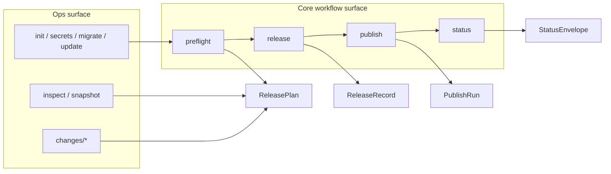

# Operational Surface Design

**Date:** 2026-04-23  
**Status:** Draft  
**Scope:** Product-facing command and workflow grouping on top of the 2026-04-22 release-platform architecture

This document turns the operational-surface memo into a concrete product-surface design. It is a follow-on to:

- [Release Platform Architecture](./2026-04-22-release-platform-architecture.md)
- [External Interface V1](./2026-04-22-external-interface-v1.md)
- [Low-Level External Interface Design](./2026-04-22-low-level-external-interface-design.md)
- [Low-Level Migration Scope Plan](./2026-04-22-low-level-migration-scope-plan.md)
- [Visual Architecture and Interface Guide](./2026-04-22-visual-architecture-and-interface.md)

## Goal

Define a product surface that keeps the release-platform core small and legible while still giving `pubm` room for setup, migration, inspection, and authoring workflows.

The main rule is:

- the canonical product surface should map cleanly to `Plan`, `Release`, `Publish`, `Closeout`, and `Status` lineage
- operational tooling should hang off that model instead of bypassing it

This memo follows the same closed-core/open-edge rule as the lower-level designs:

- root workflow verbs stay intentionally small and closed
- workflow selection under those verbs stays open through refs such as `workflow.ref` and `workflow.proposalRef`
- extension or repo-specific operational behavior should attach through noun-scoped namespaces or plugin-owned domains
- edge features should not widen the core release-state vocabulary unless the engine itself is taking ownership of that concept

## Operational Taxonomy

The public surface should be described in four families.

| Surface family | Primary user | Canonical contracts or records | Purpose |
|---|---|---|---|
| Core workflow surface | release operator, CI | `PlanRequest`, `ReleaseInput`, `PublishInput`, `StatusQuery`, `ReleasePlan`, `ReleaseRecord`, `PublishRun`, `StatusEnvelope` | create, materialize, publish, and observe a release workflow |
| Inspection surface | release operator, automation | `PlanRequest`, `StatusQuery`, inspect query services and views | inspect the planned or current workflow without introducing a second execution path |
| Authoring surface | maintainer | config files, changes files, repo-local metadata | create the inputs that later feed the core workflow |
| Setup and migration surface | maintainer, platform owner | config/bootstrap artifacts, secrets, migration output | connect the repository to the platform and keep it current |

The corresponding command groups are:

| Group | Canonical commands |
|---|---|
| Core workflow | `pubm [version]`, `pubm preflight`, `pubm release [version]`, `pubm publish`, `pubm status` |
| Inspection | `pubm inspect packages`, `pubm inspect targets`, `pubm inspect plan`, `pubm snapshot` |
| Authoring | `pubm changes add`, `pubm changes status`, `pubm changes version`, `pubm changes changelog` |
| Setup and migration | `pubm init`, `pubm secrets sync`, `pubm migrate`, `pubm update`, `pubm setup-skills` |

`pubm [version]` remains a convenience alias, not a separate domain concept. The canonical model remains `preflight -> release -> publish -> status`, matching [External Interface V1](./2026-04-22-external-interface-v1.md) and the command-flow diagram in [Visual Architecture and Interface Guide](./2026-04-22-visual-architecture-and-interface.md).

At the stable low-level boundary, `PlanRequest` stays planning-only and
`release` lowers into `ReleaseInput` after planning; the command flow does not
reintroduce a `PlanRequest` release variant.

## Core-vs-Ops Boundary

The core workflow surface is the part of the product that directly owns release lineage.

It includes commands that:

- create or consume `ReleasePlan`, `ReleaseRecord`, `PublishRun`, or `CloseoutRecord`
- expose `StatusEnvelope` and `NextAction`
- map directly onto stable service contracts from [Low-Level External Interface Design](./2026-04-22-low-level-external-interface-design.md)

The ops surface is everything else.

It includes commands that:

- prepare repository inputs before a release exists
- inspect state or topology without mutating release lineage
- migrate repositories or credentials into a shape the core can consume
- offer repo-specific convenience behavior that should not define the platform vocabulary

Boundary rules:

1. Ops commands may call the same stable services as the core surface, but they should not invent alternate orchestration contracts.
2. Ops commands may read `ReleasePlan`, `ReleaseRecord`, `PublishRun`, and `StatusEnvelope`; they should not mutate those records except through the canonical service boundary.
3. Any workflow state that needs retry, resume, or CI handoff belongs to the core surface, not to a separate ops-only command.
4. Repo utility commands can stay in the product, but they should be visibly grouped away from the release state machine.
5. Plugin or repo-specific extensions should prefer noun-qualified namespaces over new root verbs, so the open edge does not erode the closed core workflow surface.

This boundary matches Scope 6 and Scope 7 in [Low-Level Migration Scope Plan](./2026-04-22-low-level-migration-scope-plan.md): `status --json` and retry/resume semantics depend on typed execution state, while setup and migration commands remain operational support layered on top.

## Naming And Conflict Resolution

The current CLI has several naming collisions with the target architecture:

- top-level `version` overlaps with `pubm [version]` and `pubm release [version]`
- `changesets status` uses `status` for changeset state, while the new core reserves `status` for workflow observability
- bare `sync` is too generic for a long-term product verb
- `changesets` is implementation-shaped, while the proposed public namespace is domain-shaped

The naming policy should be:

| Rule | Decision |
|---|---|
| Reserve top-level verbs for state-machine concepts | `preflight`, `release`, `publish`, `status` are reserved for workflow semantics |
| Put generic maintenance verbs under a noun namespace | use `changes status`, `secrets sync`, and similar noun-first shapes |
| Keep one canonical name per concept | `changes` is the canonical namespace; `changesets` can remain a compatibility alias during migration |
| Keep the shortcut, but not as the vocabulary anchor | `pubm [version]` remains supported, but docs and future automation should center on explicit commands |
| Avoid ambiguous top-level verbs | new generic verbs such as `sync` should not be added at the root unless they are core workflow concepts |

Recommended conflict-resolution decisions:

| Current or ambiguous shape | Canonical shape | Reason |
|---|---|---|
| `pubm changesets ...` | `pubm changes ...` | domain-oriented namespace, aligned with [External Interface V1](./2026-04-22-external-interface-v1.md) |
| `pubm version` | `pubm changes version` | avoids collision with release materialization vocabulary |
| `pubm changesets status` | `pubm changes status` | frees top-level `status` for workflow state |
| `pubm sync` | domain-qualified commands such as `pubm secrets sync` | keeps the root surface from becoming a pile of unrelated verbs |

## Product Surface Grouping

The grouped product surface should be presented as follows.

### 1. Core Workflow

This is the center of gravity for documentation, tutorials, CI examples, and future SDK mapping.

- `pubm [version]`
- `pubm preflight`
- `pubm release [version]`
- `pubm publish`
- `pubm status`

### 2. Inspection And Planning Ops

These commands are read-heavy or policy-preset views over the same release model.

- `pubm inspect packages`
- `pubm inspect targets`
- `pubm inspect plan`
- `pubm snapshot`

`snapshot` stays separate because it is a planning preset, not a different core slice. That matches the `PlanRequest` model in [Low-Level External Interface Design](./2026-04-22-low-level-external-interface-design.md), where snapshot remains a specialized planning command.

### 3. Change Authoring Ops

These commands produce or summarize versioning inputs.

- `pubm changes add`
- `pubm changes status`
- `pubm changes version`
- `pubm changes changelog`

They are operational support for release planning, not alternative release execution commands.

### 4. Repository Setup And Platform Maintenance

These commands configure the repo or keep local integrations current.

- `pubm init`
- `pubm secrets sync`
- `pubm migrate`
- `pubm update`
- `pubm setup-skills`

They should remain outside the core workflow group in navigation, help output, and docs.

## Surface Diagram

## Unresolved Risks

- The current top-level command set still reflects the phase-era CLI, so migration will need compatibility aliases before help text and docs can switch fully.
- `pubm status` changes meaning at the root level; users familiar with changeset status may initially expect the old behavior.
- `snapshot` can drift back into a second orchestrator if it grows custom execution behavior instead of staying a `PlanRequest` variant.
- Repo-specific commands such as `setup-skills` and any remaining bare utility verbs can dilute the product story if they are shown as peers of `preflight` and `publish`.
- `closeout` remains intentionally non-canonical for now; if it later becomes public, the grouping must still keep `publish` and `closeout` distinct, as required by [Release Platform Architecture](./2026-04-22-release-platform-architecture.md) and [Low-Level External Interface Design](./2026-04-22-low-level-external-interface-design.md).
