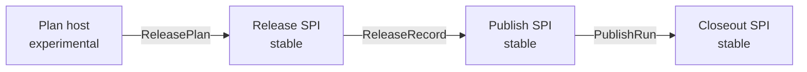

# Plugin SPI Design

**Date:** 2026-04-23
**Status:** Draft
**Scope:** Slice-aligned plugin SPI for the release-platform migration

**Depends on:**

- [release-platform-architecture](./2026-04-22-release-platform-architecture.md)
- [low-level-external-interface-design](./2026-04-22-low-level-external-interface-design.md)
- [low-level-migration-scope-plan](./2026-04-22-low-level-migration-scope-plan.md)
- [release-slice-detailed-design](./2026-04-22-release-slice-detailed-design.md)
- [publish-slice-detailed-design](./2026-04-22-publish-slice-detailed-design.md)

## Goal

Define a plugin SPI that matches the release-platform architecture rule:

- slices exchange typed artifacts, not a shared session object;
- stable plugin contracts are slice-specific;
- plugin authors can extend `Release`, `Publish`, and `Closeout` without relying on mutable runtime bags or phase timing;
- official plugins can migrate incrementally from the current `PubmPlugin` host.

This document is the concrete design for Scope 8 from
[low-level-migration-scope-plan](./2026-04-22-low-level-migration-scope-plan.md).

## Problem Statement

The current plugin surface mixes multiple concerns into one host object:

- lifecycle hooks (`beforeVersion`, `afterVersion`, `afterRelease`, etc.)
- registry/ecosystem registration
- asset pipeline hooks
- credentials and preflight checks
- plugin commands

That shape is convenient for the current phase runner, but it does not align with
the 2026-04-22 architecture set:

- stable boundaries are `ReleasePlan`, `ReleaseRecord`, `PublishRun`, and `CloseoutRecord`
- command-level contracts are narrow (`PlanRequest`, `ReleaseInput`, `PublishInput`, `CloseoutInput`)
- runtime-only host state must stay out of durable slice boundaries

The SPI therefore needs a taxonomy: which plugin surfaces become stable, which stay
experimental, and which remain internal compatibility only.

It also needs a closed-core/open-edge split:

- slice ownership and durable artifact boundaries stay closed and core-owned
- plugin registrations should stay open through category, key/ref, capability, and contract modeling
- built-in examples such as registry, distribution, and GitHub Release adapters must not become the only legal future shapes

## Design Rules

1. Stable SPI must consume or emit slice-local typed artifacts only.
2. Stable SPI must not expose `PubmContext`, `ctx.runtime`, or phase names as the contract boundary.
3. Repo mutations belong only to `Release`; external side effects belong only to `Publish` or `Closeout`.
4. A plugin may participate in multiple slices, but each registration is independent and versioned separately.
5. Experimental SPI may exist for authoring convenience, but it must not become the hidden canonical contract.
6. Closed core, open edge: slice names stay closed, but extension axes inside a slice should register by category plus adapter/contract refs rather than by exhaustive enums.

## Plugin SPI Layers



The diagram matches the slice contracts defined in
[release-platform-architecture](./2026-04-22-release-platform-architecture.md)
and the public contract tiers from
[low-level-external-interface-design](./2026-04-22-low-level-external-interface-design.md).

## Plugin Surface Taxonomy

| Surface | Current host shape | Future slice home | Stability | Why |
|---|---|---|---|---|
| Release materializers | `afterVersion` hook style | `Release` | Stable | Directly maps to `SourceMutationSet.policyWrites` from [release-slice-detailed-design](./2026-04-22-release-slice-detailed-design.md) |
| Publish target adapters (built-in registry-category examples) | `registries[]` plus task factories | `Publish` | Stable | Matches `TargetContract`, `TargetCapabilities`, and `PublishRun` without freezing the target category axis |
| Publish target adapters (built-in distribution-category examples) | asset hooks plus `afterRelease` side effects | `Publish` | Stable | `brew` and similar targets are publish-time distribution work in [publish-slice-detailed-design](./2026-04-22-publish-slice-detailed-design.md) |
| Closeout target adapters | `afterRelease` side effects, GitHub-release-style logic | `Closeout` | Stable | Closeout already has stable service/record contracts even if CLI exposure is not yet default public |
| Plan validators / capability probes | `checks()` and parts of `credentials()` | `Plan` | Experimental | Prompting, secret resolution, and volatile validation are still moving |
| Credential resolvers | `credentials()` | `Plan` and runtime secret hydration | Experimental | Secure collection UX is not yet a frozen external contract |
| Ecosystem adapters | `ecosystems[]` | source-side adapter layer | Experimental | Source discovery is not the main official-plugin path yet and should settle after core contracts |
| Artifact processors | `resolveAssets`, `transformAsset`, `compressAsset`, `nameAsset`, `generateChecksums`, `uploadAssets` | artifact/distribution layer | Experimental | Scope 5 still needs to freeze artifact ownership before this can be stable |
| Plugin CLI commands | `commands[]` | CLI composition layer | Experimental | [low-level-external-interface-design](./2026-04-22-low-level-external-interface-design.md) explicitly avoids unbounded command registration as stable SPI |
| Legacy phase hooks | `before*` / `after*` hook bag | compatibility host only | Internal | Kept only to avoid a big-bang migration |

## Stable vs Experimental SPI

### Stable SPI v1

Stable SPI v1 should contain three slice-specific registration surfaces:

- `Release` materializers
- `Publish` adapter registrations keyed by category plus adapter/contract refs
- `Closeout` adapter registrations keyed the same way

Each stable registration should obey the same boundary rule:

- input is a typed slice artifact plus narrow runtime services needed for that slice;
- output is typed slice-local data, not mutations on a shared context object;
- plugin-specific state that must survive process boundaries is recorded in the owning artifact lineage (`ReleaseRecord`, `PublishRun`, `CloseoutRecord`).

### Experimental SPI

Experimental SPI is allowed for surfaces that are still coupled to CLI/runtime behavior:

- plan-time checks and capability probes
- credential collection and secret hydration policy
- artifact pipeline transforms before the artifact model is frozen
- ecosystem registration until the source-side adapter layer is stabilized
- plugin-provided commands

Experimental SPI may change in minor releases without the same compatibility guarantee as the stable tier.

### Internal Compatibility Layer

The current `PubmPlugin` host remains internal compatibility infrastructure:

- `PluginRunner` may continue adapting legacy hooks during migration
- official plugins may dual-register against legacy and slice-specific surfaces for a limited period
- no new user-facing design should treat the legacy hook bag as the canonical plugin contract

## Per-Slice Boundaries

### Plan

`Plan` remains experimental for plugins in the first SPI pass.

Allowed responsibilities:

- declare static target metadata needed for planning
- contribute capability probes and readiness checks
- request credentials or non-secret evidence

Not allowed:

- mutate tracked repo files
- perform publish or closeout side effects
- depend on a durable shared session object

Reasoning:

- [plan-slice-detailed-design](./2026-04-22-plan-slice-detailed-design.md) keeps plan-time outputs focused on `ReleasePlan` and validation evidence
- plan-time prompt and secret UX is still not stable enough for long-term SPI commitment

### Release

`Release` is the first stable extension seam because the ownership boundary is already clear in
[release-slice-detailed-design](./2026-04-22-release-slice-detailed-design.md).

Stable release plugin responsibilities:

- read `ReleasePlan`
- contribute deterministic policy writes to `SourceMutationSet`
- participate in mutation digests recorded in `ReleaseRecord`

Not allowed:

- publish packages
- create GitHub Releases or other closeout records
- infer new release scope outside the accepted `ReleasePlan`

Canonical example:

- `externalVersionSync` moves from `afterVersion` timing into an explicit release materializer

### Publish

`Publish` owns target execution for publish-slice target contracts. Built-in v1 examples are registry- and distribution-category adapters, but the SPI should stay open through category plus adapter/contract refs.

Stable publish plugin responsibilities:

- declare target capabilities
- execute selected `TargetContract` items from `ReleaseRecord.publishTargets`
- emit per-target state that becomes part of `PublishRun`

Not allowed:

- rewrite source files after materialization
- infer versions or package scope from the current checkout
- finalize closeout-side announcements outside publish contracts

This follows the `TargetContract` / `TargetCapabilities` model from
[publish-slice-detailed-design](./2026-04-22-publish-slice-detailed-design.md).

### Closeout

`Closeout` owns post-publish workflow side effects that depend on completed publish results.

Stable closeout plugin responsibilities:

- consume `PublishRun`, `CloseoutInput`, and artifact bundle references
- perform closeout actions such as PR creation, GitHub Release updates, notifications, or deploy hooks
- emit closeout state that belongs to `CloseoutRecord`

Not allowed:

- republish registry/distribution targets
- mutate `ReleaseRecord`
- smuggle plugin-specific workflow state through process memory only

## Proposed Stable SPI Shape

The stable SPI should be organized by slice, not by one giant plugin object.

Conceptually:

```ts
type StablePluginModule = {
  release?: ReleasePluginRegistration;
  publish?: {
    adapters: PublishPluginRegistration[];
  };
  closeout?: {
    adapters: CloseoutPluginRegistration[];
  };
};
```

Each registration is intentionally narrow:

- `ReleasePluginRegistration` describes release materializers only
- `PublishPluginRegistration` describes publish-slice adapter registrations using `category`, `adapterKey`, and `contractRef`
- `CloseoutPluginRegistration` describes closeout adapters using the same reference pattern

This is the plugin equivalent of the architecture rule that command boundaries use narrow contracts rather than one monolithic orchestration object.

## Migration Path For Official Plugins

### 1. Introduce a dual host

- add slice-specific registration points in `@pubm/core`
- keep the current `PluginRunner` as a compatibility adapter
- allow an official plugin package to export both legacy and new registrations during the migration window

### 2. Migrate `@pubm/plugin-external-version-sync`

- replace `afterVersion` with a stable `Release` materializer
- generate explicit `external_version_sync` policy writes in `SourceMutationSet`
- include those writes in `ReleaseRecord` mutation digests

This is the cleanest first migration because the release slice already names this behavior explicitly in
[release-slice-detailed-design](./2026-04-22-release-slice-detailed-design.md).

### 3. Split `@pubm/plugin-brew` by slice

`plugin-brew` currently mixes:

- artifact-to-formula mapping
- formula file mutation
- git push / PR creation
- credential checks
- helper commands

Target migration:

- move formula rendering and package-asset selection into a stable `distribution` target adapter
- move repo push / PR creation behavior into a stable `closeout` target adapter
- keep helper commands and interactive credential helpers experimental

This split matches the publish/closeout boundary from
[publish-slice-detailed-design](./2026-04-22-publish-slice-detailed-design.md)
and avoids hiding SCM workflow side effects inside publish target execution.

### 4. Deprecate legacy hook timing for official plugins

After parity exists for official plugins:

- deprecate `afterVersion` and `afterRelease` for official packages
- keep legacy hooks only as a compatibility path for third-party plugins
- stop documenting phase hooks as the preferred extension model

## Versioning Policy

Stable SPI versioning should mirror the stable contract guidance from
[low-level-external-interface-design](./2026-04-22-low-level-external-interface-design.md):

- additive optional fields or new built-in registrations on already-open category/ref spaces are non-breaking
- semantic changes to stable slice registrations are breaking
- experimental SPI may change without long-term guarantee until promoted

The stable SPI should version by slice surface, not by the legacy host object.

## Unresolved Risks

- The artifact model is not fully frozen yet; some current asset hooks may eventually belong partly in `Publish` and partly in `Closeout`.
- Plan-time credential and prompt UX is still coupled to CLI/runtime behavior, so freezing that SPI too early would likely preserve the wrong abstraction.
- Recovery semantics for plugins with irreversible external effects are not finished; `PublishRun` and `CloseoutRecord` must be able to describe partial success cleanly.
- `plugin-brew` crosses distribution and closeout concerns; the exact split between formula update and PR workflow may need one implementation pass to validate.
- Ecosystem adapters are not yet proven as a stable external surface; freezing them before the source-side adapter layer settles would create avoidable churn.
- Plugin-specific observability is still underdefined; `status` and `inspect` should expose slice state without turning into an unbounded plugin-defined schema surface.

## Decision Summary

- Stable plugin SPI should start with `Release`, `Publish`, and `Closeout`, not with a replacement for the entire current plugin host.
- `Plan`, artifact processing, command registration, and ecosystem registration should remain experimental until the lower-level contracts stop moving.
- Official plugins should migrate slice-by-slice behind a compatibility layer instead of through a big-bang plugin API rewrite.
