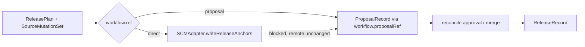

# Proposal Workflow And SCM Adapter Design

**Date:** 2026-04-23  
**Status:** Draft  
**Scope:** Implementation-anchor spec for durable proposal records, SCM adapter responsibilities, proposal lifecycle semantics, and the boundary between direct release and PR-based fallback.

**Depends on:**

- [release-platform-architecture](./2026-04-22-release-platform-architecture.md)
- [release-slice-detailed-design](./2026-04-22-release-slice-detailed-design.md)
- [low-level-external-interface-design](./2026-04-22-low-level-external-interface-design.md)
- [config-v1-and-loader-design](./2026-04-23-config-v1-and-loader-design.md)
- [monorepo-and-target-adapter-design](./2026-04-23-monorepo-and-target-adapter-design.md)
- [configuration guide](../../website/src/content/docs/guides/configuration.mdx)
- [CI/CD guide](../../website/src/content/docs/guides/ci-cd.mdx)

## Goal

This document narrows the proposal seam left open in
[release-slice-detailed-design](./2026-04-22-release-slice-detailed-design.md#proposal-seam)
and the `SCMAdapter` direction left open in
[release-platform-architecture](./2026-04-22-release-platform-architecture.md).

The implementation goal is:

- keep `ReleasePlan` immutable and `ReleaseRecord` authoritative,
- make proposal state durable enough to support approval, merge, and reconcile,
- move branch/PR/push/tag decisions behind one `SCMAdapter` contract,
- preserve current `createPr` behavior from the docs while giving it a cleaner architecture boundary.

## Design Overview



The important split is:

- `workflow.ref` chooses the primary orchestration path,
- `workflow.proposalRef` chooses the proposal transport when a proposal path is required or allowed,
- `SCMAdapter` owns git/provider side effects,
- `ProposalRecord` owns durable proposal state,
- `ReleaseRecord` only stores a compact pointer back to the proposal that gated release.

## Implementation Position

The architecture docs now use `ProposalRecord` as the reviewable artifact. For implementation, this should be a persisted `ProposalRecord` in the state store while keeping the existing closed lifecycle vocabulary from
[release-platform-architecture](./2026-04-22-release-platform-architecture.md#domain-objects).

That means:

- `ProposalRecordState` values stay `open | updated | approved | rejected | merged`,
- the stored object becomes richer than the current minimal `ProposalRecord` sketch,
- `ReleaseRecord.proposalRef` remains compact and does not duplicate the full proposal state.

## `ProposalRecord` Shape

`ProposalRecord` should be the durable handoff between `ProposalEngine`, `ReleaseEngine`, and reconcile/recovery flows.

```ts
type ProposalRecordState =
  | "open"
  | "updated"
  | "approved"
  | "rejected"
  | "merged";

type ProposalTrigger =
  | "workflow_required"
  | "explicit_request"
  | "fallback_after_direct_push_blocked";

type ProposalRecord = {
  id: string;
  planId: string;

  workflowRef: string;
  proposalRef: string;
  adapterKey: string;
  contractRef: string;
  capabilityKeys: string[];

  state: ProposalRecordState;
  trigger: ProposalTrigger;

  baseRef: string;
  baseSha: string;
  proposalBranch: string;
  proposalHeadSha?: string;
  mergeCommitSha?: string;

  externalRef?: string;
  reviewUrl?: string;

  manifestDigest: string;
  changelogDigest: string;
  policyWriteDigest: string;
  mutationDigest: string;

  approvedAt?: string;
  approvedBy?: string[];
  approvalHeadSha?: string;

  mergedAt?: string;
  rejectedAt?: string;
  replacedByProposalId?: string;

  reconcileStatus:
    | "clean"
    | "needs_update"
    | "stale_base"
    | "merged_equivalent"
    | "merged_drifted";

  createdAt: string;
  updatedAt: string;
};
```

### Why these fields are required

- `planId` keeps the proposal anchored to an immutable plan, as required by
  [release-slice-detailed-design](./2026-04-22-release-slice-detailed-design.md#proposal-seam).
- `workflowRef` and `proposalRef` are both needed because a direct workflow may still use a proposal transport as fallback.
- `adapterKey`, `contractRef`, and `capabilityKeys` keep the extension seam open, matching
  [low-level-external-interface-design](./2026-04-22-low-level-external-interface-design.md#closed-core-open-edge).
- `baseSha`, `proposalHeadSha`, `mergeCommitSha`, and the digests give reconcile enough evidence to distinguish "same intent, different merge SHA" from real drift.
- `trigger` makes explicit whether the proposal was the configured workflow or only a protected-branch escape hatch.

## `ReleaseRecord.proposalRef` Relation

`ReleaseRecord` should keep only a compact link back to the proposal:

```ts
type ProposalRef = {
  proposalId: string;
  proposalRef: string;
  adapterKey: string;
  externalRef?: string;
  mergeCommitSha?: string;
};
```

Rules:

- direct releases omit `proposalRef`,
- PR-gated releases copy the pointer from `ProposalRecord`,
- fallback proposals also copy the pointer, but the original `workflowRef` stays whatever the plan selected,
- `Publish` and `Closeout` must treat `proposalRef` as traceability only, not as mutable release input.

## SCM Adapter Contract

`SCMAdapter` is the low-level boundary for branch, commit, tag, push, and proposal-provider operations. It must not own manifest writes or publish target behavior. Those remain in `ReleaseEngine`, `Ecosystem`, `PublishEngine`, and target adapters as defined in
[release-platform-architecture](./2026-04-22-release-platform-architecture.md#engine-responsibilities)
and
[monorepo-and-target-adapter-design](./2026-04-23-monorepo-and-target-adapter-design.md#low-level-target-adapter-contract).

```ts
type SCMCapabilities = {
  adapterKey: string;
  contractRef: string;
  capabilityKeys: string[];
  supportsDirectPush: boolean;
  supportsProposalUpdates: boolean;
  supportsApprovalInspection: boolean;
  supportsMergeInspection: boolean;
  supportsMergeAction: boolean;
  supportsTaggingMergedHead: boolean;
};

type WriteReleaseAnchorsInput = {
  planId: string;
  workflowRef: string;
  branch: string;
  expectedBaseSha: string;
  commitMessage: string;
  tags: SourceMutationSet["tagPlan"];
  mode: "commit_and_tag" | "tag_existing_head";
};

type WriteReleaseAnchorsResult =
  | {
      outcome: "written";
      releaseSha: string;
      branch: string;
      tags: string[];
    }
  | {
      outcome: "blocked";
      reason: "protected_branch" | "review_required" | "forbidden";
      remoteState: "unchanged";
    }
  | {
      outcome: "partial";
      remoteState: "partial";
      releaseSha?: string;
      tags: string[];
    };

interface SCMAdapter {
  getCapabilities(): Promise<SCMCapabilities>;

  createProposal(input: {
    plan: ReleasePlan;
    mutationSet: SourceMutationSet;
    workflowRef: string;
    proposalRef: string;
    trigger: ProposalTrigger;
    baseRef: string;
    baseSha: string;
  }): Promise<ProposalRecord>;

  updateProposal(input: {
    proposal: ProposalRecord;
    mutationSet: SourceMutationSet;
    baseSha: string;
  }): Promise<ProposalRecord>;

  inspectProposal(input: {
    proposal: ProposalRecord;
  }): Promise<ProposalRecord>;

  mergeProposal?(input: {
    proposal: ProposalRecord;
  }): Promise<ProposalRecord>;

  writeReleaseAnchors(
    input: WriteReleaseAnchorsInput,
  ): Promise<WriteReleaseAnchorsResult>;
}
```

### Contract rules

- `createProposal` and `updateProposal` may create branches and PRs/MRs, but they must not invent new release scope or versions.
- `inspectProposal` is the reconcile entry point. The engine should not scrape provider APIs directly.
- `writeReleaseAnchors` is the only place that classifies "blocked but fallback-safe" versus "partial remote mutation, recovery required".
- `mode = "tag_existing_head"` is required for merge-first PR flows where the merged commit already contains the approved mutation set.

## Proposal Lifecycle

`ProposalRecord.state` stays closed and engine-owned, but reconcile details live beside it in `reconcileStatus`.

| State | Meaning | Required evidence |
|---|---|---|
| `open` | proposal exists and awaits review | `externalRef` or provider-local equivalent |
| `updated` | proposal content changed after creation | new `proposalHeadSha`, `updatedAt` |
| `approved` | review gate satisfied for the current head | `approvedAt`, `approvalHeadSha` |
| `rejected` | proposal closed or superseded without merge | `rejectedAt` or `replacedByProposalId` |
| `merged` | approved proposal landed on base branch | `mergeCommitSha`, `mergedAt` |

### Update semantics

- Any content change that affects `mutationDigest`, `proposalHeadSha`, or the effective base must clear prior approval and move the record back to `updated`.
- Label changes, comments, or metadata refreshes that do not change release content do not reset approval.

### Approval semantics

- Approval is attached to the exact proposed head and digest, not just the proposal number.
- `approved` means "review gate passed"; it does not mean release materialization already happened.
- A provider without native approval concepts may still support proposals, but it cannot drive workflows that require `approved` as a durable state.

### Merge semantics

- `merged` is an SCM fact, not a review fact.
- Merge may happen through merge commit, squash merge, or rebase merge. Reconcile must compare the resulting tree against `mutationDigest`, not only `proposalHeadSha`.
- If the merged tree is digest-equivalent, set `reconcileStatus = "merged_equivalent"` and allow release to continue.
- If the merged tree differs, set `reconcileStatus = "merged_drifted"` and stop before emitting `ReleaseRecord`.

### Reconcile semantics

Reconcile is the engine-owned process that refreshes proposal state from the adapter and decides whether the original plan is still safe to materialize.

Reconcile should run:

- before `ReleaseEngine` consumes an approved or merged proposal,
- after webhook or polling events from the proposal provider,
- when recovery resumes from a stale or interrupted proposal flow.

Reconcile outcomes:

- `clean`: proposal still matches `planId` + digest expectations,
- `needs_update`: proposal branch no longer matches the current base and needs a refresh,
- `stale_base`: base branch moved in a way that invalidates the proposal and requires re-plan,
- `merged_equivalent`: merge landed and still matches the planned mutation set,
- `merged_drifted`: merge landed but the effective tree no longer matches release intent.

## Relation To `workflow.ref` And `workflow.proposalRef`

This document tightens the split introduced in
[config-v1-and-loader-design](./2026-04-23-config-v1-and-loader-design.md).

### `workflow.ref`

`workflow.ref` selects the primary orchestration preset, such as:

- `builtin:one-shot` for direct release,
- `builtin:split-ci` for staged release/publish handoff,
- `builtin:release-pr` for proposal-gated release,
- `builtin:snapshot` for non-release snapshot flows.

It should answer "what runtime path is the user asking for?"

### `workflow.proposalRef`

`workflow.proposalRef` selects the proposal transport and review contract used when a proposal path is required or allowed.

It should answer "if a proposal exists, how is it represented and reviewed?"

Rules:

- `workflow.ref = builtin:release-pr` requires `workflow.proposalRef`.
- direct workflows may still set `workflow.proposalRef` to allow protected-branch fallback or an explicit review detour.
- the legacy `createPr` mapping from
  [config-v1-and-loader-design](./2026-04-23-config-v1-and-loader-design.md)
  remains valid:
  `createPr: true` maps to `workflow.ref = "builtin:release-pr"` and a default `workflow.proposalRef = "builtin:release-pr"`.
- current user-facing behavior documented in
  [configuration guide](../../website/src/content/docs/guides/configuration.mdx#createpr)
  and
  [CI/CD guide](../../website/src/content/docs/guides/ci-cd.mdx#pr-based-version-bump-workflow)
  should be preserved during migration.

## PR-Based Release Flow

Recommended first-pass semantics:

1. `Planner` emits immutable `ReleasePlan`.
2. `ReleaseEngine` derives deterministic `SourceMutationSet` as described in
   [release-slice-detailed-design](./2026-04-22-release-slice-detailed-design.md#sourcemutationset).
3. `ProposalEngine` asks `SCMAdapter.createProposal` to render those exact mutations into a proposal branch/PR.
4. Review happens externally; `inspectProposal` updates `ProposalRecord`.
5. When the proposal is merged, reconcile verifies digest equivalence.
6. If the merged tree is equivalent, `ReleaseEngine` emits `ReleaseRecord` using the merged commit as `releaseSha` and calls `writeReleaseAnchors({ mode: "tag_existing_head" })` to create only the missing tags.
7. `Publish` consumes `ReleaseRecord` exactly as in the direct path.

This keeps the architecture promise that `Propose` is a gate in front of `Release`, while still allowing a reviewable PR to carry the release mutations users expect from current `createPr` behavior.

## Fallback / Direct-Push Boundary

The fallback rule must be explicit because the current product behavior already falls back to PR mode when direct push is blocked.

Automatic fallback to proposal is allowed only when all of the following are true:

- the selected workflow is direct, but `workflow.proposalRef` is available,
- `SCMAdapter.writeReleaseAnchors()` returns `outcome = "blocked"`,
- `reason` is `protected_branch`, `review_required`, or another policy-style block,
- `remoteState = "unchanged"`, so no remote commit or tag was created.

Automatic fallback is not allowed when:

- the adapter reports `outcome = "partial"`,
- the failure is ambiguous or transport-level rather than policy-level,
- required proposal capabilities are unavailable,
- the repo state has already diverged from the planned base and needs re-plan.

This boundary is the key implementation rule:

- "blocked and remote unchanged" may fall back to proposal,
- "partial remote mutation" must hand off to recovery, not silently switch workflows.

## Unresolved Risks

- Squash and rebase merges change commit identity, so digest-equivalence must be defined carefully enough to tolerate merge strategy differences without hiding real drift.
- Approval semantics differ across GitHub, GitLab, Gerrit, and local git-only environments. The contract may need capability-gated approval rules rather than one universal meaning.
- A proposal that merges with extra manual commits may be `merged` but not safely releasable. The first implementation should stop on `merged_drifted` rather than auto-repair.
- Polling and webhook lag can cause stale `approved` or `merged` observations. Reconcile must remain idempotent and re-check provider state before materialization.
- Branch naming, fork-based proposals, and token scope are provider-specific and should remain adapter policy, not core state.
- The exact boundary between "proposal preview writes" and "release materialization writes" may need one extra pass once the first `SCMAdapter` is wired into the existing git tasks.
