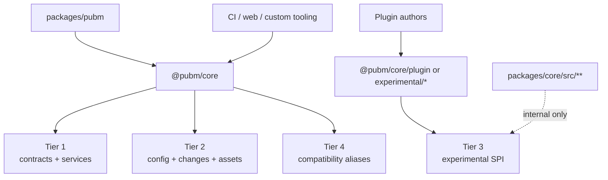

# SDK Public Exports Design

**Date:** 2026-04-23  
**Status:** Draft  
**Scope:** `@pubm/core` public export policy, tiering, and subpath boundary for the post-migration SDK

This document turns the SDK/public-exports memo into an explicit package-boundary design. It builds on:

- [Low-Level External Interface Design](./2026-04-22-low-level-external-interface-design.md)
- [Release Platform Architecture](./2026-04-22-release-platform-architecture.md)
- [Low-Level Migration Scope Plan](./2026-04-22-low-level-migration-scope-plan.md)
- [External Interface V1](./2026-04-22-external-interface-v1.md)
- [Visual Architecture and Interface Guide](./2026-04-22-visual-architecture-and-interface.md)

## Goal

Define which `@pubm/core` exports are part of the stable SDK, which stay experimental, and which must remain internal while the 2026-04-22 architecture is implemented.

The guiding rule is the same one used elsewhere in the architecture set:

- stable exports should follow typed slice contracts and durable records
- extension-facing exports should use category/key/ref/capability contracts instead of freezing built-in edge kinds into the root surface
- package boundaries should reflect contract families, not current folder layout or phase-era helper placement

## Current Boundary Problem

Today `packages/core/package.json` exports only `"."`, but that single root entry re-exports a wide mix of concerns from `packages/core/src/index.ts`:

- config authoring helpers
- changeset and changelog helpers
- asset-pipeline helpers
- plugin types and runners
- monorepo discovery helpers
- runtime, rollback, token, and CLI-oriented utilities

That root-only export map is convenient, but it freezes too much of the phase-era implementation shape. It is broader than the stable surface described in [Low-Level External Interface Design](./2026-04-22-low-level-external-interface-design.md), which centers on narrow service inputs and durable records:

- `PlanRequest`
- `ReleaseInput`
- `PublishInput`
- `CloseoutInput`
- `StatusQuery`
- `ReleasePlan`
- `ReleaseRecord`
- `PublishRun`
- `CloseoutRecord`
- `NextAction`
- `StatusEnvelope`
- `ErrorEnvelope`

## Export Tiers

The SDK should use four export tiers.

| Tier | Stability | Intended consumers | Content |
|---|---|---|---|
| Tier 1: Stable contracts and services | semver-supported | CLI adapter, CI, web backends, custom integrators | slice contracts, durable records, result envelopes, service interfaces |
| Tier 2: Stable authoring and tooling helpers | semver-supported | config authors, repo tooling, plugin users with supported helpers | `defineConfig`, config loading/resolution, documented asset and changes helpers, stable discovery helpers |
| Tier 3: Experimental extension surface | opt-in | plugin authors and advanced integrators | plugin SPI, inspect query/view APIs, `ExecutionState`-backed read APIs, and adapter/category/capability/contract extension points |
| Tier 4: Compatibility and deprecating surface | temporary | existing SDK users migrating off phase-era APIs | root exports kept only to avoid breaking consumers before replacement contracts are ready |

Anything outside those tiers is internal and should not be exported.

### Tier 1: Stable Contracts And Services

This tier is the long-term SDK center of gravity. It should align exactly with the stable section of [Low-Level External Interface Design](./2026-04-22-low-level-external-interface-design.md).

It includes:

- command-to-service input contracts such as `PlanRequest`, `ReleaseInput`, `PublishInput`, `CloseoutInput`, and `StatusQuery`
- durable records such as `ReleasePlan`, `ReleaseRecord`, `PublishRun`, and `CloseoutRecord`
- machine-facing envelopes such as `StatusEnvelope`, `ErrorEnvelope`, and `NextAction`
- service interfaces corresponding to `PlanService`, `ReleaseService`, `PublishService`, `CloseoutService`, and `StatusService`

This tier is for consumers that need workflow control or observability, not for consumers that want access to internal orchestration state.

### Tier 2: Stable Authoring And Tooling Helpers

This tier keeps the documented authoring experience usable without forcing all tooling through the release services.

Examples include:

- `defineConfig`, `loadConfig`, and `resolveConfig`
- stable changes helpers that are already part of the supported authoring workflow
- stable asset-pipeline helpers and types that are already documented for plugin users
- stable workspace discovery helpers needed by documented repository tooling

Tier 2 is still public, but it should stay clearly separate from Tier 1. These exports support authoring and integration tasks around the workflow; they are not themselves the workflow contract.

### Tier 3: Experimental Extension Surface

This tier is where plugin and adapter evolution should happen until Scope 8 settles.

It includes:

- plugin SPI that depends on `Plan`, `ReleaseRecord`, `PublishRun`, or `CloseoutRecord`
- inspect-only request/result contracts
- `ExecutionState`-backed status/inspect read APIs and other recovery-facing APIs
- adapter/category/capability/contract extension points that are not yet stable enough for root-level commitment

This follows the stable/experimental/internal split already defined in [Low-Level External Interface Design](./2026-04-22-low-level-external-interface-design.md) and the plugin-boundary guidance in [Visual Architecture and Interface Guide](./2026-04-22-visual-architecture-and-interface.md).

Closed core, open edge here means:

- root exports stay small and centered on stable slice contracts
- extension surfaces live behind explicit subpaths and experimental markers
- open-ended adapter categories should be modeled as refs and capability contracts, not as root-level enum growth

### Tier 4: Compatibility And Deprecating Surface

Some current root exports exist only because the SDK still exposes phase-era implementation seams.

Representative examples include:

- context-oriented APIs such as `PubmContext` and `createContext`
- orchestration-era helpers such as `resolvePhases`
- process-local recovery helpers such as `RollbackTracker`
- legacy plugin runtime helpers that freeze current timing assumptions instead of the future contract

This tier should remain available only long enough to migrate consumers to Tier 1 through Tier 3. It is not the target shape of the SDK.

## Package And Subpath Boundary

The package boundary should be defined by contract family, not by source folder.

### Package-level rules

1. `@pubm/core` is the canonical SDK package.
2. `pubm` is the CLI package, even if it temporarily re-exports `@pubm/core` for compatibility.
3. Consumers should never deep-import from `packages/core/src/**`, `dist/**`, or generated internal paths.
4. A path becomes public only when it is declared in `exports`, documented, and assigned to an explicit tier.

### Root entry policy

The root entry `@pubm/core` should remain the default import path for:

- Tier 1 stable contracts and services
- the most common Tier 2 authoring helpers
- temporary Tier 4 compatibility re-exports during migration

The root should not become an unbounded dump of every helper that exists inside the package.

### Subpath policy

Public subpaths should be introduced only for coherent contract families. The design target is:

| Subpath | Intended tier | Purpose |
|---|---|---|
| `@pubm/core/contracts` | Tier 1 | stable request, record, and envelope types |
| `@pubm/core/services` | Tier 1 | stable service interfaces and constructors |
| `@pubm/core/config` | Tier 2 | config authoring and resolution helpers |
| `@pubm/core/changes` | Tier 2 | changes authoring helpers and types |
| `@pubm/core/assets` | Tier 2 | asset-pipeline contracts already documented for users |
| `@pubm/core/plugin` | Tier 3 until stabilized | plugin and adapter SPI keyed by category/ref contracts |
| `@pubm/core/experimental/*` | Tier 3 | explicitly unstable advanced APIs |

These subpaths should track the same surface families described in [Low-Level External Interface Design](./2026-04-22-low-level-external-interface-design.md), not the current implementation folders.

## Migration And Deprecation Strategy

The export migration should happen in ordered stages.

1. Define tiers in docs first.
2. Introduce explicit stable subpaths for Tier 1 and the highest-confidence Tier 2 families.
3. Keep root re-exports for those stable subpaths so existing imports continue to work.
4. Mark Tier 4 exports as deprecated with release notes and type-level deprecation markers.
5. Remove Tier 4 exports only after replacement imports exist and have shipped long enough to migrate real plugin and integrator usage.

Deprecation policy:

- deprecations should be announced in docs and changesets before removal
- type-level deprecation markers are preferred over noisy runtime warnings
- no compatibility export should survive past the point where it blocks the stable contract model

This stage ordering matches Scope 7 and Scope 8 in [Low-Level Migration Scope Plan](./2026-04-22-low-level-migration-scope-plan.md): public CLI/config alignment and plugin API stabilization should happen after the internal contracts have stopped moving.

## Relation To Plugin Authors And Integrators

The export policy should distinguish three consumer types.

| Consumer | Expected tier | Guidance |
|---|---|---|
| CLI adapter and automation integrators | Tier 1 first, Tier 2 as needed | build against stable contracts and durable records, not context bags or phase helpers |
| Plugin authors | Tier 2 for current documented helpers, Tier 3 for evolving SPI | depend on the explicit plugin surface, not internal host/runtime details |
| Repository tooling authors | Tier 2 | use supported config, asset, changes, and discovery helpers; do not depend on release internals unless they are promoted to Tier 1 |

Practical implications:

- plugin authors should eventually target a dedicated plugin SPI instead of relying on `PluginRunner`, phase hooks, or orchestration timing internals
- integrators should prefer `StatusQuery` and `StatusEnvelope` over reading private files or reconstructing state from CLI text
- official plugins can use Tier 3 during migration, but they should be the proving ground for the future SPI, not a reason to keep internal exports public forever

## Export Diagram

## Unresolved Risks

- The current root export list is large, and some helpers sit awkwardly between tooling and internal runtime concerns; tier assignment will need concrete API-by-API review.
- `pubm` currently re-exports `@pubm/core`, which can blur the package boundary and weaken the message that `@pubm/core` is the canonical SDK.
- Introducing subpaths changes build, types, and docs expectations for both ESM and CJS consumers.
- Plugin authors currently depend on phase-era exports such as `resolvePhases`; removing those too early would break official plugins before the new SPI exists.
- Some utilities that feel harmless today, such as generic process or Git helpers, may accidentally become permanent API surface if they stay in the root without a tier decision.
