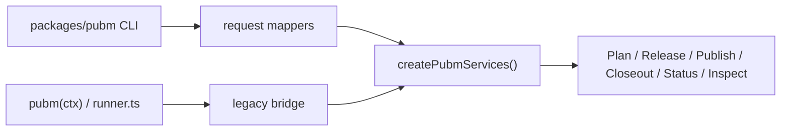

# Service Composition And Legacy Bridge Design

**Date:** 2026-04-23  
**Status:** Draft  
**Scope:** Implementation-anchor spec for wiring the low-level service interfaces into `@pubm/core`, while bridging the current `PubmContext` and phase-era runner until the external CLI and plugin migration scopes land.

This memo builds on:

- [Low-Level External Interface Design](./2026-04-22-low-level-external-interface-design.md)
- [SDK Public Exports Design](./2026-04-23-sdk-public-exports-design.md)
- [Release Platform Architecture](./2026-04-22-release-platform-architecture.md)
- [Operational Surface Design](./2026-04-23-operational-surface-design.md)
- [Config V1 And Loader Design](./2026-04-23-config-v1-and-loader-design.md)
- [Execution State And Recovery Design](./2026-04-23-execution-state-and-recovery-design.md)
- [Monorepo And Target Adapter Design](./2026-04-23-monorepo-and-target-adapter-design.md)
- [Artifact and Closeout Design](./2026-04-23-artifact-and-closeout-design.md)
- [Plugin SPI Design](./2026-04-23-plugin-spi-design.md)
- [Core SDK Reference](../../website/src/content/docs/reference/sdk.mdx)

## Goal

Turn the abstract service contracts from
[Low-Level External Interface Design](./2026-04-22-low-level-external-interface-design.md)
into one concrete composition model that:

- keeps `packages/pubm` as CLI composition only;
- aligns code layout with the `@pubm/core/contracts` and `@pubm/core/services` tiers from
  [SDK Public Exports Design](./2026-04-23-sdk-public-exports-design.md);
- lets legacy `pubm(ctx)` and `packages/core/src/tasks/runner.ts` delegate into the same service graph instead of becoming a second long-lived orchestrator;
- keeps `PubmContext`, `PluginRunner`, rollback closures, and phase names out of new service method boundaries.

## Placement And Export Boundary

All service interfaces live in `packages/core`, not `packages/pubm`. The CLI remains an adapter over those services, consistent with the low-level external interface rules.

| Concern | Planned path | Export tier | Notes |
|---|---|---|---|
| Stable request, record, and envelope types | `packages/core/src/contracts/*` | Tier 1 via `@pubm/core/contracts` | Canonical home for `PlanRequest`, `ReleaseInput`, `PublishInput`, `CloseoutInput`, `StatusQuery`, `ReleasePlan`, `ReleaseRecord`, `PublishRun`, `CloseoutRecord`, `StatusEnvelope`, `ErrorEnvelope` |
| Stable service interfaces and public factories | `packages/core/src/services/*` | Tier 1 via `@pubm/core/services` | `PlanService`, `ReleaseService`, `PublishService`, `CloseoutService`, `StatusService`, `createPubmServices()` |
| Experimental inspect service | `packages/core/src/services/inspect-service.ts` plus `packages/core/src/experimental/inspect/*` | Tier 3 | `InspectService` lives beside the other services for composition purposes, but exports remain experimental until inspect contracts settle |
| Internal service implementations | `packages/core/src/services/internal/*` | Internal | Concrete classes such as `DefaultPlanService` stay private so constructor shape does not become API surface |
| Composition root | `packages/core/src/composition/create-default-service-graph.ts` | Internal implementation behind stable factories | Owns wiring, default stores, and internal compat host injection |
| Legacy bridge | `packages/core/src/legacy/*` | Tier 4 or internal only | Adapters from `PubmContext`, phase flags, and legacy hooks into the new services |

The root package entry `@pubm/core` may temporarily re-export stable constructors and compatibility aliases during migration, but the canonical imports should be:

- `@pubm/core/contracts`
- `@pubm/core/services`
- `@pubm/core/experimental/inspect`

## Composition Shape



The key rule is that there is one default service graph in `packages/core`. Everything else, including the current phase runner, is an adapter into that graph.

## Public Constructor Policy

The stable constructor surface should be factory-based, not class-based.

Recommended stable exports from `@pubm/core/services`:

```ts
type PubmServices = {
  plan: PlanService;
  release: ReleaseService;
  publish: PublishService;
  closeout: CloseoutService;
  status: StatusService;
  inspect: InspectService;
};

type CreatePubmServicesInput = {
  cwd: string;
  configPath?: string;
  config?: LoadedConfigV1 | ResolvedPubmConfig;
  stores?: {
    artifacts?: ArtifactStore;
    execution?: ExecutionStore;
  };
  secrets?: SecretProvider;
  clock?: Clock;
  ids?: IdFactory;
};

declare function createPubmServices(
  input: CreatePubmServicesInput,
): Promise<PubmServices>;
```

Notes:

- `createPubmServices()` is the stable composition entrypoint for SDK users and the CLI.
- Concrete class constructors such as `new DefaultPlanService(deps)` stay internal.
- Passing `ResolvedPubmConfig` is a transition aid only; the composition root should normalize it into the `LoadedConfigV1` boundary from
  [Config V1 And Loader Design](./2026-04-23-config-v1-and-loader-design.md).
- No service method accepts `PubmContext`, `PluginRunner`, `ListrTask`, or `ctx.runtime`.

## Service Constructors And Dependencies

The services should depend on slice-owned engines plus narrow runtime infrastructure, not on a giant mutable session object.

| Service | Internal constructor deps | Why |
|---|---|---|
| `PlanService` | `Planner`, `LoadedConfigProvider`, `RepoSnapshotReader`, `PlanEvidenceCollector`, `ArtifactStore`, `Clock`, `IdFactory` | Matches the `PlanRequest -> PlannerInput -> ReleasePlan` boundary from [Plan Slice Detailed Design](./2026-04-22-plan-slice-detailed-design.md) |
| `ReleaseService` | `ReleaseEngine`, `ArtifactStore`, `ExecutionStore`, `RepoMutationGateway`, `Clock`, `IdFactory` | Owns `ReleasePlan -> ReleaseRecord` materialization without recomputing plan intent |
| `PublishService` | `PublishEngine`, `ArtifactStore`, `ExecutionStore`, `SecretProvider`, `TargetAdapterRegistry`, `ArtifactMaterializer`, `Clock`, `IdFactory`, `CloseoutCoordinator` | Executes `ReleaseRecord.publishTargets`, rehydrates credentials, and optionally coordinates auto-closeout without absorbing closeout ownership |
| `CloseoutService` | `CloseoutEngine`, `ArtifactStore`, `ExecutionStore`, `SecretProvider`, `CloseoutAdapterRegistry`, `Clock`, `IdFactory` | Owns `PublishRun -> CloseoutRecord` and the prepare/finalize split from [Artifact and Closeout Design](./2026-04-23-artifact-and-closeout-design.md) |
| `StatusService` | `ArtifactStore`, `ExecutionStore`, `StatusProjector`, `Clock` | Must project from durable artifacts plus `ExecutionState`, never from process memory, per [Execution State And Recovery Design](./2026-04-23-execution-state-and-recovery-design.md) |
| `InspectService` | `PlanService`, `WorkspaceInspector`, `TargetCatalogInspector`, `ArtifactStore` | Reuses planning and topology inspection without creating a second orchestration path; stays experimental for export purposes |

Additional constructor rules:

- `PluginRunner` is not a stable constructor dependency. If legacy hooks still need to fire, that happens through an internal `LegacyPluginCompatHost`.
- `TargetAdapterRegistry` and `CloseoutAdapterRegistry` are runtime registries keyed by `targetKey`, `adapterKey`, and `contractRef`, consistent with
  [Monorepo And Target Adapter Design](./2026-04-23-monorepo-and-target-adapter-design.md)
  and
  [Plugin SPI Design](./2026-04-23-plugin-spi-design.md).
- `StatusService` and `InspectService` are read-only services and must not mutate stores.

## Default Composition Root

`createPubmServices()` should delegate into one internal root, for example `createDefaultServiceGraph()`, with this sequence:

1. Load or normalize config into `LoadedConfigV1`.
2. Build default artifact and execution stores.
3. Construct target, closeout, and release materializer registries.
4. Construct slice engines and projectors.
5. Construct service instances.
6. Return a `PubmServices` bundle.

Default implementation choices should follow the adjacent docs:

- filesystem-backed artifact and execution stores first, per
  [Execution State And Recovery Design](./2026-04-23-execution-state-and-recovery-design.md);
- open adapter registries keyed by ref and contract, per
  [Monorepo And Target Adapter Design](./2026-04-23-monorepo-and-target-adapter-design.md);
- no implicit plugin host in the public constructor surface, per
  [Plugin SPI Design](./2026-04-23-plugin-spi-design.md).

## CLI Delegation

`packages/pubm` should stop constructing `PubmContext` for canonical commands. Its job is:

- parse flags and arguments;
- resolve prompting and locale policy;
- assemble `PlanRequest`, `ReleaseInput`, `PublishInput`, `CloseoutInput`, `StatusQuery`, or `InspectRequest`;
- call the services;
- render text or `--json`;
- map `ErrorEnvelope` to exit codes.

`PlanRequest` remains the planning-only service input. `pubm release` may call
`plan.prepare(...)` first, but the stable release boundary is still
`release.runRelease(ReleaseInput)`, not a `PlanRequest` release variant.

Command-to-service delegation should be:

| CLI shape | Service delegation |
|---|---|
| `pubm preflight` | `plan.prepare(PlanRequest)` |
| `pubm release [version]` | `plan.prepare(...)` then `release.runRelease(ReleaseInput)` |
| `pubm publish` | `publish.runPublish(PublishInput)` |
| `pubm [version]` | internal convenience composer: `plan -> release -> publish` |
| `pubm status --json` | `status.query(StatusQuery)` |
| `pubm inspect packages` / `targets` / `plan` | `inspect.*(...)` |
| `pubm snapshot` | `plan.prepare({ command: "snapshot", ... })` |

Two transition constraints from
[Operational Surface Design](./2026-04-23-operational-surface-design.md)
apply here:

- top-level workflow `status` should eventually delegate to `StatusService`, while changeset status moves under `pubm changes status`;
- `snapshot` and `inspect` must remain alternate views over the same planning and status model, not a second orchestration stack.

## Current Phase Runner Delegation

`packages/core/src/tasks/runner.ts` should become a compatibility adapter, not the owner of workflow orchestration.

Recommended responsibility split:

- `packages/core/src/index.ts` `pubm(ctx)` becomes a Tier 4 compatibility wrapper that instantiates the legacy bridge and calls it.
- `packages/core/src/tasks/runner.ts` becomes `LegacyPhaseRunnerBridge.run(ctx)`.
- the bridge maps current phase semantics into service calls:
  - `prepare` -> `plan.prepare()` then `release.runRelease()`
  - `publish` -> `publish.runPublish()`
  - local default -> `plan -> release -> publish`
- the bridge may temporarily keep signal handling, legacy console text, and rollback interop, but it must not keep direct ownership of plan/release/publish execution.

This keeps the current phase vocabulary contained to the compatibility layer while the services own the actual release-platform flow.

## Compatibility Layers

The bridge should be explicit and small. The needed adapters are:

| Adapter | Responsibility |
|---|---|
| `ResolvedConfigCompatAdapter` | Convert current `ResolvedPubmConfig` into `LoadedConfigV1` for the new composition root |
| `LegacyContextRequestAdapter` | Convert `PubmContext`, `ctx.options`, and current version/tag state into service request objects |
| `LegacyLineageResolver` | Resolve `PublishInput.from` from `ReleaseRecord`, `planId`, tag, or temporary manifest/tag heuristics while durable lineage is still being introduced |
| `LegacyRuntimeMirror` | Mirror selected service outputs back into `ctx.runtime` fields that old hooks or tests still inspect |
| `LegacyPluginCompatHost` | Translate slice lifecycle events into the current `PluginRunner` hook bag without making that hook bag part of the new service interfaces |
| `LegacyErrorSurfaceAdapter` | Convert `Result<_, ErrorEnvelope>` into current thrown errors, CLI messages, and temporary rollback behavior |

None of these adapters should be exported as Tier 1 surface.

## Transition Strategy From `pubm(ctx)` And `runner.ts`

1. Introduce `contracts`, `services`, and `createPubmServices()` in `packages/core`, with stable exports aligned to
   [SDK Public Exports Design](./2026-04-23-sdk-public-exports-design.md).
2. Re-implement `pubm(ctx)` as a compatibility wrapper over `LegacyPubmBridge`, not as the owner of pipeline orchestration.
3. Rework `packages/core/src/tasks/runner.ts` into a thin phase-to-service delegator and move real execution ownership into the service implementations.
4. Migrate CLI commands incrementally:
   `snapshot` and `inspect` first, then `preflight`, `release`, `publish`, and finally the top-level `status` rename/cutover.
5. Mark `PubmContext`, `createContext`, `resolvePhases`, `pubm`, and `runSnapshotPipeline` as Tier 4 compatibility exports and remove them only after CLI, docs, and official plugins no longer rely on them.

This order matches the scope sequencing in
[Low-Level Migration Scope Plan](./2026-04-22-low-level-migration-scope-plan.md):
first move orchestration boundaries, then move state/recovery, then finish public CLI and plugin migration.

## Unresolved Risks

- The published SDK docs in [Core SDK Reference](../../website/src/content/docs/reference/sdk.mdx) still describe a root `pubm()` flow that does not match the current `pubm(ctx)` implementation. The migration needs one explicit deprecation story instead of silently carrying both narratives.
- `publish`-only legacy flows currently reconstruct intent from manifests and tags. Until `ReleaseRecord` and `ExecutionState` are ubiquitous, `LegacyLineageResolver` will carry heuristic risk.
- Current rollback is closure-based and process-local. Bridging service errors back into rollback without fighting the future reconcile model from
  [Execution State And Recovery Design](./2026-04-23-execution-state-and-recovery-design.md)
  is a temporary compromise, not a stable architecture.
- Legacy plugin hooks, asset hooks, and `afterRelease` behavior still cut across release, publish, and closeout. The compat host must stay internal or it will freeze the wrong SPI before
  [Plugin SPI Design](./2026-04-23-plugin-spi-design.md)
  lands.
- `InspectService` belongs in the shared service graph, but its export tier should stay experimental until `inspect plan` and workflow status view contracts stop moving.
- If `ResolvedPubmConfig -> LoadedConfigV1` normalization becomes leaky, the composition root can accidentally preserve the old flat config semantics longer than intended.

## Decision

Adopt one service graph in `packages/core`, export stable contracts and service factories from `@pubm/core`, keep `packages/pubm` adapter-only, and force `pubm(ctx)` plus the current phase runner through an internal legacy bridge rather than letting phase orchestration remain a parallel architecture.
