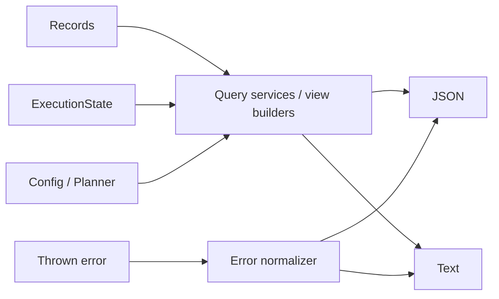

# Status, Inspect, and Error Query/View Design

**Date:** 2026-04-23  
**Status:** Draft  
**Scope:** Implementation-anchor spec for workflow status queries, inspect scopes, and machine/text error views

This document defines the read-side query services, internal view builders, and error normalization path that sit between typed records plus `ExecutionState` and the user-facing outputs for:

- `pubm status`
- `pubm inspect packages`
- `pubm inspect targets`
- `pubm inspect plan`
- `pubm changes status`
- `pubm changesets status` as a compatibility alias

It follows and narrows the direction in:

- [External Interface V1](./2026-04-22-external-interface-v1.md)
- [Low-Level External Interface Design](./2026-04-22-low-level-external-interface-design.md)
- [Operational Surface Design](./2026-04-23-operational-surface-design.md)
- [Execution State And Recovery Design](./2026-04-23-execution-state-and-recovery-design.md)
- [Plan Slice Detailed Design](./2026-04-22-plan-slice-detailed-design.md)
- [Release Platform Architecture](./2026-04-22-release-platform-architecture.md)
- [Pretty Error & Log Formatting Implementation Plan](./2026-03-08-error-log-formatting.md)

## Goal

Make `status`, `inspect`, and error output come from explicit read-side services instead of command-local formatting.

That read-side path must:

- consume typed records, `ExecutionState`, config/workspace discovery, or normalized errors
- produce one typed view per query variant
- render both JSON and text from the same typed view
- keep top-level `pubm status` reserved for workflow observability
- preserve current `changesets status` and `inspect packages` behavior where compatibility matters

## Decision Summary

- `status`, `inspect`, and `error` use separate query services and builders; `changes status` is a compatibility view, not the meaning of top-level `status`.
- Workflow status is assembled from immutable records plus `ExecutionState`, with `ExecutionState` taking precedence while a lineage is active or in recovery.
- Inspect views are scope-specific:
  - `packages` is config/workspace discovery
  - `targets` is target topology over resolved config or `ReleasePlan`
  - `plan` is a summarized `ReleasePlan`
- JSON and text are parallel renderings of the same typed view. Commands do not invent extra ad hoc fields.
- Machine errors use the shared `ErrorEnvelope` shape from [Low-Level External Interface Design](./2026-04-22-low-level-external-interface-design.md); text errors are a deterministic rendering of the same normalized error.
- `projection` is an internal implementation term only; it is not the public CLI, SDK, or architecture-layer vocabulary.

## Read-Side Role



Query services are read-only. Internal view builders are pure read-model code. They do not mutate plans, records, `ExecutionState`, or config.

## Read Queries And View Types

The implementation should use explicit read-side query types and typed views. Internal unions are fine, but they are an implementation convenience rather than the public architecture surface.

```ts
type RenderFormat = "json" | "text";

type ReadQuery =
  | WorkflowStatusViewQuery
  | ChangesStatusViewQuery
  | InspectPackagesViewQuery
  | InspectTargetsViewQuery
  | InspectPlanViewQuery
  | NormalizeErrorInput;

type ReadResult =
  | WorkflowStatusView
  | ChangesStatusView
  | InspectPackagesView
  | InspectTargetsView
  | InspectPlanView
  | ErrorEnvelope;

type WorkflowStatusViewQuery = {
  kind: "status.workflow";
  format: RenderFormat;
  query: StatusQuery;
};

type ChangesStatusViewQuery = {
  kind: "status.changes";
  format: RenderFormat;
  cwd: string;
  sinceRef?: string;
  verbose?: boolean;
  resolveKey?: (key: string) => string;
};

type InspectPackagesViewQuery = {
  kind: "inspect.packages";
  format: RenderFormat;
  request: InspectRequest & { requestedTarget: "packages" };
  cwd: string;
  config: ResolvedPubmConfig;
};

type InspectTargetsViewQuery = {
  kind: "inspect.targets";
  format: RenderFormat;
  request: InspectRequest & { requestedTarget: "targets" };
  cwd: string;
  config: ResolvedPubmConfig;
  plan?: ReleasePlan;
};

type InspectPlanViewQuery = {
  kind: "inspect.plan";
  format: RenderFormat;
  request: InspectRequest & { requestedTarget: "plan" };
  plan: ReleasePlan;
};

type NormalizeErrorInput = {
  kind: "error";
  format: RenderFormat;
  error: unknown;
  requestId?: string;
  command?: string;
};
```

### Result variant rules

- `WorkflowStatusView` is the workflow-facing result for `pubm status`.
- `ChangesStatusView` is only for `pubm changes status` and `pubm changesets status`.
- `InspectPackagesView`, `InspectTargetsView`, and `InspectPlanView` are separate results even if they share some fields.
- `NormalizeErrorInput` normalizes arbitrary thrown values into `ErrorEnvelope`; the text renderer then formats that normalized envelope.

## JSON Envelopes

### Machine envelope rule

All new status/inspect query entrypoints should expose JSON as:

```ts
type ViewEnvelope<T> =
  | { ok: true; data: T }
  | { ok: false; error: ErrorEnvelope };
```

This matches the `Result<T, ErrorEnvelope>` pattern already set in [Low-Level External Interface Design](./2026-04-22-low-level-external-interface-design.md).

### 1. Workflow status JSON

`pubm status --json` returns:

```ts
type WorkflowStatusView = StatusEnvelope & {
  schemaVersion: "1";
  view: "status.workflow";
  planId?: string;
  workflowRef?: string;
  proposalRef?: string;
  source: {
    releaseRecordId?: string;
    publishRunId?: string;
    closeoutRecordId?: string;
    executionStateLineageId?: string;
    authority: "records_only" | "execution_state" | "merged";
  };
  targets?: Array<{
    targetKey: string;
    phase: "release" | "publish" | "closeout";
    status:
      | "queued"
      | "running"
      | "succeeded"
      | "failed"
      | "compensated"
      | "blocked";
    attempt?: number;
    requiredForProgress?: boolean;
    requiredForCloseout?: boolean;
    reason?: string;
    externalRef?: string;
  }>;
  history?: Array<{
    publishRunId?: string;
    closeoutRecordId?: string;
    state: string;
    startedAt?: string;
    completedAt?: string;
  }>;
};
```

Compatibility rule:

- the stable subset remains the existing `StatusEnvelope` contract from [Low-Level External Interface Design](./2026-04-22-low-level-external-interface-design.md)
- `view`, `source`, `targets`, and `history` are additive
- `targets` is emitted only when `StatusQuery.includeTargets` is true
- `history` is emitted only when `StatusQuery.includeHistory` is true

### 2. Changes status JSON

`pubm changes status --json` and `pubm changesets status --json` return:

```ts
type ChangesStatusView = {
  schemaVersion: "1";
  view: "status.changes";
  generatedAt: string;
  hasChangesets: boolean;
  sinceRef?: string;
  packages: Array<{
    packageKey: string;
    path: string;
    ecosystem?: string;
    bumpType: "patch" | "minor" | "major";
    changesetCount: number;
    summaries: string[];
  }>;
  changesets?: Array<{
    id: string;
    summary: string;
    releases: Array<{
      path: string;
      ecosystem?: string;
      type: "patch" | "minor" | "major";
    }>;
  }>;
};
```

Compatibility rule:

- the semantic source stays `getStatus()` from [packages/core/src/changeset/status.ts](/Users/classting/Workspace/temp/pubm/packages/core/src/changeset/status.ts)
- the JSON form is new machine output for the noun-scoped changes command family
- top-level `pubm status` must never emit this shape

### 3. Inspect packages JSON

`pubm inspect packages --json` returns:

```ts
type InspectPackagesView = {
  schemaVersion: "1";
  view: "inspect.packages";
  generatedAt: string;
  ecosystem: string;
  workspace: {
    type: string;
    monorepo: boolean;
  };
  packages: Array<{
    name: string;
    version: string;
    path: string;
    registries: string[];
  }>;
};
```

Compatibility rule:

- keep the existing fields and meanings from [packages/core/src/inspect.ts](/Users/classting/Workspace/temp/pubm/packages/core/src/inspect.ts)
- `schemaVersion`, `view`, and `generatedAt` are additive only
- if a migration phase needs strict byte-for-byte compatibility, the command may temporarily unwrap `data` and omit additive metadata, but the internal view object should still use the shape above

### 4. Inspect targets JSON

`pubm inspect targets --json` returns:

```ts
type InspectTargetsView = {
  schemaVersion: "1";
  view: "inspect.targets";
  generatedAt: string;
  workflowRef?: string;
  packages: Array<{
    packageKey: string;
    packageName: string;
    targetRefs: Array<{
      targetKey: string;
      targetCategory: string;
      targetRef: string;
      adapterKey: string;
      contractRef?: string;
      orderGroup?: string;
      requiredForCloseout?: boolean;
    }>;
  }>;
};
```

Source preference:

- use `ReleasePlan.targetPlans` when a resolved plan exists
- otherwise derive a best-effort preview from resolved config and adapter catalogs

### 5. Inspect plan JSON

`pubm inspect plan --json` returns:

```ts
type InspectPlanView = {
  schemaVersion: "1";
  view: "inspect.plan";
  generatedAt: string;
  planId: string;
  command: ReleasePlan["command"];
  commitSha: string;
  state: ReleasePlan["state"];
  workflowRef?: string;
  units: Array<{
    unitKey: string;
    packageName?: string;
    selectedVersion?: string;
  }>;
  targetPlans: ReleasePlan["targetPlans"];
  validation: ReleasePlan["validation"];
};
```

This is a shaped inspect view, not a raw plan dump. It may omit internal-only fields that are not useful for inspection.

## Text Views

Text rendering must be deterministic and derived from the typed view. The command layer should only choose the renderer, not compose lines itself.

| View | Required text shape | Notes |
|---|---|---|
| `status.workflow` | one summary line, optional record IDs, optional failed target block, final `Next action:` line | compact and CI-readable |
| `status.changes` | current pending/no-pending wording plus per-package lines and optional summaries | preserve current operator expectations |
| `inspect.packages` | current ecosystem line, workspace line, packages header, package lines | preserve current output order |
| `inspect.targets` | target topology grouped by package, then target lines | no lifecycle state here |
| `inspect.plan` | plan summary, units block, target block, validation summary | summary, not raw artifact dump |
| error | badge/summary line plus optional detail block and cause chain | follow [2026-03-08-error-log-formatting.md](./2026-03-08-error-log-formatting.md) |

### Workflow status text

Default text shape:

```text
Workflow: builtin:split-ci
Release: materialized (rel_789)
Publish: partial (run_999)
Closeout: partial

Failed targets:
  - npm: auth_failed
  - brew-core: publish_failed

Next action: publish_retry_failed
```

Rules:

- if no active lineage exists, print a short empty-state summary and `Next action: release`
- if `includeTargets` is false, only emit the failed-target summary block
- IDs are helpful but secondary; lifecycle state remains the primary text signal

### Changes status text

Keep current semantics from [packages/pubm/src/commands/status.ts](/Users/classting/Workspace/temp/pubm/packages/pubm/src/commands/status.ts):

- no changesets and no `--since` -> `No pending changesets.`
- no changesets with `--since` -> `No changesets found.` and exit 1
- pending packages -> list `name: bumpType (count changesets)`
- `--verbose` -> append summary bullets

This compatibility profile applies only under `pubm changes status` and `pubm changesets status`.

### Inspect packages text

Keep the current shape from [packages/pubm/src/commands/inspect.ts](/Users/classting/Workspace/temp/pubm/packages/pubm/src/commands/inspect.ts):

```text
Ecosystem: JavaScript
Workspace: pnpm (monorepo)

Packages:
  @pubm/core (1.0.0) -> npm, jsr
```

Any future additions should be opt-in or appended after the existing package lines.

## View Sources And Precedence

### Source matrix

| View field | Primary source | Fallback | Rule |
|---|---|---|---|
| `releaseState`, `publishState`, `closeoutState` | `ExecutionState` while active/recovery | latest matching record | mutable state wins until lineage is terminal |
| `failedTargets` | `ExecutionState.targetStates` | `PublishRun.targetStates` or closeout attempt snapshot | use latest relevant phase only |
| `nextAction` | `ExecutionState.nextAction` | latest record `nextAction`, else derived default | `ExecutionState` owns recovery intent |
| `history` | record store | none | history comes from immutable attempts |
| `inspect.packages.*` | resolved config plus `detectWorkspace()` | none | no record lookup required |
| `inspect.targets.*` | `ReleasePlan.targetPlans` | config-derived preview | prefer planned truth over inferred topology |
| `inspect.plan.*` | `ReleasePlan` | planner output before persistence | summary view, not raw serialization |
| JSON error fields | existing `ErrorEnvelope` | normalized thrown error | never serialize raw stack in JSON |

### Workflow status precedence

1. If an `ExecutionState` exists for the selected lineage and its `phase` is active or `recovery.mode !== "none"`, it is authoritative for mutable fields.
2. Immutable record snapshots remain authoritative for completed attempt history and stable IDs.
3. If no `ExecutionState` exists, `StatusService` assembles the view from the latest records only.
4. If neither state nor records exist, the status query returns an empty workflow view with `nextAction: "release"`.

This matches [Execution State And Recovery Design](./2026-04-23-execution-state-and-recovery-design.md), which makes `ExecutionState` the mutable source of truth and `StatusEnvelope` the stable external status view.

## Inspect Scopes

`InspectRequest.requestedTarget` stays the dispatcher input from [Plan Slice Detailed Design](./2026-04-22-plan-slice-detailed-design.md). The inspect query service turns it into three concrete scopes.

### `packages`

Purpose:

- show package discovery
- show workspace type
- show per-package registry assignments

Data sources:

- resolved config
- workspace detection
- registry catalog for ecosystem label inference

This scope must stay record-independent so it can work before any plan exists.

### `targets`

Purpose:

- show publish and distribution target topology
- show which packages map to which targets
- show target kind, adapter identity, and closeout relevance

Data sources:

- `ReleasePlan.targetPlans` when available
- resolved config plus adapter catalog as preview fallback

This scope must not show live execution status. Lifecycle state belongs to `status`, not `inspect`.

### `plan`

Purpose:

- show the current resolved release plan without mutating anything
- expose version decisions, unit scope, target plan, and validation summary

Data sources:

- persisted `ReleasePlan`
- or planner output before persistence for preflight-time inspection

This scope is intentionally narrower than a raw artifact dump so the public inspect surface can stay readable and stable.

## Error Normalization And Rendering

### JSON error contract

Errors emitted by `status` or `inspect` use `ErrorEnvelope` exactly as defined in [Low-Level External Interface Design](./2026-04-22-low-level-external-interface-design.md):

```ts
type ErrorEnvelope = {
  code: string;
  kind: "validation" | "state" | "io" | "dependency" | "auth" | "internal";
  message: string;
  nextAction?: NextAction;
  retryAfterSeconds?: number;
  targetKey?: string;
  field?: string;
  requestId?: string;
  command?: string;
  causedBy?: string;
};
```

Normalization rules:

- if the thrown value is already an `ErrorEnvelope`, preserve it
- if the thrown value is an `AbstractError` or `Error`, classify and normalize it once
- JSON errors must not include stack traces or raw stderr dumps as separate fields
- `nextAction` is allowed on stateful workflow failures, but should usually be omitted for inspect/config errors

### Text error contract

Text error output should keep the current formatting direction in [packages/core/src/error.ts](/Users/classting/Workspace/temp/pubm/packages/core/src/error.ts) and [2026-03-08-error-log-formatting.md](./2026-03-08-error-log-formatting.md):

- one summary line with command-relevant message
- optional indented detail block for stderr-like body text
- optional cause chain only when it adds information
- stack traces only in debug mode

Normalization rule:

- the text renderer consumes normalized `ErrorEnvelope` plus optional diagnostic detail
- command handlers should not call `consoleError()` on raw thrown values after the normalizer exists; they should render the normalized error view instead

## Compatibility With Current `changesets status` And `inspect packages`

### Current `changesets status`

Current state:

- top-level `status` and `changesets status` both use the same implementation in [packages/pubm/src/commands/status.ts](/Users/classting/Workspace/temp/pubm/packages/pubm/src/commands/status.ts)
- the underlying data comes from [packages/core/src/changeset/status.ts](/Users/classting/Workspace/temp/pubm/packages/core/src/changeset/status.ts)

Compatibility decision:

- keep that aggregation logic for the changes domain
- move it behind the changes status view builder
- expose it from `pubm changes status`
- keep `pubm changesets status` as an alias during migration
- stop using that implementation for root `pubm status`

This aligns with [Operational Surface Design](./2026-04-23-operational-surface-design.md), which reserves top-level `status` for workflow observability.

### Current `inspect packages`

Current state:

- [packages/core/src/inspect.ts](/Users/classting/Workspace/temp/pubm/packages/core/src/inspect.ts) returns `ecosystem`, `workspace`, and package registry data
- [packages/pubm/src/commands/inspect.ts](/Users/classting/Workspace/temp/pubm/packages/pubm/src/commands/inspect.ts) renders that structure directly

Compatibility decision:

- preserve the existing fields, meanings, and default text ordering
- wrap them in the new inspect query/view path
- allow additive metadata only
- do not force `inspect packages` to depend on `ReleasePlan` or `ExecutionState`

That keeps current utility value while fitting the newer inspect surface described in [External Interface V1](./2026-04-22-external-interface-v1.md).

## Implementation Anchors

The likely code split is:

- workflow status query service plus status view builder under `packages/core/src/status/`
- changes status view builder under `packages/core/src/changeset/`
- inspect query services and view builders under `packages/core/src/inspect/`
- error normalization plus text rendering under `packages/core/src/error/`
- thin command adapters in `packages/pubm/src/commands/status.ts`, `packages/pubm/src/commands/inspect.ts`, and the future `changes` namespace command

The important boundary is architectural, not file naming:

- commands parse flags and select a status/inspect query or error normalization path
- services/loaders fetch records, config, or `ExecutionState`
- view builders shape the result
- renderers turn that result into JSON or text

## Unresolved Risks

- `inspect packages --json` currently prints a raw object, not an explicit result envelope; changing that too early could break scripts.
- `StatusQuery.scope = "all"` plus `includeHistory` can become large quickly; pagination or truncation rules are still unspecified.
- `inspect targets` without a persisted `ReleasePlan` is inherently preview-like and may drift from the final planned topology.
- some failure cases today only exist as free-form `Error.message`; normalizing them into stable `ErrorEnvelope.code` values will take a broader classification pass.
- there is still no fully specified public inspect view contract in the 2026-04-22 docs, so this memo is defining it ahead of the lower-level docs being updated.
- if commands continue to call formatters directly, text and JSON can drift again; the read-side split only helps if command-local formatting is actually removed.
