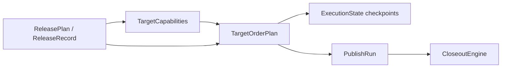

# Target Order Plan And Execution Scheduler Design

**Date:** 2026-04-23  
**Status:** Draft  
**Scope:** Implementation-anchor spec for deriving a deterministic `TargetOrderPlan` from release artifacts and executing it safely across local runs, split CI, retries, and recovery.

**Depends on:**

- [release-platform-architecture](./2026-04-22-release-platform-architecture.md)
- [plan-slice-detailed-design](./2026-04-22-plan-slice-detailed-design.md)
- [publish-slice-detailed-design](./2026-04-22-publish-slice-detailed-design.md)
- [low-level-external-interface-design](./2026-04-22-low-level-external-interface-design.md)
- [monorepo-and-target-adapter-design](./2026-04-23-monorepo-and-target-adapter-design.md)
- [artifact-and-closeout-design](./2026-04-23-artifact-and-closeout-design.md)
- [execution-state-and-recovery-design](./2026-04-23-execution-state-and-recovery-design.md)

## Goal

Close the remaining gap between:

- planner-owned source topology (`ReleaseUnit`, `dependencyKeys`, target declarations),
- release-owned durable publish intent (`ReleaseRecord.publishTargets`),
- adapter-owned runtime execution metadata (`TargetCapabilities`),
- publish-time scheduling (`TargetOrderPlan`), and
- retry/recovery state (`ExecutionState`).

This document is intentionally narrower than the full publish slice. It does not redefine `PublishInput`, target adapters, or closeout ownership. It specifies how publish turns already-planned targets into a deterministic, retry-safe execution schedule.

## Decision Summary

- `TargetOrderPlan` is an internal scheduler artifact derived from frozen release intent plus runtime `TargetCapabilities`. It is not a new public API surface.
- Grouping starts from planner-owned `orderGroup`, but the scheduler may split groups further for dependency edges, preparation gates, closeout preparation, and concurrency limits. It must never merge different `orderGroup` values.
- `targetCategory` remains an open classification for grouping defaults and UX, but compatibility and dependency lifting must be keyed by concrete target identity or adapter-declared compatibility, not by category label alone.
- Target-level dependency ordering comes from `ReleaseUnit` dependency facts, not from registry heuristics alone. Cross-ecosystem ordering is only created when the dependency can be mapped to a concrete compatible upstream target.
- Preparation work is modeled as explicit deduplicated gates, not hidden inside target executors.
- `closeoutDependencyKey` creates a publish-time gate on closeout preparation. Publish may request preparation, but final closeout remains owned by `CloseoutEngine` as described in [artifact-and-closeout-design](./2026-04-23-artifact-and-closeout-design.md).
- Concurrency is an upper bound declared by adapter capabilities and reduced by scheduler safety rules. The default posture is deterministic first, then parallel where safe.
- Retries always reuse the same logical `TargetOrderPlan` for a lineage. Retry filters change the runnable view, not the topology.

## Placement In The Flow



`TargetOrderPlan` sits between the release artifact boundary from [publish-slice-detailed-design](./2026-04-22-publish-slice-detailed-design.md#target-planning-vs-execution-boundary) and the mutable state model from [execution-state-and-recovery-design](./2026-04-23-execution-state-and-recovery-design.md).

## Design Position

The scheduler should preserve the current architecture split:

- `Planner` and `Release` decide topology, selection, versions, and durable publish target declarations.
- `PublishEngine` decides runtime grouping, gate execution, retries, and persistence of attempt state.
- `CloseoutEngine` owns final closeout side effects and any `prepare` operation behind `closeoutDependencyKey`.

This means publish must not rediscover targets from checkout state or config. It may only:

1. filter an already-frozen target set,
2. load runtime capability metadata by `adapterKey`,
3. derive execution edges and gates from frozen topology plus capability metadata,
4. run the resulting schedule against `ExecutionState`.

## Scheduler Inputs

### Required Inputs

The scheduler needs all of the following:

- `ReleaseRecord.publishTargets`
- `ReleaseRecord.closeoutTargets` when `closeoutDependencyKey` is present
- runtime `TargetCapabilities` loaded by `adapterKey`
- current `ExecutionState`
- artifact metadata and prepared endpoint bindings from `ArtifactBundle` when retrying or resuming

### Required Frozen Dependency Topology

The publish docs already require publish to avoid re-planning from checkout state. That implies target ordering cannot depend on rereading manifests during publish.

For v1, publish needs one frozen dependency source attached to the lineage:

- preferred: persist `dependencyUnitKeys` on each resolved publish target during release materialization, or
- acceptable fallback: load the originating `ReleasePlan.units` by `ReleaseRecord.planId` and project `ReleaseUnit.dependencyKeys` without re-running planner logic.

The preferred direction is the first one because it keeps publish anchored on `ReleaseRecord` alone and matches the release-to-publish trust boundary from [publish-slice-detailed-design](./2026-04-22-publish-slice-detailed-design.md#target-planning-vs-execution-boundary).

## Proposed Internal Shape

Keep the lightweight shape from [publish-slice-detailed-design](./2026-04-22-publish-slice-detailed-design.md#target-contracts-and-capabilities), but make the scheduler artifact concrete enough to drive execution and recovery:

```ts
type TargetOrderPlan = {
  releaseRecordId: string;
  schedulerVersion: "1";
  groups: TargetOrderGroup[];
  gateIndex: TargetOrderGate[];
  targetIndex: TargetOrderTarget[];
};

type TargetOrderGroup = {
  groupKey: string;
  orderGroup: string;
  order: "serial" | "parallel";
  contracts: TargetContract[];
  dependencyGroupKeys: string[];
  gating: {
    requiredForProgress: boolean;
    requiredForCloseout: boolean;
    preparationGateKeys: string[];
    closeoutDependencyKeys: string[];
  };
};

type TargetOrderGate = {
  gateKey: string;
  kind: "preparation" | "closeout_prepare";
  targetKeys: string[];
  unitKeys: string[];
  digest: string;
};

type TargetOrderTarget = {
  targetKey: string;
  unitKey: string;
  groupKey: string;
  slotIndex: number;
  dependencyTargetKeys: string[];
  retryClass: "safe" | "reconcile_first" | "not_supported";
};
```

Notes:

- `groups[].contracts` remains the primary execution surface so this stays aligned with the publish-slice design.
- `gateIndex` is scheduler-owned metadata. It does not widen the public contract surface.
- `targetIndex` exists so `ExecutionState.checkpoints` and `PublishRun.targetStates` can refer back to stable scheduler keys without recomputing group membership.

## Grouping And Ordering Rules

### Deterministic Build Order

The scheduler should build `TargetOrderPlan` in this order:

1. Start from scoped `TargetContract[]` selected from `ReleaseRecord.publishTargets`.
2. Load `TargetCapabilities` for each distinct `adapterKey`.
3. Resolve target-level dependency edges from frozen unit-level dependency facts.
4. Resolve explicit preparation gates from `TargetCapabilities.preparation`.
5. Resolve explicit closeout preparation gates from `closeoutDependencyKey`.
6. Partition contracts by planner-emitted `orderGroup`.
7. Split each `orderGroup` further when dependency edges, gate boundaries, or concurrency limits require it.
8. Sort all groups deterministically by topological rank, then stable tie-breakers.

Recommended stable tie-breakers:

- dependency depth,
- planner `orderGroup`,
- existing `orderIndex` when present on the resolved target,
- `packagePath`,
- `targetKey`.

### Hard Rules

- Different `orderGroup` values must never be merged into one execution group.
- Groups may be split, but only to become stricter than planner intent, never looser.
- Inter-group order is always serial.
- Intra-group order is `parallel` only when the concurrency rules below all pass.
- Groups should be keyed by deterministic content, for example `orderGroup + contract keys + gate digest + dependency digest`, so retries can map back to the same group identity.

### Group Gating Semantics

For one `TargetOrderGroup`:

- `requiredForProgress` is `true` if any member contract is required for progress.
- `requiredForCloseout` is `true` if any member contract is required for closeout.
- `dependencyGroupKeys` must contain all upstream groups needed by any member contract.
- `preparationGateKeys` must be satisfied before any target in the group starts.
- `closeoutDependencyKeys` must be prepared before any target in the group starts.

## Cross-Ecosystem Dependency Handling

This area needs explicit rules because [monorepo-and-target-adapter-design](./2026-04-23-monorepo-and-target-adapter-design.md#dependency-edge-rules) correctly forbids inventing cross-ecosystem ordering from registry grouping alone.

### Source Of Truth

- `ReleaseUnit.dependencyKeys` remains the only source-side dependency fact.
- Scheduler logic lifts those unit edges into target edges.
- `targetCategory` may inform default lanes such as registry vs distribution, but it is not sufficient by itself to create a dependency edge.
- Raw manifest dependency names, workspace grouping, or registry labels are not enough to create publish ordering.

### Target Edge Derivation

Given a unit edge `A depends on B`, the scheduler should create a target edge `target(A) depends on target(B)` only when one of these is true:

1. both targets resolve to the same concrete publish surface, usually the same `targetKey`,
2. both targets share an adapter-defined compatible publish surface, usually the same `adapterKey`,
3. a future adapter capability explicitly declares a compatibility mapping.

If no compatible upstream target exists, the unit dependency still matters for release/source preparation, but it does not create a publish-time target edge.

### Built-In Compatibility Defaults

| Downstream target | Compatible upstream target | Scheduling result |
|---|---|---|
| npm or custom npm registry | same registry `targetKey` | downstream waits for upstream registry publish |
| jsr | same `targetKey` | downstream waits for upstream jsr publish |
| crates | same `targetKey` | downstream waits for upstream crate publish |
| distribution targets such as `brew` | none from source dependency edges | distribution waits on artifacts or `closeoutDependencyKey`, not package manifest edges |

### Cross-Ecosystem Rule

Cross-ecosystem unit edges are legal when the planner can resolve them, but publish ordering must stay explicit:

- JS unit -> Rust unit does not imply npm waits for crates.
- Rust unit -> JS unit does not imply crates waits for npm.
- A cross-ecosystem publish edge exists only when a compatible upstream target can be named concretely.

This preserves the source graph while avoiding false global serialization.

## Preparation Gates

Preparation requirements are already declared in [monorepo-and-target-adapter-design](./2026-04-23-monorepo-and-target-adapter-design.md#proposed-contract) through `TargetCapabilities.preparation`. This document makes them executable scheduler gates.

### Gate Model

A preparation gate is a deduplicated prerequisite node keyed by:

- normalized preparation spec,
- affected unit or workspace scope,
- selected version snapshot,
- relevant artifact spec inputs when `artifactMode !== "none"`.

One gate may unblock many targets.

### Rules

- Gates run before the first dependent target group, never inline inside target execution.
- Gates must be idempotent for the same digest.
- Gate success may be reused across retry attempts when the lineage, selected target set, and digest are unchanged.
- Gate failure blocks only dependent targets, not unrelated targets in other groups.
- Gate output should be visible through `ExecutionState.checkpoints` so resume/reconcile can distinguish "preparation not started" from "preparation may already have mutated sources".

### Built-In Preparation Examples

- JS registry targets may request workspace protocol resolution and optional lockfile sync.
- Rust crate targets may request sibling path version materialization and required lockfile sync.
- Distribution targets may request artifact bundle materialization before publish.

Preparation remains source-side work owned by `PublishEngine` plus `Ecosystem`, not by target executors directly.

## Closeout Dependency Gating

`closeoutDependencyKey` is the explicit bridge between publish and closeout preparation from [artifact-and-closeout-design](./2026-04-23-artifact-and-closeout-design.md#publish-vs-closeout-boundary).

### Rule

If a publish target declares `closeoutDependencyKey`, the scheduler must create a `closeout_prepare` gate for that key and block the target until preparation succeeds.

### Required Behavior

- Publish requests preparation by key from the closeout side; it does not finalize the closeout target.
- The gate is satisfied only when the required prepared binding exists in durable state, for example `ArtifactBundle.endpointBindings`.
- Multiple publish targets that share a `closeoutDependencyKey` must reuse the same prepared binding and the same gate.
- Failure in closeout preparation should mark dependent publish targets as failed or blocked according to the current attempt state.

### Consequence For Grouping

Targets that depend on closeout preparation should normally be split into their own group even if the planner originally gave them the same `orderGroup` as ordinary registry targets. This keeps gate visibility explicit and prevents half-ready mixed groups.

## Concurrency Rules

Concurrency is allowed only after ordering and gating have already been resolved.

### Parallel Eligibility

A group may be `parallel` only when all of the following are true:

- every member capability declares `executionOrder: "parallel"`,
- every member capability allows retry semantics compatible with grouped execution,
- there are no dependency edges between members,
- no member depends on a gate that is still mutable during the group,
- no member requires preserved relative order because `canReorder` is `false`.

If any condition fails, the group becomes `serial`.

### `canReorder` Rule

`canReorder = false` is a hard safety constraint, not a hint. For v1 the scheduler should treat it as:

- keep the member in deterministic serial order relative to its peers,
- do not widen concurrency inside that cohort,
- preserve planner/release tie-breakers exactly.

This is intentionally conservative and matches the "deterministic first" posture.

### Fan-Out Limits

This design keeps the existing publish-slice rule that groups execute serially and only contracts inside a group may run in parallel. A future worker-pool limit can be added later, but it should be an execution throttle over a fixed `TargetOrderPlan`, not a new planning axis.

## Retry-Safe Scheduling

This section binds the scheduler to [execution-state-and-recovery-design](./2026-04-23-execution-state-and-recovery-design.md).

### Core Rule

Retry never recomputes topology from checkout state. It always reuses the same logical `TargetOrderPlan` for a lineage and only changes which groups are runnable.

### Checkpoint Rules

- Starting a group records `target_group_started` with `groupKey`.
- Finishing a group records `target_group_finished` with `groupKey`.
- A crash after a target call starts but before the group finishes marks affected targets as `reconcileRequired`.
- A retry is blocked when any selected upstream target or gate is still `uncertain`.

### Retry Modes

`retry=failed`:

- reruns failed targets only,
- treats successful upstream targets and successful gates as already satisfied,
- reopens blocked downstream targets only after their failed dependencies succeed.

`retry=all`:

- reruns all selected targets only when each selected target is retryable and no selected checkpoint is uncertain,
- reuses successful gates when their digests still match,
- should still skip recomputation of target topology and version intent.

### Retry Classification

`targetIndex[].retryClass` should be derived this way:

- `safe`: `canRetry = true` and no unresolved ambiguity is present,
- `reconcile_first`: the target can theoretically retry, but current state is ambiguous or external evidence must be checked first,
- `not_supported`: `canRetry = false`.

This classification is scheduler metadata used to reject unsafe retries early.

### Group Failure Semantics

When a parallel group partially succeeds:

- successful targets stay succeeded,
- failed targets become failed,
- untouched targets stay queued,
- downstream groups re-evaluate readiness per target, not per original group boundary.

This keeps parallel fan-out from forcing unnecessary re-execution of successful siblings.

## Required ExecutionState Scheduler Metadata

To make the scheduler observable and recoverable, `ExecutionState.targetStates` should carry enough scheduler identity to avoid reverse-engineering it later.

Recommended minimum additions or derived fields:

- `groupKey`
- `dependencyTargetKeys`
- `gateKeys`
- `retryClass`

If these stay derived-only and are not stored directly, the runtime must still be able to reconstruct them from the frozen `TargetOrderPlan` without rereading repo state.

## Recommended Implementation Anchors

This design lines up with the current migration map from [monorepo-and-target-adapter-design](./2026-04-23-monorepo-and-target-adapter-design.md#mapping-from-current-registry-abstraction).

### Planner / Release Side

- Keep planner ownership of `orderGroup`.
- Persist enough frozen dependency topology for publish scheduling.
- Preserve stable target ordering hints such as `orderIndex` on resolved targets.

### Publish Side

- Replace current ad hoc grouping in `packages/core/src/tasks/grouping.ts` with a pure `deriveTargetOrderPlan(...)` step.
- Replace direct Listr fan-out construction in `packages/core/src/tasks/runner-utils/publish-tasks.ts` with a scheduler that consumes `TargetOrderPlan`.
- Treat `packages/core/src/registry/catalog.ts` ordering flags as migration inputs to adapter capability metadata, not as the final execution API.

### Closeout Side

- Introduce an idempotent closeout preparation call keyed by `closeoutDependencyKey`.
- Persist prepared bindings so publish retry/resume can reuse them without duplicating draft or asset-upload work.

## Unresolved Risks

- `ReleaseRecord.publishTargets` does not yet clearly carry enough frozen dependency topology for target-edge derivation. The architecture needs one explicit persistence rule here.
- The current capability shape may be too small for future resource locks. `executionOrder` and `canReorder` may not fully capture shared external bottlenecks.
- Registry visibility may lag after publish. Some downstream targets may need adapter-specific "publish visible" checks before the scheduler treats upstream success as satisfiable.
- Mixed-ecosystem dependency compatibility is still intentionally conservative. A future plugin SPI will likely need an explicit compatibility declaration surface.
- Closeout preparation retries need stable external IDs for draft releases, uploaded assets, or other prepared endpoints; otherwise reconciliation remains too coarse.
- Partial completion inside a parallel group may still force expensive reconcile work unless per-target success evidence is persisted immediately after each execution.

## Recommendation

Implement `TargetOrderPlan` as the deterministic internal bridge between frozen release intent and mutable publish execution, keep dependency lifting explicit and conservative, make preparation and closeout preparation first-class gates, and treat retry as a filtered rerun over a frozen schedule rather than a fresh planning pass.
